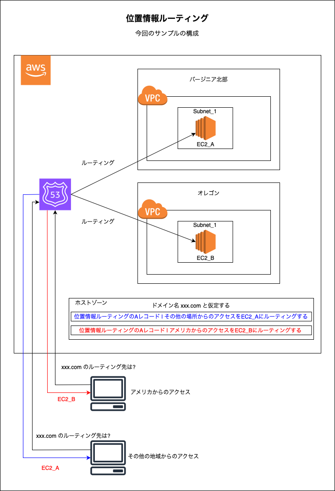
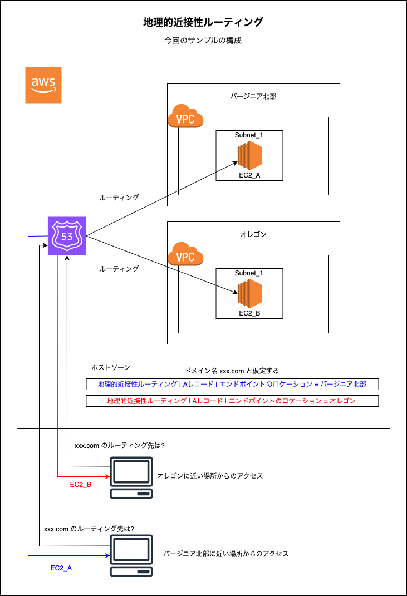
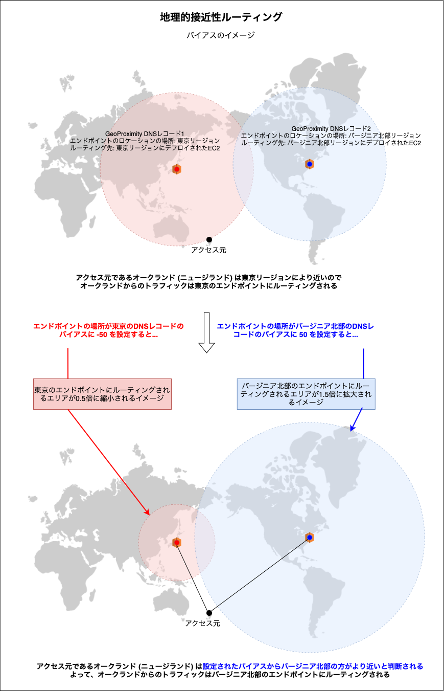

# Index (目次)

1. [ドメイン名の対してルーティング先追加の基本的な操作](#基本的な操作)

2. [レコード作成画面 (クイック作成) の設定項目](#レコード作成画面-クイック作成-の設定項目)


3. [シンプルルーティングの設定方法](#シンプルルーティング)

4. [加重ルーティングの設定方法](#加重ルーティング)

5. [フェイルオーバールーティングの設定方法](#フェイルオーバールーティング)

6. [位置情報ルーティングの設定方法](#位置情報ルーティング)

7. [地理的近接性ルーティングポリシー]()

8. [IPベースルーティングの設定方法](#ipベースルーティング)

9. [複数値回答ルーティングの設定方法](#複数値回答ルーティング)

---

### 基本的な操作

1. マネージドコンソールにログイン後、 Route53 画面に遷移し、サイドメニューの `ホストゾーン` をクリック

    

<br>

2. ルーティングを追加したいホストゾーンを選択し、ホストゾーンの詳細画面に遷移し、`レコードを作成` をクリックする

    - ★基本的に、作成済みの 2 レコード (NS & SOA) はいじらない

    

<br>

3. 基本的には A レコードを作成し、そのレコードに任意のルーティングポリシーを設定する

    - クイック作成画面 (デフォルト)

    

    <br>

    - ウィザード作成画面

    

<br>

#### DNS レコードについて

- [こちらのメモ](https://github.com/MasaGt/CS/blob/1613eb010b87df4b65d1d2f1eb0b2ff07ea96549/DNS%E3%83%AC%E3%82%B3%E3%83%BC%E3%83%89.md)を参照　

- [こちらの記事](https://blog.serverworks.co.jp/basic-knowledge-of-dns-records)も参考になる

<br>
<br>

参考サイト

[【初心者向け】DNSレコードの基本的な知識](https://blog.serverworks.co.jp/basic-knowledge-of-dns-records)

---

### レコード作成画面 (クイック作成) の設定項目


<br>

- `レコード名`

    - サブドメインについてのレコードを作成したい場合、テキストボックスにサブドメインを入力する

<br>

- `レコードタイプ`

<br>

- `エイリアス`

    - レコードの値を IP アドレスではなく、リソースで設定するようにする項目

<br>

- `値`

    - 作成する DNS レコードの値

<br>

- `TTL`

    - このレコードのキャッシュ時間

    - DNS キャッシュサーバーにキャッシュされる時間

<br>

- `ルーティングポリシー`

    - ルーティング方法

<br>

#### エイリアスを有効にすると


<br>

- `トラフィックのルーティング先`

    - その名の通り、ルーティング先

    - エンドポイントの種類、リージョン、リソースを選択して設定する

    <br>

    

<br>
<br>

参考サイト

[Route53にALBのレコードを追加　#487](https://note.com/ym202110/n/nf352554c9f81)

---

### [シンプルルーティング](./Route53.md#--シンプルルーティング)

1. ホストゾーンに A レコードを作成する

    - ルーティング先は EC2 のパブリックIP アドレスを選択した

        - EC2 アクセスした際に HTMLページが表示されるように index.htmlファイルを配置し、アパッチを起動している

    - ルーティングポリシーに`シンプルルーティング`を選択する

        - 複数のルーティング先を設定する場合は、 `値` のテキストエリアにて改行して次の IP アドレスを入力する

        

<br>

2. nslookup や dig コマンドでドメイン名に IP アドレスが紐づけられているかを確認

    - dig コマンドでは、ANSWER SECTION の中でドメイン名に対するルーティング先 IP が正しく返ってきていれば OK

        

    <br>

    - 今回は、htmlファイルを配置し、アパッチを起動した EC2 にドメインを紐づけたので、Web ブラウザでも確認してみる

        

---

### [加重ルーティング](./Route53.md#--加重ルーティング)

1. ホストゾーンに A レコードを作成する

    - 2つのルーティング先のうちの1つへの A レコードを作成する

    - ルーティングポリシーに`加重`を選択する

        

    <br>

    - 残りのルーティング先への A レコードを作成する

    - ルーティングポリシーに`加重`を選択する

        

    <br>

    - `加重`
        - 対象のルーティング先へのリクエストの振り分け率

        - 詳しくは[こちら](#加重)を参照

    <br>

    - `ヘルスチェック`

        - 対象ルーティング先へのヘルスチェックを設定

    <br>

    - `レコード ID`
        - 対象の A レコードの識別子

        - 加重ルーティングでは同じレコード名の A レコードが2つ以上作成されるので、それぞれのレコードを識別するために、レコード ID を設定する必要がある

<br>

2. nslookup や dig コマンドでドメイン名に IP アドレスが紐づけられているかを確認

    - dig コマンドでは、ANSWER SECTION の中でドメイン名に対するルーティング先 IP が正しく返ってきていれば OK

    - 何回か dig コマンドで　問い合わせを行い、設定したルーティング先が設定した割合で返却されていれば OK

        

    <br>

    - 今回は、htmlファイルを配置し、アパッチを起動した 2つの EC2 にドメインを紐づけたので、Web ブラウザでも確認してみる

        - 対象先のルーティング先に設定した割合で接続できた

        

<br>

#### 加重

- リクエストを振り分ける比率

- `対象のレコードの加重値 / 全ての加重ルーティングレコードの加重値の合計` で各レコードの振り分け率が決まる

    ```
    例1: 2つのルーティング先それぞれ 50% の割合でリクエストを振り分けたい

    A: 2つのレコードの加重値を同じ値にすれば良い

    2つのレコードの加重にそれぞれ1を設定すると...
    それぞれのレコードへのトラフィックの重みは 1 / 2 = 50 %


    2つのレコードの加重にそれぞれ50を設定すると...
    それぞれのレコードへのトラフィックの重みは 50 / 100 = 50 %
    ```
    
    <br>

    ```
    例2: 2つのルーティング先を 8 : 2 の割合でリクエストを振り分けたい

    A:2つのレコードの加重の値が 4 : 1　になるように設定する

    1つのレコードの加重値を80
    もう1つのレコードの加重を20にすると...

        - 加重値80のレコードへのトラフィックの重みは 80 / 100 = 80 %

        - 加重値20のレコードへのトラフィックの重みは 20 / 100 = 20 %

    
    1つのレコードの加重値を8
    もう1つのレコードの加重を2にすると...

        - 加重値8のレコードへのトラフィックの重みは 8 / 10 = 80 %

        - 加重値2のレコードへのトラフィックの重みは 2 / 10 = 20 %
    ```

<br>

#### 注意点

- ルーティング先ごとに加重ルーティングポリシーの A レコードを作成する

    - [シンプルルーティング](#シンプルルーティング)のように、1つのレコードに複数のルーティング先を設定しないように注意する

---

### [フェイルオーバールーティング](./Route53.md#--フェイルオーバールーティング)

#### 今回の構成


#### 手順

1. EC2_A へのヘルスチェックの作成を行う

    - ヘルスチェックの作成についての詳細は[こちら](./Route53_ヘルスチェック作成.md)を参照

    

<br>

2. 同様に EC2_B へのヘルスチェックの作成を行う (オプショナル)

    

<br>

3. ヘルスチェックの結果が正常であることを確認する

    

<br>

4. ホストゾーンにフェイルオーバールーティングの A レコードを作成する

    

    <br>

    - `フェイルオーバーレコードタイプ`

        - 当レコードのルーティング先がプライマリかセカンダリのどちらなのかを設定する
    
    <br>

    - `ヘルスチェック ID`

        - フェイルオーバー検知のためのヘルスチェックを指定する

<br>

5. nslookup や dig コマンドでドメイン名に**プライマリの IP アドレス**が紐づけられているかを確認

    - dig コマンドでのドメイン名に紐づく IP アドレスを問い合わせると、プライマリ (EC2_A) の グローバル IP アドレスが返ってくることが確認できる

        

    <br>

    - ブラウザでドメイン名にアクセスしてみると、プライマリ (EC2_A) に配置した index.html が表示されることが確認できる

        


<br>

#### フェイルオーバーが正しく起きるか確認


<br>

1. プライマリ (EC2_A) で障害を起こしてみる

    - EC2_A へのヘルスチェックで異常を検知させるには以下のような方法がある

        - EC2_A を停止する

        - EC2_A へのヘルスチェックステータスを反転させる

        - EC2_A で動いている Apache を停止する (今回の EC2_A へのヘルスチェックは :80/index.html を見に行ってるから)
    
<br>

2. 上記の方法のうちどれかでプライマリへのヘルスチェックに異常を検知させる

    

<br>

3. nslookup や dig コマンドでドメイン名に**セカンダリの IP アドレス**が紐づけられているかを確認

    - dig コマンドでのドメイン名に紐づく IP アドレスを問い合わせると、**セカンダリ (EC2_B) の グローバル IP アドレス**が返ってくることが確認できる

        

    <br>

    - ブラウザでドメイン名にアクセスしてみると、**セカンダリ (EC2_B)** に配置した index.html が表示されることが確認できる

        

<br>

#### プライマリが障害から回復した時の挙動

[フェイルオーバーが正しく起きるか確認](#フェイルオーバーが正しく起きるか確認)の続き


<br>

1. プライマリを復旧する

    

<br>

2. nslookup や dig コマンドでドメイン名に**プライマリの IP アドレス**が紐づけられているかを確認

    - dig コマンドでのドメイン名に紐づく IP アドレスを問い合わせると、**プライマリ (EC2_A) の グローバル IP アドレス**が返ってくることが確認できる

        

    <br>

    - ブラウザでドメイン名にアクセスしてみると、**プライマリ (EC2_A)** に配置した index.html が表示されることが確認できる

        

<br>

#### ポイント

- プライマリ、セカンダリ全てのエンドポイントで障害が発生した場合

    - プライマリがルーティング先になる
    
    

<br>

#### 注意点

- プライマリに障害が起きても、すぐにルーティング先が切り替わるわけではない

    - プライマリへのヘルスチェックが異常を検知するまではプライマリへルーティングされる

<br>
<br>

参考サイト

プライマリ、セカンダリ全てのエンドポイントで障害が発生した場合の挙動について
- [Route 53 フェイルオーバールーティングポリシーの問題をトラブルシューティングする方法を教えてください。](https://repost.aws/ja/knowledge-center/route-53-fix-failover-policy-errors)

---

### [位置情報ルーティング](./Route53.md#--レイテンシールーティング)

#### 今回の構成



<br>

#### 手順

1. ホストゾーンに位置情報ルーティングの A レコードを作成する

    

    <br>

    - `場所`: アクセス元の場所
    
<br>

2. 現在の場所 (アメリカ以外) から nslookup や dig コマンドでドメイン名に**EC2_A (バージニア北部) の IP アドレス**が紐づけられているかを確認

    - 現在の場所 (アメリカ以外) から確認

        

    <br>

    - ★もしくは Amazon CloudShell で任意のリージョンからドメイン名へのアクセスを試すことができる

        
        

<br>

3. アメリカから nslookup や dig コマンドでドメイン名に**EC2_B (オレゴン) の IP アドレス**が紐づけられているかを確認

    - ★VPN でアメリカに接続してから nslookup や dig で確認すると

        

    <br>

    - ★もしくは Amazon CloudShell で任意のリージョンからドメイン名へのアクセスを試すことができる

        

<br>

#### 位置情報ルーティングでのフェイルオーバー

- もし EC2_B (オレゴン) のサーバーで障害が発生した場合、以下の画像のように、アメリカからのアクセスは EC2_A (バージニア北部) にルーティングされる 

    
    
    <br>

    - ★EC2_B へルーティングする位置情報ルーティングの A レコードで EC2_B へのヘルスチェックを設定している必要がある

        
        
        <br>

    - ★EC2_B が復旧 = EC2_B へのヘルスチェックが正常を検知すれば、アメリカからのトラフィックは再び EC2_B にルーティングされる
    
    - 逆も同様に、EC2_A (バージニア北部) で障害が発生した場合、デフォルトアクセスは EC2_B (オレゴン) にルーティングされる

<br>

#### ポイント

- 全てのエンドポイントで障害が発生した場合

    - アメリカからのアクセス → EC2_B (オレゴン) の IP アドレスが返ってくる

    - アメリカ以外からのアクセス → EC2_A (バージニ北部) の IP アドレスが返ってくる

        

<br>

- ★★★設定されている地域以外からのアクセスのルーティングはどうなる?

    - デフォルト地域からのトラフィックに対するルーティング先を設定したレコードがある場合

        - そのレコードのルーティング先に接続する

            

    <br>

    - デフォルト地域からのトラフィックに対するルーティング先を設定したレコードがない場合

        - ホスト名を解決できない

            

---

### [地理的近接性ルーティング](./Route53.md#--地理的近接性ルーティングポリシー)

#### 今回の構成



<br>

#### 手順

1. ホストゾーンに地理的近接性ルーティングの A レコードを作成する

    

    <br>

    - `エンドポイントのロケーションタイプ`

        

        <br>

        - リソースエンドポイント場所の指定方法を選択

    <br>

    - `場所`

        - 具体的なエンドポイントの場所を指定

        - 詳しくは[こちら](#エンドポイントのロケーションとバイアスについて)を参照

    <br>

    - `バイアス`

        - 指定したエンドポイントのロケーションに設定するバイアス

        - 詳しくは[こちら](#エンドポイントのロケーションとバイアスについて)を参照

<br>

2. バージニア北部に近い場所から nslookup や dig コマンド等を使い、ドメイン名に**EC2_A (バージニア北部) の IP アドレス**が紐づけられているかを確認

    - AWS CloudShell でバージニア北部から curl でドメイン名にアクセスしてみる

        

<br>

3. オレゴン近い場所から nslookup や dig コマンド等を使い、ドメイン名に**EC2_B (オレゴン) の IP アドレス**が紐づけられているかを確認

    - AWS CloudShell でオレゴンから curl でドメイン名にアクセスしてみる

        

<br>

#### エンドポイントのロケーションとバイアスについて

- #### エンドポイントのロケーション

    

    - 特定のリクエストをどのサーバー（エンドポイント）にルーティングするかを決定するために指定&設定する地理的な位置のこと

    - 基本的には以下のようにエンドポイントがある地域を指定すればよい

        

<br>

- #### バイアス

    

    <br>

    - バイアスを設定すると、バイアスを設定したエンドポイントのロケーションからアクセス元の地域までの距離がバイアス分 縮小/拡大 して計算される

    - バイアスを設定することで、そのリージョンにトラフィックされる範囲を 拡大/縮小 するイメージ

        - もしくは、そのリージョンのルーティング先のエンドポイントの優先度を 高く/低く するイメージ

        

<br>

#### 地理的近接性ルーティングでのフェイルオーバー


<br>

- アクセス元の地域から、**次に近い**他のエンドポイントにルーティングする

<br>

#### ポイント

- 全てのエンドポイントで障害が発生した場合

    

    <br>

    - (ルーテイング先は障害でダウンしているが) 通常の地理的近接性ルーティングと同様に、アクセスした地域から近いエンドポイントにルーティングする

<br>
<br>

参考サイト

`エンドポイントのロケーション`について
- [地理的近接性レコードに固有の値](https://docs.aws.amazon.com/ja_jp/Route53/latest/DeveloperGuide/resource-record-sets-values-geoprox.html#rrsets-values-geoprox-endpoint-location)

`バイアス`について
- [地理的近接性ルーティング](https://docs.aws.amazon.com/ja_jp/Route53/latest/DeveloperGuide/routing-policy-geoproximity.html#routing-policy-geoproximity-bias)

---

### [IPベースルーティング](./Route53.md#--ipベースルーティングポリシー)

#### CIDR コレクションと CIDR ブロック

- IP ベースルーティングを利用するには CIDR コレクションと CIDR ブロックというものを作成する必要がある

<br>


<br>

- CIDR ブロックとは  

    - IP ベースのルーティングで使用される任意の ネットワーク IP アドレスのリスト (CIDR 表記)

<br>

- CIDR コレクションとは

    - CIDR ブロックのコンテナ

<br>

#### 今回の構成

- 自分の PC からのアクセスではバージニア北部の EC2 インスタンスにルーティングされる

- それ以外のネットワークアドレスに属している PC からのアクセスではオレゴンの EC2 インスタンスにルーティングされる


<br>

#### 手順

1. #### CIDR コレクション & CIDR ブロックの作成

    - マネージドコンソールにログインし、Route53 画面のサイドメニューにある CIDR コレクションをクリックし `CIDR コレクションを作成` をクリックする

        

    <br>

    - 自分のルーターに設定されているキャッシュ DNS サーバーの IP アドレスを設定した CIDR ブロックを持つ CIDR コレクションの作成

        

        <br>

        - 今回のサンプルで自分の PC のグローバル IP アドレスではなく、キャッシュ DNS サーバーの IP アドレスを設定する理由は[こちら](https://github.com/MasaGt/aws/blob/38dd10001eb0170a9e3617e129c455c292b18b8e/issues/IP%E3%83%99%E3%83%BC%E3%82%B9%E3%83%AB%E3%83%BC%E3%83%86%E3%82%A3%E3%83%B3%E3%82%B0%E3%81%A7%E8%A8%AD%E5%AE%9A%E3%81%97%E3%81%9F%E3%83%89%E3%83%A1%E3%82%A4%E3%83%B3%E5%90%8D%E3%82%92%E8%A7%A3%E6%B1%BA%E3%81%A7%E3%81%8D%E3%81%AA%E3%81%84.md)を参照

        <br>

        - キャッシュ DNS サーバーの IP アドレスを調べるのに役立つコマンドは `dig TXT o-o.myaddr.l.google.com +short`

        <br>

        - 自分のマシンのグローバル IP アドレスを調べるのに役立つコマンドは `curl ipinfo.io/ip` や `curl httpbin.org/ip` など

        <br>

        - 対象の IP アドレスがどのネットワークアドレスに属しているのかを調べるのに役立つコマンドは `whois {対象のIPアドレス}`

<br>

2. ホストゾーンに IP ベースルーティングの A レコードを作成する

    

    <br>

    - `IPベース`: アクセス元の IP アドレス範囲 

        - CIDR ブロック: CIDR ブロックで定義されている IP アドレスの範囲からのアクセスを指す

        - デフォルト: 他の IP ベースルーティングの A レコードで設定されている IP ベース**以外から**のアクセスを指す

<br>

3. 正しくルーティングされるか確認する

    - 自分のマシンからアクセスし、ドメイン名に**バージニア北部の EC2 インスタンスの IP アドレス**が紐づけられているかを確認
        - dig コマンドでドメイン名の問い合わせ

            

    <br>

    - 自分のマシンが属しているネットワークアドレスではない IP アドレスでアクセスし、ドメイン名に**オレゴンの EC2 インスタンスの IP アドレス**が紐づけられているかを確認

        - dig コマンドでドメイン名の問い合わせ (subnet オプションで 198.51.100.0/24 からのアクセスをテスト)

            

<br>

#### IP ベースルーティングでのフェイルオーバー

##### - デフォルトの IP ベースルーティングレコードが存在する場合

- デフォルトの IP ベースルーティング先のヘルスチェックが正常の場合

    - ヘルスチェックで異常を検知された他のエンドポイントにルーティングされるアクセスは、デフォルトのルーティング先にフェイルオーバーされる

        

<br>

- デフォルトの IP ベースルーティング先のヘルスチェックが異常の場合

    - フェイルオーバーは起きない

        


<br>

##### - デフォルトの IP ベースルーティングレコードが存在しない場合

- フェイルオーバーは起きない

    

<br>

##### - すべてのルーティング先のヘルスチェックで異常が検知されたら

- デフォルトの IP ベースルーティングレコードが存在していれば、デフォルトのルーティング先の IP アドレスが回答される

    

<br>

- デフォルトの IP ベースルーティングレコードが存在していなければ、アクセス元の IP アドレスに対応するルーティング先の IP アドレスが回答される

    
<br>

#### ポイント

- そのドメインの IP ベースルーティングレコードに指定する CIDR ブロックは、**同じ CIDR コレクションから選択される必要がある**

    

<br>

- アクセス元の IP アドレスのサブネットマスクよりも CIDR ブロックにて指定されたサブネットマスクの値が小さい場合 \= `CIDR ブロックで指定されたネットワーク範囲 > アクセス元が属するネットワーク範囲` の場合、

    - Route53 はアクセス元の IP アドレスがその CIDR ブロックの範囲に属するとして対応するレコードで応答する

<br>

- アクセス元の IP アドレスのサブネットマスクよりも CIDR ブロックにて指定されたサブネットマスクの値が大きい場合 \= `CIDR ブロックで指定されたネットワーク範囲 < アクセス元が属するネットワーク範囲` の場合

    - Route53 はアクセス元の IP アドレスはその CIDR ブロックの範囲外であるとしてデフォルトのレコードで応答する (デフォルトレコードがあれば)

<br>


<br>
<br>

参考サイト

whois コマンドについて
- [プロバイダ・ISPが利用しているIP帯(CIDR)の検索手順](https://www.ipvx.info/provider-ip-zone-search/)
- [WHOIS コマンドを使用してドメインと IP アドレスの情報を取得する方法](https://linux-jp.org/?p=1780)

CIDRブロックのサブネットマスクとアクセス元のサブネットマスクについて
- [IP ベースのルーティング](https://docs.aws.amazon.com/ja_jp/Route53/latest/DeveloperGuide/routing-policy-ipbased.html)

---

###  [複数値回答ルーティング](./Route53.md#--複数値回答ルーティングポリシー)

#### 今回の構成

<br>

#### 手順