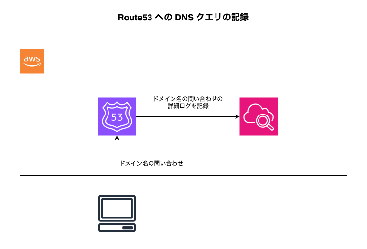
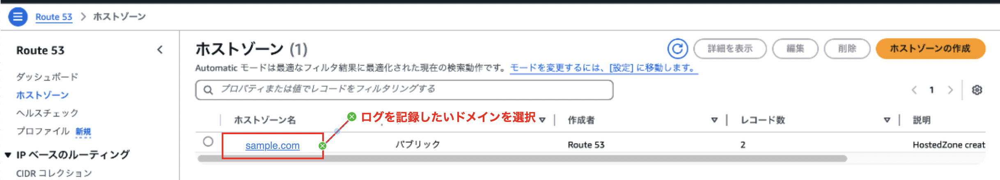
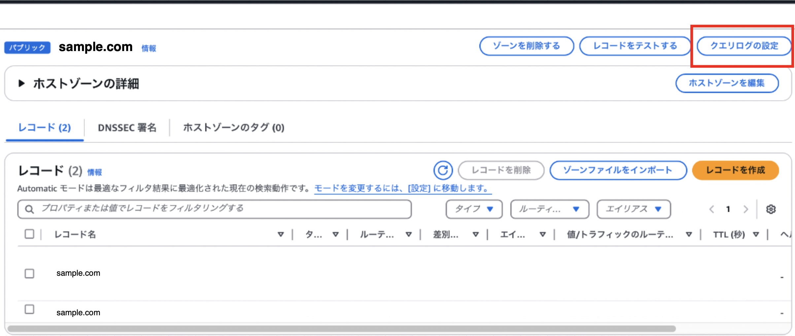
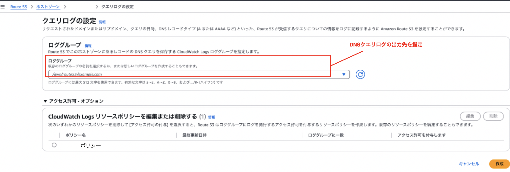
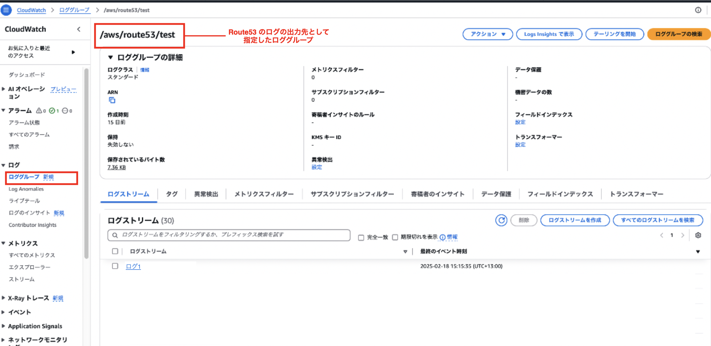
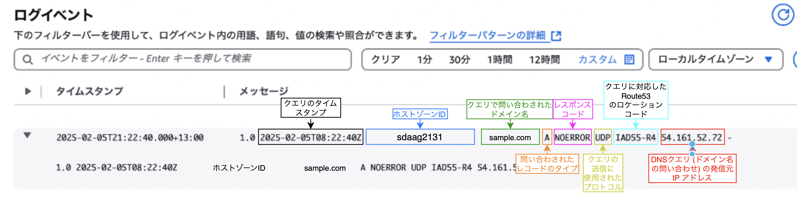

###  DNS クエリのログを記録

#### 概要

- Route53 で管理しているドメイン名への DNS クエリのログを CloudWatch Logs に記録する

 

#### 設定手順

1. AWS マネージドコンソールにログインし、Route53 画面に遷移後、ログを取りたいホストゾーンを選択

    - イメージ的には、ログの対象となるドメイン名を選択する感じ

    

 

2. ホストゾーン詳細画面の `クエリログの設定` をクリック

    

 

3. ログの出力先となるロググループを選択し、 `決定` をクリック

    

---

### DNS クエリログの確認

- CloudWatch Logs にあるログの出力先に指定したロググループを選択

    

 

#### ログの見方

ログには以下の情報が出力される

- クエリのタイムスタンプ
- クエリで問い合わせのあったホストゾーン ID
- クエリで問い合わせのあったドメイン名
- クエリで問い合わせのあった レコードタイプ (A や AAAA など)
- DNS レスポンスコード (NoError や ServFail など)
- クエリ送信に使用されたプロトコル
- DNS クエリに応答した Route 53 エッジロケーション
- クエリの発信元 IP アドレス

 
 

参考サイト

[パブリック DNS クエリのログ記録](https://docs.aws.amazon.com/ja_jp/Route53/latest/DeveloperGuide/query-logs.html#query-logs-format)
