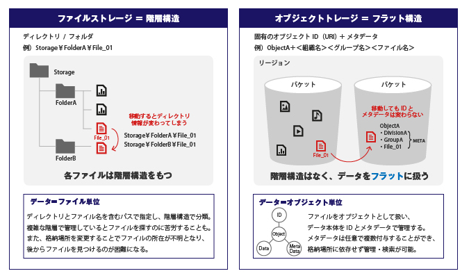
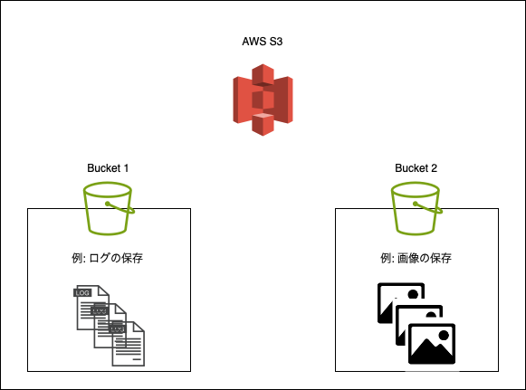
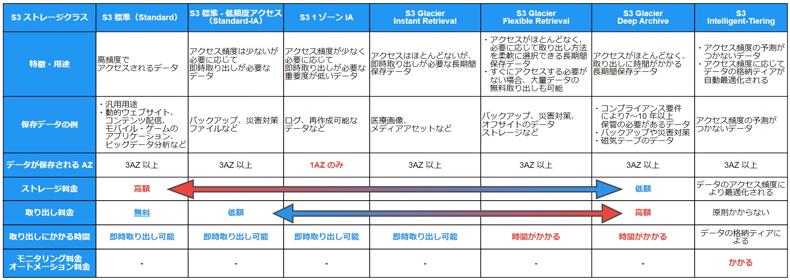
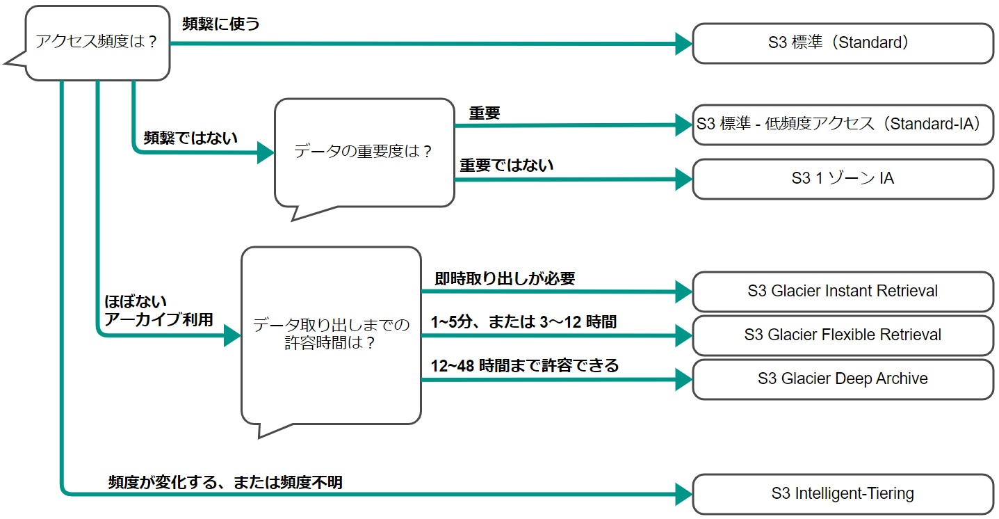

### S3 とは

AWS 上で提供されるストレージサービス

マネージドサービスなので、OSのアップデートなどは AWS 側の責任範囲

 

**特徴**
- 可用性が高い
    - 自動で同リージョン内の他の AZ に複製されるため、1 AZ で障害が発生しても稼働する

- 無制限にデータを保存できる
    - アップロードできる1ファイルのサイズは5TBまでという制限はあるが、 S3 自体の保存できるデータの総容量は無制限
    - 大量のデータを保存するためのストレージに利用されたりする

- 暗号化
    - S3 への保存の際に、 S3 サイドで暗号化してから保存できる
    - S3 からのデータ転送の際に S3 サイドで暗号化してから転送できる

- データの保存期間を設定できる
    - 「ライフサイクル」という機能を利用して、データを保存してから一定期間を過ぎた場合、そのデータを削除、他のストレージに移動することができる

- 柔軟な権限管理
    - [バケット]()単位、オブジェクト単位でアクセス権の設定が可能

- HTTP/HTTPS からもアクセスできるので、静的なウェブサイトのホストにも利用できる

- バージョニング
    - オブジェクト (保存データ)のバージョンを管理することもできる
    - 過去のバージョンのオブジェクトも保存ことになるので、その分ストレージが利用され利用料金は増大することに注意

 
 

参考サイト

S3 について
- [Amazon S3とは？3分でわかる用語解説](https://www.itechh.ne.jp/blog/column/S3-explain.html)

S3 の暗号化について
- [Amazon S3の暗号化について調べてみた。](https://dev.classmethod.jp/articles/lim-s3-sse-2021/)

S3 のバージョニングについて
- [【AWS】Amazon S3の基本まとめ](https://ameblo.jp/bakery-diary/entry-12801023539.html#4.1)

---

### オブジェクトストレージとは

データを「オブジェクト」として保存するストレージ形態

オブジェクトとは以下のデータで構成される

- データを一意に認識するための ID
- データの属性を表すメタデータ
- データ本体

引用: [＜テープで実現＞安価×セキュアなS3互換のオブジェクトストレージ](https://lto.co.jp/hpgen/HPB/entries/36.html)

 
 

参考サイト

[＜テープで実現＞安価×セキュアなS3互換のオブジェクトストレージ](https://lto.co.jp/hpgen/HPB/entries/36.html)

---

### バケットとは

- バケットとは、S3内のデータを管理する基本単位

- S3 に保存されるオブジェクトのコンテナ (DBとかフォルダのイメージ)

- 1バケットに保存できるデータの総容量とファイル（オブジェクト）数は無制限

---

### ストレージクラスとは

- ストレージの種類
    - 利用する種類によってデータの取得速度、可用性 (複製が作成される AZ 数)、 利用料金に違いがでる

引用: [S3 ストレージクラスの選択に迷った時みるチャートを作ってみた（2023年度版）](https://dev.classmethod.jp/articles/should_i_choice_s3_storage_class_2023/)

 

- 上記画像の「取り出し」とは
    - データの取得のこと
    - 利用するストレージによってデータの取得に時間がかかる理由は [S3 と S3 Glacier の違い](#s3-と-s3-glacier-の違い) を参照

 

- どのストレージクラスを利用するべきか
    - 以下のチャートが役立ちそう

引用: [S3 ストレージクラスの選択に迷った時みるチャートを作ってみた（2023年度版）](https://dev.classmethod.jp/articles/should_i_choice_s3_storage_class_2023/)

---

### S3 と S3 Glacier の違い

S3 Glacier の特徴

- 主にアクセス頻度が低いデータアーカイブ保持を意識して作られたストレージタイプ

- 元々は S3 とは別のサービスだったが、現在では S3 のストレージタイプの1種

- S3 Glacier Instant Retrival はすぐにデータを取得できるが、それ以外の Glacier はデータの取得に時間がかかる
     - データ(オブジェクト)を取得する際に、対象オブジェクトの復元という処理が必要だから
    
- ストレージ容量の利用料金は安いが、 Glacier へのリクエストにかかる料金は高い

 

S3 Glacier のユースケース

- ログデータの保存

 
 

参考サイト

Glacier 系でデータの取得に時間がかかる理由

- [[アップデート]Amazon S3 Glacier Flexible Retrieval でデータの復元時間が最大 85% 短縮されました](https://dev.classmethod.jp/articles/amazon-s3-glacier-flexible-retrieval-improves-restore-time/)

- [Glacierに保存したオブジェクトをまとめて復元するシェルスクリプト](https://qiita.com/suzuki_kento/items/1f7e506bbf37deb8baf6)

---

### ライフサイクル機能によるデータ移行の注意点

S3 に保存して一定期間経過したデータを ライフサイクル機能を利用して Glacier に移行し、ストレージ容量にかかる料金を抑えたい

ポイント
- S3 と同じリージョンでの AWS サービス間でのデータのやり取りには転送料はかからない

- 一方、 **移行先の Glacier へのリクエスト**(PUT) には料金がかかる

- また、S3 Glacier または S3 Glacier Deep Archive に保存されるオブジェクトに 40KB のデータが追加されて保存される
    
    ->オブジェクト数が多ければ多いほどストレージ容量を食う

 

S3 にそのまま保存しておくのか、 Glacier にデータを移行するのかは、計算して試算を出すのがいい

 

参考サイト

[CloudTrailの証跡データをS3ライフサイクルでGlacierに移行する際の損益分岐点を探る](https://dev.classmethod.jp/articles/explore-breakeven-points-when-migrating-cloudtrail-trail-data-to-glacier-in-s3-lifecycles/)

---

### 利用料金

以下の3点に関して料金が発生する

*リージョンや利用するストレージの種類(ストレージクラス)によって料金は異なる

- 実際に使用されているストレージの容量
    - 1GB あたり ~~ UDS で料金が出されている
    - 例: バージニア北部で 1GB あたり 0.025 UDS (高くて 0.01 UDS) ぐらい

- データの転送容量
    - アップロードのデータ転送量は無料 (アップロードリクエストには料金が発生する)
    - 同一リージョン内のAWSサービスへの送信、受信は無料
    - インターネット経由でダウンロードするケース等では料金が発生する
    - 1GB あたり ~~ USD で料金が出されている
    - 月毎の総データ転送量に応じて 高くても大体 0.09USD/GB (バージニア北部) 

- S3 へのリクスト数(PUT や GET など)
    - リクエストの種類によって料金は異なる
    - DELETE リクエストおよび CANCEL リクエストは無料
    - 1000 リクエストで　~~ UDS で料金が出されている
    - 1000リクエストで 0.025 UDS (高くて0.06 USD (バージニア北部)) ぐらい

 
 

参考サイト

- [Amazon S3 の料金](https://aws.amazon.com/jp/s3/pricing/)

- [【AWS初学者向け】S3のストレージクラスとその料金](https://academ-aid.com/qualif/aws/s3-storage-class)

- [S3の料金体系が分かりにくいと聞かれたので纏めた](https://qiita.com/kawaz/items/07d67a851fd49c1c183e)