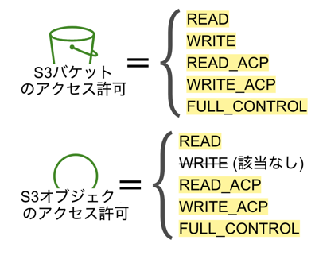

### S3 の ACL

バケットとデータ(オブジェクト)にアタッチされるもの

リソース(バケットやオブジェクト)に対するアクセスがあった場合 S3 は対応する ACL を確認してアクセスの許可をする

*ACL はアクセスの許可のみの設定で、~~のアクセスは拒否するという設定はできない

現在では S3 へのアクセス権限の管理はACLではなく、バケットポリシー、IAM ロールで行うのが一般的

<br>

基本的な概念

- 非付与者 (Grantee): バケット、そのバケットに保存されているデータ(オブジェクト)にアクセスするユーザーのこと


引用: [S3のアクセスコントロールリスト(ACL)の基礎を学ぼう](https://dev.classmethod.jp/articles/amazon-s3-acl-basics/)

<br>

- 非付与者は以下のパターンに限定される

    - 正規ユーザーIDを指定して、 個別の AWS アカウントを非付与者にする

    - 事前定義済み S3グループ: S3 が事前に定義している非付与者のグループ
    
        - All Users グループ: AWS アカウントのユーザーである/ないに関わらず、世界中の人を指す

        - Authenticated Users グループ: AWS アカウントのユーザーであればどんな人でもを指す

        - Log Delivery グループ: S3のサーバーアクセスログを書き込むAWSのシステムを指す

            Log Delivery グループに、オブジェクトの書き込み、バケットACLの読み込みの権限を許可することで、別バケットにアクセスログを保存することが可能になる

            $\color{red}現在では、アクセスログの記録にも ACL ではなく、バケットポリシーを利用することが推奨されているらしい
            $ ([こちら](https://dev.classmethod.jp/articles/s3-server-access-logging-using-bucket-policy-not-using-acl/) を参照)

            *S3サーバアクセスログとは、S3バケット内のオブジェクトに対する操作やアクセスをログとして記録する機能


引用: [S3のアクセスコントロールリスト(ACL)の基礎を学ぼう](https://dev.classmethod.jp/articles/amazon-s3-acl-basics/)

<br>

- 許可の種類

    以下の画像のようにバケットに対するアクセス許可の種類は5つ、オブジェクトに対するものは4つとなっている



引用: [S3のアクセスコントロールリスト(ACL)の基礎を学ぼう](https://dev.classmethod.jp/articles/amazon-s3-acl-basics/)

- それぞれの許可の意味


引用: [S3のアクセスコントロールリスト(ACL)の基礎を学ぼう](https://dev.classmethod.jp/articles/amazon-s3-acl-basics/)

<br>

**ACL 設定 (json版)**

```json
{
   "Owner": {
        "DisplayName": "対象のバケット/オブジェクトの所有者名",
        "ID": "↑のAWSアカウントID"
    },
    "Grants": [
        {
            "Grantee": {
            "DisplayName": "非付与者のAWSアカウント名もしくは事前定義済み S3グループ",
            "ID": "↑のAWSアカウントID",
            "Type": "↑の種類"
        },
        "Permission": "FULL_CONTROL" // 付与される許可の種類 
        },
        {
            "Grantee": {
                ...
            },
            "Permission": "~~"
        }
    ]
}
```

<br>

**ACL 設定 (AWSコンソール版)**

- AWS コンソールにて、 S3 ダッシュボードの「バケット」より、対象のバケットを選択し、「アクセス許可」タブをクリック


<br>

「アクセス許可」画面をスクルールしていくと、「アクセスコントロールリスト(ACL)」のセクションがある


*ACLを無効にしているので、「編集」ボタンがグレーアウトされている

<br>
<br>

参考サイト

ACL とはについて
- [S3のアクセスコントロールリスト(ACL)の基礎を学ぼう](https://dev.classmethod.jp/articles/amazon-s3-acl-basics/)

ACL を無効化にした場合の S3 のサーバーログの取得について
- [ACL無効化が推奨されたことでS3のサーバアクセスログ記録のためのアクセス許可はどうなったのか!?確認してみた](https://dev.classmethod.jp/articles/s3-server-access-logging-using-bucket-policy-not-using-acl/)
