### バケットポリシーとは

ポイント
- バケットにアタッチするアクセスコントロール設定
- バケットポリシーはポリシードキュメントという JSON 形式で記述する (IAMポリシーの JSON 版と同じ記法)

---

### S3のバケットポリシー

1. AWS コンソールから S3 ダッシュボード画面に遷移

2. サイドメニューの「バケット」から、バケットポリシーを確認/編集したいバケットを選択

3. 「アクセス許可」タブを選択し、「バケットポリシー」の「編集」をクリック


<br>

4. 直接 JSON を記述するか、右側の「ステートメントを編集」を使って、バケットポリシーを編集可能。編集が終わったら、「変更の保存」をクリック


--- 

### バケットポリシーの見方

```JSON
{
    "Version": "2012-10-17",
    "Statement":　{
            "Sid": "Stmt1621068192000",
            "Effect": "Allow",
            "Principal": {
                "AWS": "*"
            },
            "Action": "s3:*",
            "Resource": "arn:aws:s3:::bucket-name",
            "Condition": {
                "IpAddress": {
                    "aws:SourceIp": "xxx.xxx.xxx.xxx",
                },
            }
        }
}
```

<br>

各項目とその説明

- Version: ドキュメントポリシーの文法のバージョン
- Statement: 権限の設定単位
    - Sid: ステートメントID (**文字列のため "firstStm"とかでもいい**)

    - Effect: Allow(許可)かDeny(拒否)

    - Principal: 誰に対するアクセス設定なのか (下のアクションの実行者)

    - Action: 当Statementで制御(Allow/Deny)するアクション
        - アカウント、ロール、IAMグループ、AWSサービスなどを指定できる
        - サービス名.* でそのサービスの全ての操作を指定できる

    - Resource: Allow/Denyする対象の操作(バケットのARNなど)
        - サービス名.* でそのサービスの全ての操作をAllow/Denyできる

    - Condition: Allow/Denyの条件
        - IPアドレスの制限
        - ユーザー名による制限

            など様々な条件を設定することができる

<br>

ステートメントは複数設定可能
- Statementに\[\](配列)の形で指定し、中に\{\}で個別のStatementを記述する

```JSON
{
    "Version": "2012-10-17",
    // Statementに[]を設定する
    "Statement": [
        // 内部にて、{}で個別のStatementを記述する
        {
            "Sid": "1"
            // 特定のユーザーが特定のS3バケットにアップロードするアクションの許可
        },
        {
            "Sid": "2"
            // 特定のユーザーが特定のS3バケットからデータを取得するアクションの許可
        }
    ]
}
```

<br>

Principal や Action, Resource, Condition などにも複数の値を設定可能

*Statementと同様に\[\]の配列の形で設定する (**Conditionはちょっと異なる**)

```JSON
{
    "Statement": {
        "Sid": "xxx",
        "Effect": "Allow",
        "Principal": {
            "AWS": [
                "xxxxxxxxxxxx", // 特定のユーザーを指定したり(アカウントIDやARN)、
                "arn:aws:iam::xxxxxxxxxxxx:group/{group-name}", // 特定のIAMグループも指定できる
            ],
        },
        "Action": [
            "s3:GetObject", // S3のデータを取得する操作
            "s3:PutObject" // S3にデータを保存する操作
        ],
        "Resource": [
            // AWSのインスタンスのARNで特定のバケットを指定したり、
            "arn:aws:s3:::bucket-name", 
            //特定のバケット内のオブジェクトを指定したりできる
            "arn:${Partition}:s3:::bucket-name/object-name"
        ],
        "Condition": {
            // Conditionは複数の条件があっても{}でくくる
            // なお複数条件を設定した場合、全ての条件をクリアしないとアクションの許可はされない(今回の場合はAllowのStatementだから)

            //1つ目の条件(IPアドレス制限)
            "IpAddress": {
                // 特定の項目には[]で括って複数値を設定する
                "aws:SourceIp": [
                    // もしアクションを実行するprincipalのIPがxxx.xxx.xxx.xxxだったら、許可する
                    "xxx.xxx.xxx.xxx",
                    // または、以下のIPアドレスに属するIPだったら許可
                    "192.228.xx.xx/32"
                ],
            },
            // 2つ目の条件(ユーザー名制限)
            "StringEquals": {
                // ユーザー名が以下の通りだったら、アクションを許可
                "aws:username": "yyyyy" 
            },
        },
    },
}
```

<br>
<br>

参考サイト

ポリシードキュメントの基本について
- [S3のバケットポリシー書き方まとめ](https://qiita.com/irico/items/a3ab1f8ebf1ece9cc783)
- [JSONポリシーについて簡単にまとめ](https://www.capybara-engineer.com/entry/2019/12/07/212926)

Principalについて
- [AWS JSON ポリシーの要素: Principal](https://docs.aws.amazon.com/ja_jp/IAM/latest/UserGuide/reference_policies_elements_principal.html)

---

### "Principal": "*" の意味

- パブリックアクセスを意味する = (AWSアカウントの有無に関係なく)誰でも

- 次の書き方は同じパブリックアクセスを意味する
```JSON
"Principal": "*"
```

```JSON
"Principal": {
    "AWS": "*"
}
```

<br>
<br>

参考サイト

[S3バケットのバケットポリシーで「Principal: "*"」とすることの意味について](https://qiita.com/st10/items/d5a4737d6e5ede77ea3f)

[AWS JSON ポリシーの要素: Principal](https://docs.aws.amazon.com/ja_jp/IAM/latest/UserGuide/reference_policies_elements_principal.html#principal-anonymous)

[S3のバケットポリシー書き方まとめ](https://qiita.com/irico/items/a3ab1f8ebf1ece9cc783)

[バケットポリシーとユーザーポリシー - Amazon Simple Storage Service](https://zenn.dev/mn87/articles/726f7e3574e2fb)

---

### "Resource" を正しく理解する

バケットポリシーの Action によって、操作対象の Resourec の種類が決まっている

- Action 対象の Resource が正しく設定されていない場合、実行がエラーになる

<br>

例: "Action": "s3:GetObject"

```JSON
{
    "Version": "~~",
    "Statement": {
        "Action": {
            "s3:GetObject"
        },
        "Resource": {
            "arn:aws:s3:::bucket-name"
        },
    }
}
```

上記バケットポリシーについて
- Resource は"bucket-name"という$\color{red}バケット$
- Action の s3.GetObject の対象はバケットではなく$\color{red}オブジェクト$

→ よって、上記のバケットポリシーは誤り

<br>

"Action": "s3:GetObject"の正しい設定

```JSON
{
    "Version": "~~",
    "Statement": {
        "Action": {
            "s3:GetObject"
        },
        "Resource": {
            "arn:aws:s3:::bucket-name/*"
        },
    }
}
```

上記バケットポリシーについて
- Resource は"bucket-name"というバケットの全ての$\color{red}オブジェクト$
- Action の s3.GetObject の対象は$\color{red}オブジェクト$

→ よって、上記バケットポリシーの Action の対象と esource の種類は正しく設定されている

<br>

複数の Action とそれぞれの Action に対応する Resource をまとめて1つの Statement に記述することもできる

- Action について
    - s3:ListBucket の対象は**バケット**
    - s3.GetObject の対象は**オブジェクト**

- Resource について
    - "bucket-name"という**バケット**
    - "bucket-name"というバケット内の全ての**オブジェクト**

```JSON
{
    "Version": "~~",
    "Statement": {
        "Action": [
            "s3:ListBucket"
            "s3.GetObject",
        ],
        "Resource": [
            "arn:aws:s3:::bucket-name",
            "arn:aws:s3:::bucket-name/*"
        ]
    }
}
```

<br>
<br>

参考サイト

Action と Resource の関係について
- [S3のポリシーに定義した「Resource」を正しく理解できていますか？](https://dev.classmethod.jp/articles/how-to-write-resource-of-s3-bucket-policy-and-iam-policy/)

各アクションの対象一覧
- [Amazon S3 のアクション、リソース、条件キー](https://docs.aws.amazon.com/ja_jp/service-authorization/latest/reference/list_amazons3.html#amazons3-actions-as-permissions)

---

### バケットポリシーと IAM ポリシー

バケットポリシー
- バケットに設定する
- 対象のバケットに対して、一元にアクセス元の許可/拒否を管理したい場合に利用すると便利

<br>

IAMポリシー(ロール)
- ユーザーや AWS インスタンスに設定する
- バケットポリシーとは逆に、対象のユーザーに対し一元にアクセス先の許可/拒否を管理したい場合に利用すると便利

<br>

簡単な比較

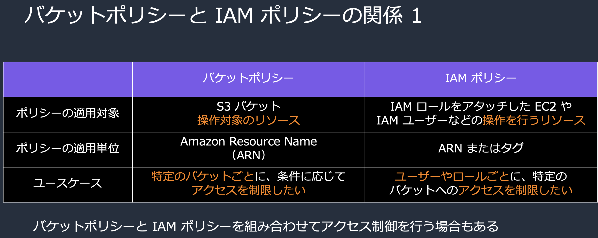

引用: [Amazon Simple Storage Service (Amazon S3) 27p](https://pages.awscloud.com/rs/112-TZM-766/images/AWS-Black-Belt_2023_Amazon_S3_Security_0131_v1.pdf)

<br>

#### シングルアカウント/クロスアカウントで S3 を運用する場合

シングルアカウントで運用する場合
- バケットポリシーまたは IAM ポリシー(ロール)の$\color{red}どちらかに$アクセス許可を設定すれば、 S3 バケット/オブジェクトにアクセス可能


引用: [S3のバケットポリシーでハマったので、S3へのアクセスを許可するPrincipalの設定を整理する](https://dev.classmethod.jp/articles/summarize-principal-settings-in-s3-bucket-policy/)

<br>

クロスアカウントで運用する場合 **(バケット所有者でない場合)**
- バケット所有者側のバケットポリシーとアクセス側での IAM ポリシー(ロール)の$\color{red}両方で$アクセス許可の設定が必要

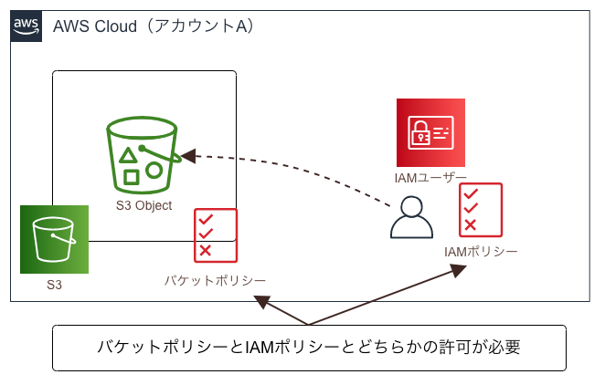

引用: [S3のバケットポリシーでハマったので、S3へのアクセスを許可するPrincipalの設定を整理する](https://dev.classmethod.jp/articles/summarize-principal-settings-in-s3-bucket-policy/)

<br>

#### バケットポリシーと IAM ポリシー/ロールのどちらが強いのか

ポイント
- バケットポリシーと IAM ポリシー/ロールのどちらかで**明示的な拒否**の設定がされている場合
    - 対象のアクセスは失敗する

<br>

- バケットポリシーと IAM ポリシー/ロールのどちらにも明示的な拒否がない場合
    - どちらかに明示的な許可がある場合
        - 対象のアクセスは成功する

    - どちらにも明示的な許可がない場合
        - 対象のアクセスは失敗する

*クロスアカウントアクセスの場合、バケットポリシーと IAM ポリシー/ロールの両方で明示的な許可が必要

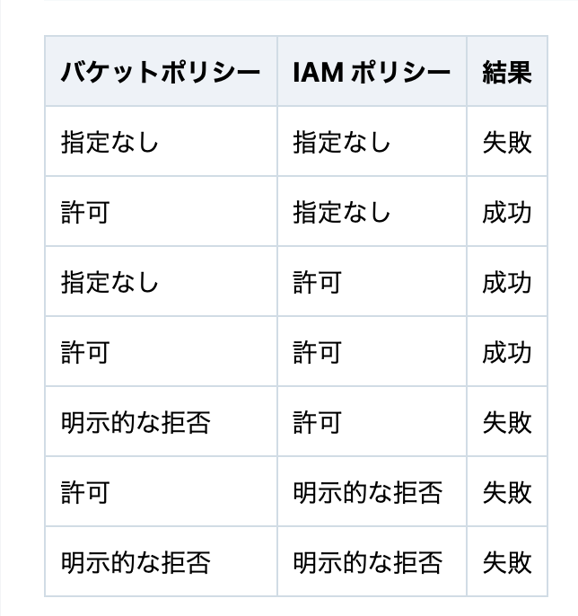

引用: [S3 のオブジェクトACLの無効化が推奨となったので、改めて IAM ポリシーと S3 バケットポリシーの評価論理をまとめてみた](https://dev.classmethod.jp/articles/s3-iam-policy-kanzennirikaishita/)

<br>
<br>

参考サイト

バケットポリシーと IAM ポリシー(ロール)の違い
- [S3バケットポリシーとIAMポリシーの関係を整理する](https://www.bioerrorlog.work/entry/s3-bucket-policy-vs-iam-policy)

バケットポリシーと IAM ポリシーの片方または両方でアクセス許可が必要なケース
- [S3のバケットポリシーでハマったので、S3へのアクセスを許可するPrincipalの設定を整理する](https://dev.classmethod.jp/articles/summarize-principal-settings-in-s3-bucket-policy/)

バケットポリシーと IAM のどちらが強力なのか
- [S3 のオブジェクトACLの無効化が推奨となったので、改めて IAM ポリシーと S3 バケットポリシーの評価論理をまとめてみた](https://dev.classmethod.jp/articles/s3-iam-policy-kanzennirikaishita/)

---

### オブジェクトの所有者とアクセス

- デフォルトでは、オブジェクトにはそのオブジェクト所有者のみがアクセス可能
    - たとえ、バケットの所有者であろうと他の人が所有者となっているオブジェクトにはアクセスできない

- ACL を無効にするとオブジェクトの所有者は、バケットの所有者になる
    - たとえ他のユーザーからアップロードされたオブジェクトでも、所有者はバケットの所有者になる

#### バケットポリシーは 「バケットの所有者=オブジェクトの所有者」 のオブジェクトにしか作用しない

- バケットを新規作成する場合、AWS 公式が勧めている通り、オブジェクトライターに関係なく「オブジェクトの所有者 = バケットの所有者」になるよう ACL を無効にし、アクセス管理はバケットポリシー & IAM ポリシー/ロールで行う方が楽 (特別な理由がない場合)

<br>
<br>

参考サイト

オブジェクトの所有者とアクセス権

[SAA学習-S3-オブジェクト所有者の変更](https://in-housese.hatenablog.com/entry/2021/05/10/082954)

バケットポリシーとオブジェクトの所有者について

[S3クロスアカウントアクセスと所有権を理解する](https://zenn.dev/delta/articles/3fa05d8ecf236d#s3バケットポリシーはバケット所有者とオブジェクト所有者が同じオブジェクトにしか作用しない)

---

### ブロックパブリックアクセスとは

S3バケットが誤ってパブリックに公開されるのを防ぐ仕組み
- ブロックパブリックアクセスを有効化しておくと、バケットポリシーで "principal": "*" の設定ができなくなる

    -> パブリックに公開されるのを防ぐ
    
<br>

ブロックパブリックアクセスには2つのレベルがある
- アカウントレベルのブロックパブリックアクセス 
    - その AWS アカウントに存在するすべての S3 バケットに対してのブロックパブリックアクセス設定

    - AWS コンソールの S3 ダッシュボードにて、「このアカウントのブロックパブリックアクセス設定」をクリック

    

    <br>

- バケットレベルのブロックパブリックアクセス
    - 1 つの S3 バケット単体に対してブロックパブリックアクセス設定

    - AWS コンソールの S3 ダッシュボードにて、任意のバケットを選択し、「アクセス許可」タブをクリック

    

<br>

実際にブロックパブリックアクセスはどのように機能するのか?
- 例: バケットレベルのブロックパブリックアクセスを有効化、そのバケットのバケットポリシーを変更し、オブジェクトをパブリックに公開しようとすると

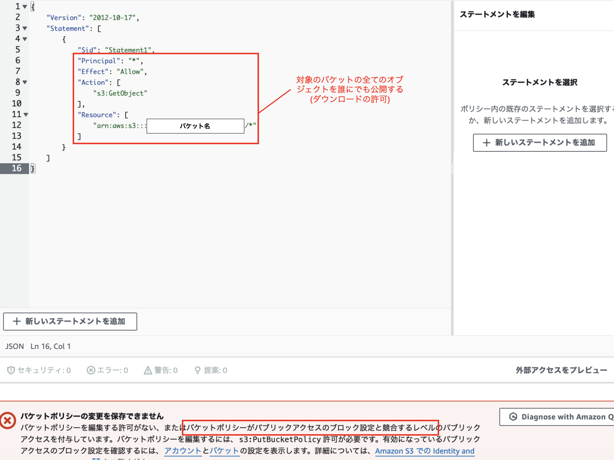

結果: バケットポリシーがブロックパブリックアクセスに競合し、エラーとなる

<br>

ブロックパブリックアクセスの各項目について

- アカウントレベルもバケットレベルもブロックパブリックアクセスの項目は同じ


- 新しいアクセスコントロールリスト (ACL) を介して付与されたバケットとオブジェクトへのパブリックアクセスをブロックする
    - 新規に作成する ACL でパブリックに公開する設定をできなくする

<br>

- 任意のアクセスコントロールリスト (ACL) を介して付与されたバケットとオブジェクトへのパブリックアクセスをブロックする
    - 既存 ACL にて、パブリックに公開する設定を削除する

<br>

- 新しいパブリックバケットポリシーまたはアクセスポイントポリシーを介して付与されたバケットとオブジェクトへのパブリックアクセスをブロックする
    - 新規に作成するバケットポリシーでパブリックに公開する設定をできなくする

<br>

- 任意のパブリックバケットポリシーまたはアクセスポイントポリシーを介したバケットとオブジェクトへのパブリックアクセスとクロスアカウントアクセスをブロックする
    - 既存のバケットポリシーでパブリックに公開する設定をできなくする。かつ[クロスアカウントアクセス](#クロスアカウントアクセスとは)の設定もできなくする

<br>

2つのブロックパブリックアクセスの競合について

以下の競合ケースを考える

1. アカウントレベルのブロックパブリックアクセスは ON で、バケットレベルのブロックパブリックアクセスは OFF
    - 無理らしい。バケットレベルのブロックパブリックアクセスを OFF にしてバケットをパブリックに公開しようとしても、アカウントレベルのブロックパブリックアクセスが ON ならばバケットの公開はできない

    - 上記の理由: アカウントレベルのブロックパブリックアクセスの方が強いから

<br>

2. アカウントレベルのブロックパブリックアクセスは OFF で、バケットレベルのブロックパブリックアクセスは ON
    - 十分にあり得る。ユースケースとしては、個別にパブリックに公開したいバケットと、プライベートにしておきたいバケットがある場合など

<br>

ブロックパブリックアクセスに関するよくある勘違い

以下は誤り
- ブロックパブリックアクセスを OFF にするとパブリックに公開されてしまう

正しくは、
- ブロックパブリックアクセスを OFF にすると、パブリックに公開する**設定が可能になる**

→ ブロックパブリックアクセスを OFF にしても、バケットポリシー や ACL でアクセスの許可を設定しなければ、誰もアクセスできない

<br>
<br>

参考サイト

ブロックパブリックアクセスについて
- [s3のブロックパブリックアクセス とは](https://qiita.com/miyuki_samitani/items/61c736f300424b9be3fa)

- [[小ネタ] AWS アカウントレベルの S3 ブロックパブリックアクセスが設定されていて S3 のオブジェクトを公開するのに少し手間取った](https://dev.classmethod.jp/articles/i-had-a-bit-of-trouble-publishing-s3-objects-because-of-the-aws-account-level-s3-block-public-access-set-up/)

ブロックパブリックアクセスの各項目について
- [S3で誤ったデータの公開を防ぐパブリックアクセス設定機能が追加されました](https://dev.classmethod.jp/articles/s3-block-public-access/)

どちらのブロックパブリックアクセスが強いのか
- [アカウントレベルのブロックパブリックアクセスを有効化した場合、バケット毎にブロックパブリックアクセスを無効化することはできるのか教えてください](https://dev.classmethod.jp/articles/tsnote-account-block-public-access-01/)

---

### クロスアカウントアクセスとは

S3 バケットを所有していない他の AWS アカウントからのアクセス


引用: [AWS：S3のクロスアカウントアクセスを試してみよう](https://bunsugi.com/s3-cross-acount-access/)

<br>

#### クロスアカウントアクセスを試してみる

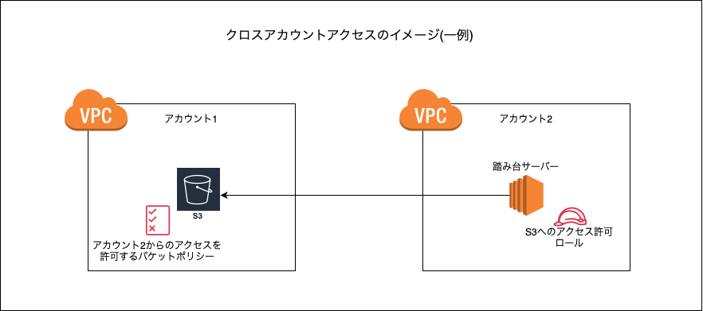

用意するもの
- AWS アカウト1 (バケット所有者)
    - バケット
    - バケットポリシー

- AWS アカウト2 (アカウト1のバケットにアクセスするアカウント)
    - EC2 (アカウント1のバケットへアクセスする手段)
    - S3(バケット)へのアクセスを許可するIAMポリシー/ロール

<br>

ポイント
- $\color{red}バケットポリシーとIAMポリシー/ロールの両方でアクセス許可の設定をしなければならない$
- バケットポリシーでアカウント2からのアクセスを許可する
- アカウント2にて、アカウント1のバケットへのアクセスを許可するIAMロールを作成する
- 適切なアクションをIAMポリシー/ロールで許可すること
- 適切なアクションをバケットポリシーで許可すること

<br>


1. アカウント1のバケットにて、アカウントBからのアクセスを許可するよう設定する 

    - バケットには確認用にindex.htmlというファイルをアップロードしておく

    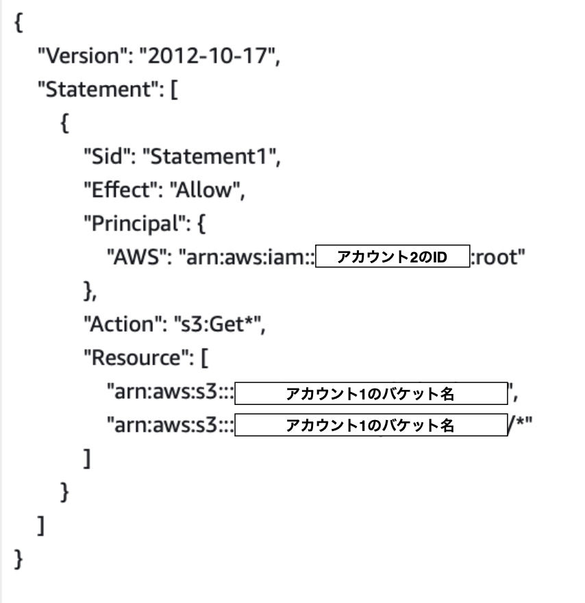

<br>

2. アカウント2にて、s3(バケット)へのアクセス許可をもつ IAM ロールを作成する (今回はバケットに対して読み取りだけ行いたい)

    - IAM ロールを EC2 にアタッチする方法は[こちら](./EC2からS3へのアクセス.md)を参照

    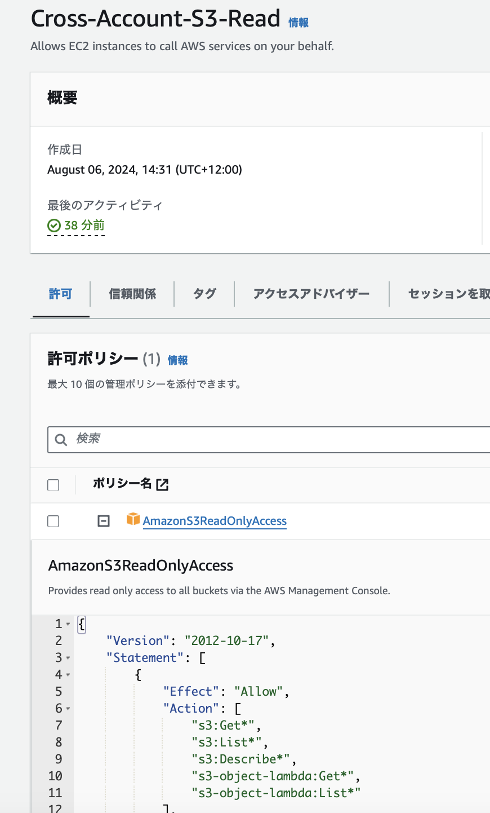

<br>

3. アカウント2にて、踏み台サーバーを作成し、 IAM ロールをアタッチする

    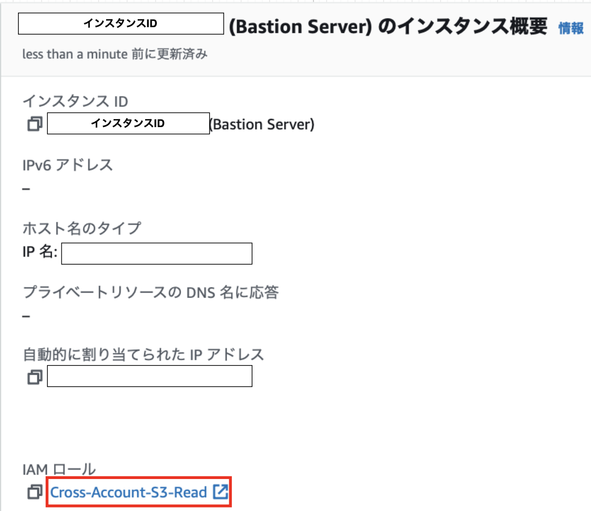

<br>

4. ssh で踏み台サーバーにログインし、 s3 コマンドでバケットのオブジェクト(データ)一覧を表示する

    - ssh で踏み台サーバーにログインする方法は[こちら](./踏み台サーバー.md)を参照

    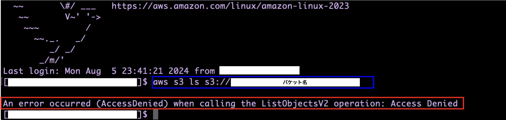

<br>

エラーが発生した

- なぜエラーが発生したのか？

    → バケットポリシーか IAM ロールの許可設定に誤りがあった

    - s3 ls コマンドは s3:List 系のアクション
        
    → IAM ロールでは、s3:List系アクションを許可しているが、**バケットポリシー側では s3:Get 系のアクションした許可していなかった**

<br>

5. バケットポリシー側で、 S3:List 系アクションを許可 Statement に追加する

    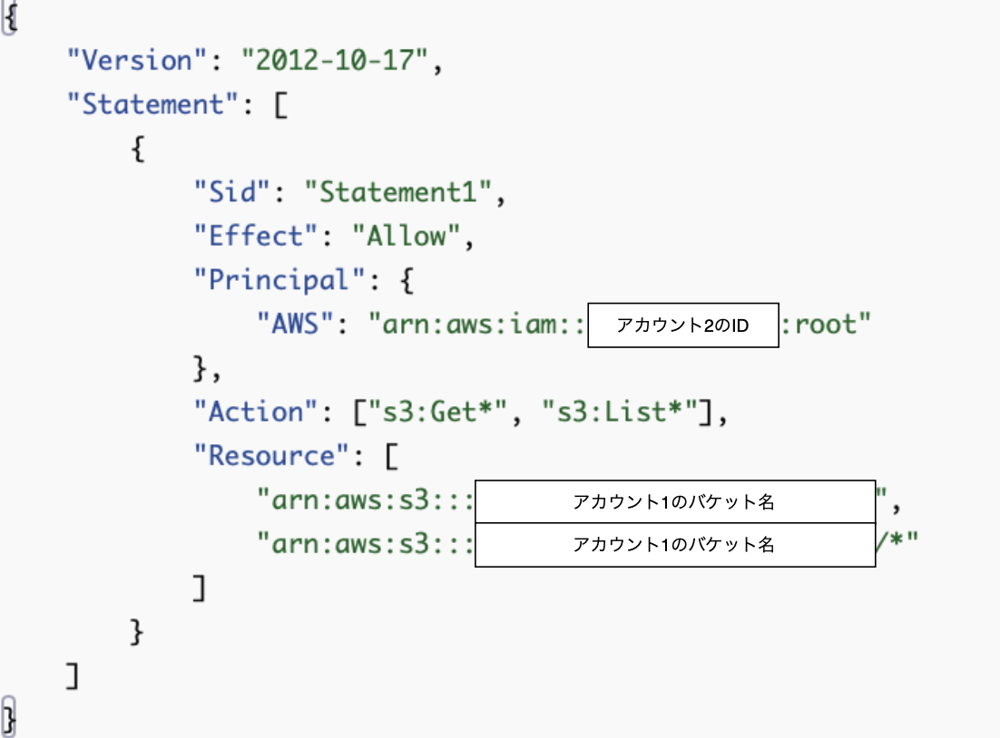

<br>

6. 再度アカウント2の踏み台サーバーからアカウント1の s3 バケットの中身を取得してみる

    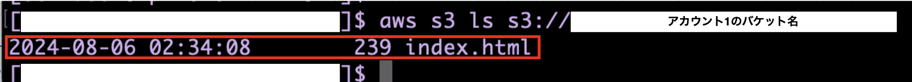

<br>

結果、バケットの中身が取得できた

<br>
<br>

参考サイト

[S3のクロスアカウントアクセス方法(とにかく簡単編)](https://www.cloudbuilders.jp/articles/1932/)