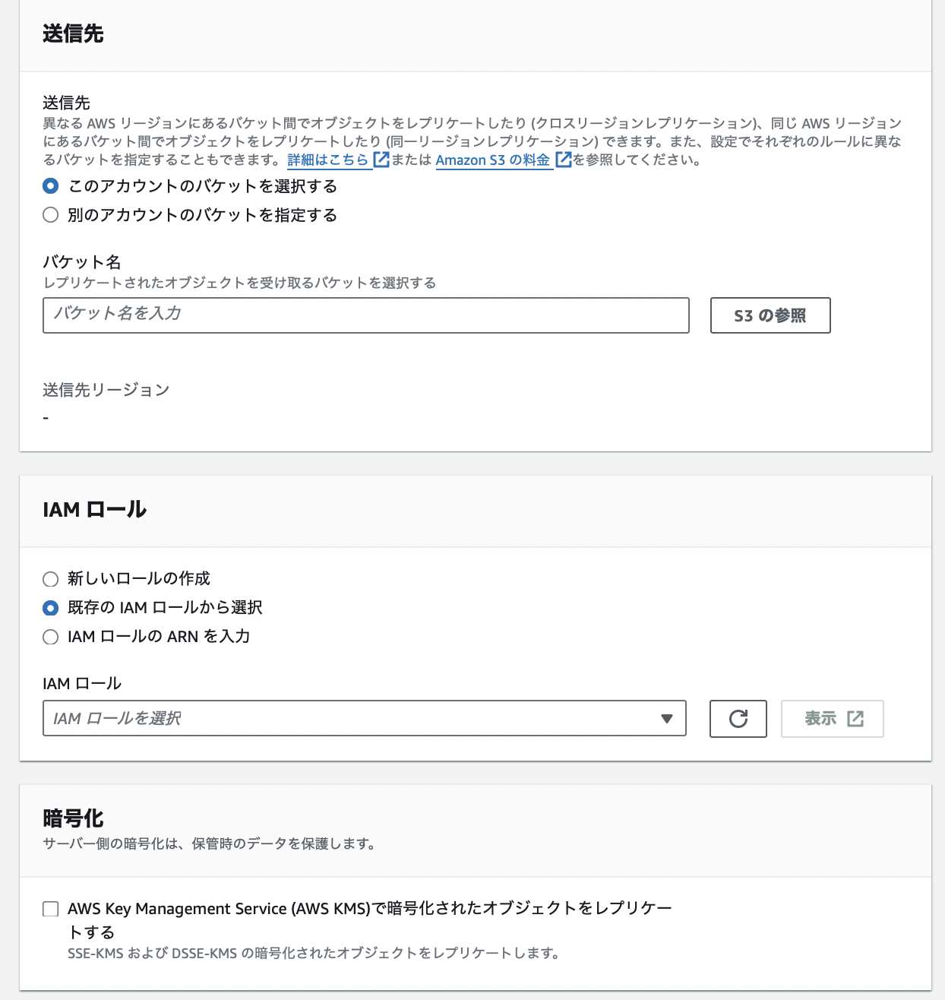
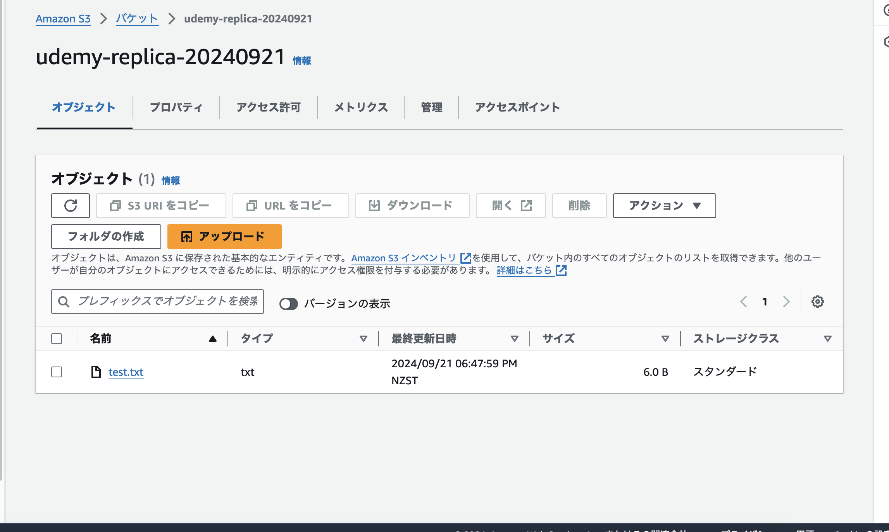

### S3 の複製

- S3はリージョンを指定して作成する

- 他のリージョンにバックアップないし、複製を作成したい場合に利用する機能

*複製元、複製先のバケットの両方を $\color{red}\text{バージョニングを有効にする}$ 必要がある

---

### レプリケーションの方法

1. マスタとなる S3 バケットとレプリケーション S3 バケット を作成する

    - udemy-main-20240921 というマスタをバージニア北部リージョンに作成した

    - udemy-replica-20240921 というマスタの複製先をオハイオリージョンに作成した

    

 

2. マスタとなるバケットを選択し、管理タブから `レプリケーションルールを作成` をクリック

    

 

3. 必要項目を記述し、`保存`　をクリックしレプリケーションルールを作成する

    - レプリケーションルール

        - レプリケーションルール名: 今回作成するレプリケーションのルール名

        - ステータス
            - 有効: 今回作成するレプリケーションルールにしたがってレプリケーション機能が ON になる

            - 無効: 今回作成するレプリケーションは OFF のまま

        - 優先順位: 複数のレプリケーションルールが競合する際に優先するルールを示すためのもの **(数値が大きいほど優先度が高い)**

    

     

    - ソースバケット: マスタとなるバケット

        - ルールスコープ: バケットの内の全てをレプリケーションの対象にするか、特定のフォルダ(プレフィックス)配下のファイルのみをレプリケーションの対象にするかどうかの設定

        - プレフィックス: (ルールスコープにてスコープの制限を選択した場合) レプリケーション対象のフォルダ(プレフィックス)を指定

    

     

    - バケット内の全てのオブジェクトをレプリケーションの対象にすると、プレフィックスの指定をする必要はなくなる

    

     

    - 送信先: レプリケーション先

    - バケット名: レプリケーション先のバケット名

    - IAM ロール: マスタバケットからオブジェクトを読み取り、レプリケーション先に複製するアクセス許可

    - 暗号化: SSE-KMS または DSSE-KMS で暗号化されたオブジェクトもレプリケーションする場合にチェックを入れる

        *チェックを入れないと、上記方法で暗号化されたオブジェクトはレプリケーションされない

    

     

    - 追加のレプリケーションオプション

        - レプリケーション時間のコントロール
            - オブジェクトの 99.99 %を 15 分以内にレプリケートする

            - *レプリケーション時間のコントロールを有効にすると、 0.015USD/GB の追加料金が発生する

            - 以下のレプリケーションメトリクスが有効になる

         

        - レプリケーションメトリクス
            - レプリケーションメトリクスの有効化が可能になる

            - 15 分以内にレプリケートされなかったオブジェクトがある場合にイベント通知を実装することが可能になる

            - *CloudWatchLogs の料金が発生する

         

        - 削除マーカーのレプリケーション
            - マスタバケットで削除マーカーを置くと、それもレプリケーションされる

            - デフォルトでは、マスタバケットでのオブジェクトの削除はレプリケーションされない

         

        - レプリカ変更の同期
            - タグ、ACL、オブジェクトロック設定などの **オブジェクトのメタデータ** をマスタとレプリケート先で同期する

            - デフォルトでは、マスタ → レプリケート先 の方向にはオブジェクトのメタデータはレプリケートされるが、 レプリケート先 → マスタ の方向にはレプリケートされない

            - 双方向レプリケーションでは有効にするといいらしい (by こちらの[記事](https://aws.amazon.com/jp/getting-started/hands-on/replicate-existing-objects-with-amazon-s3-batch-replication/))

    

 

4. 最後に、マスタバケットの既存のファイル(オブジェク)を複製するか/しないか選択する

    

 

5. クロスアカウントの場合は、レプリケーション先のバケットのバケットポリシーを編集し、マスタバケットからのアクセスを許可する必要がある
    
    - 今回は同一アカウントでのクロスリージョンのレプリケーションのため上記操作を行う必要はない

 

#### 確認

1. マスタバケットにファイルをアップロードしてみる

    

    

 

2. レプリケーション先バケットにファイルがコピーされている

    *ファイルのサイズやS3間のネットワーク状況によって、レプリケーションにかかる時間は変わる

    今回は、約3分でレプリケートされた

    

 

3. マスタバケットのファイルを選択すると、レプリケーションの状況や結果が確認できる

    

 
 

参考サイト

概要
- [Amazon S3のレプリケーション機能を使用してみました。](https://dev.classmethod.jp/articles/lim-s3-replication/)

- [[備忘録]S3のレプリケーション設定する際のTips](https://zenn.dev/keni_w/articles/865ebea86cf9f0)

レプリケーションのIAMロールについて
- [ライブレプリケーションのアクセス許可の設定](https://docs.aws.amazon.com/ja_jp/AmazonS3/latest/userguide/setting-repl-config-perm-overview.html)

レプリケーション時間のコントロールについて
- [S3 Replication Time Control (S3 RTC) はどういったユースケースで使用されますか？](https://support.serverworks.co.jp/hc/ja/articles/37003995300505-S3-Replication-Time-Control-S3-RTC-はどういったユースケースで使用されますか)

レプリカ変更の同期について

- [Amazon S3 バッチレプリケーションを利用して、Amazon S3 バケット内の既存のオブジェクトをレプリケートする](https://aws.amazon.com/jp/getting-started/hands-on/replicate-existing-objects-with-amazon-s3-batch-replication/)

- [AWS S3 BatchReplication 使ってみた](https://zenn.dev/na0kia/articles/f1b0fa251b4d4b)

- [Amazon S3 レプリカの変更同期によるメタデータ変更のレプリケート](https://docs.aws.amazon.com/ja_jp/AmazonS3/latest/userguide/replication-for-metadata-changes.html)

---

### S3 の暗号化のレプリケーションへの影響

- レプリケーションの際、レプリケーション先バケットはマスタバケットと同じ暗号化を使用する
    - レプリケーション先バケットでマスタバケットとは違う暗号化が設定されたとしても、レプリケーションの際にはマスタバケットと同じ暗号化が使われるらしい

- デフォルトでは、Amazon S3 は SSE-KMS または DSSE-KMS で暗号化されたオブジェクトをレプリケートしない
    - 上記キータイプで暗号化したバケットのレプリケーションをしたい場合、レプリケーションルールで、`暗号化` の項目にてチェックを入れる必要がある

 
 

参考サイト

[暗号化されたオブジェクトのレプリケート (SSE-C、SSE-S3、SSE-KMS、DSSE-KMS)](https://docs.aws.amazon.com/ja_jp/AmazonS3/latest/userguide/replication-config-for-kms-objects.html)

[SSE-KMS暗号化したS3バケットのクロスアカウントレプリケーションをやってみた](https://dev.classmethod.jp/articles/s3-bucket-replication-with-encryption/)

---

### ライフサイクルとレプリケーション

- マスタ側でのオブジェクトの削除 (削除マーカーの配置)はレプリケーションされるが、**[オブジェクトの完全削除](#オブジェクトの完全削除とは)はレプリケーションされない**

- マスタ側で完全に削除されたオブジェクトをレプリケーション先でも完全に削除したい場合、**ライフサイクルルールによって、完全削除するしかない**

- また、**マスタ側でライフサイクルルールによって実行されたアクションはレプリケーションされない**

    → マスタと同じライフサイクルルールをレプリケーション先バケットにも設定する必要がある

#### オブジェクトの完全削除とは

- バージョニングが有効なバケットにて、オブジェクトを削除すると、削除マーカーをおいて論理的に削除はされるが、実は削除前のバージョンを保持している

    - そのため、(論理)削除してもそのオブジェクトはストレージを確保したまま

- 削除マーカーと以前のバージョンを全て選択し削除することで、完全にオブジェクトを削除することができる

 

 
 

参考サイト

[S3バケットのクロスレプリケーションではオブジェクトの完全削除はレプリケートされるのでしょうか？](https://dev.classmethod.jp/articles/tsnote-s3-cross-account-replication-permanently-remove/)

[S3クロスアカウントレプリケーションの料金と注意点](https://studist.tech/s3-replication-cross-account-a0afb7a45056)

---

### レプリケーションの際に考慮すべきこと

- レプリケーションに発生する料金はちゃんと把握しておくこと

- レプリケーションで発生する料金

    - リージョン間でのデータ転送料金
        - マスタバケットのリージョンに基づく金額

    - レプリケーション先バケットへのPUT リクエストの料金

    - レプリケーション時間のコントロールを有効にした場合、その分の料金

    - ライフサイクルルールを設定した場合、その分の料金
    
 
 

参考サイト

[S3クロスアカウントレプリケーションの料金と注意点](https://studist.tech/s3-replication-cross-account-a0afb7a45056)

[Amazon S3バケットを同期する際の検討ポイントをまとめてみた](https://dev.classmethod.jp/articles/s3-replication-best-practices/)