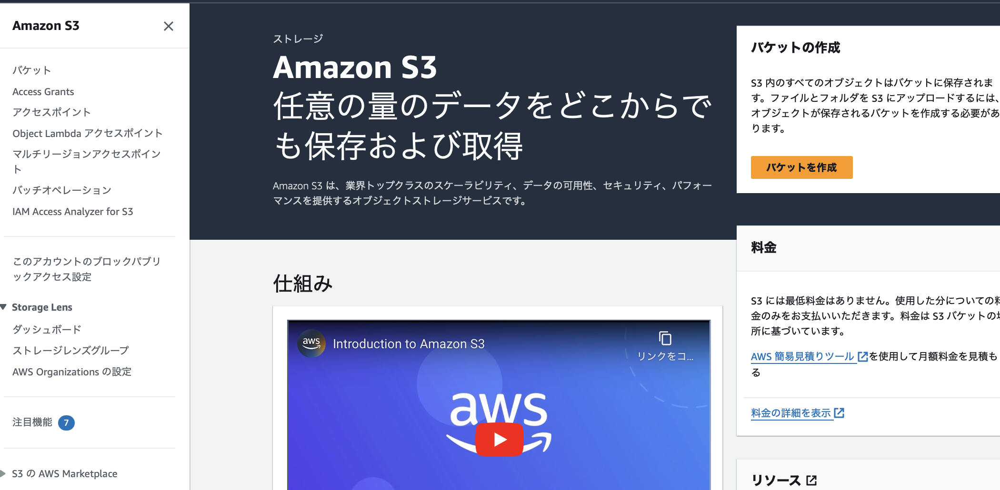
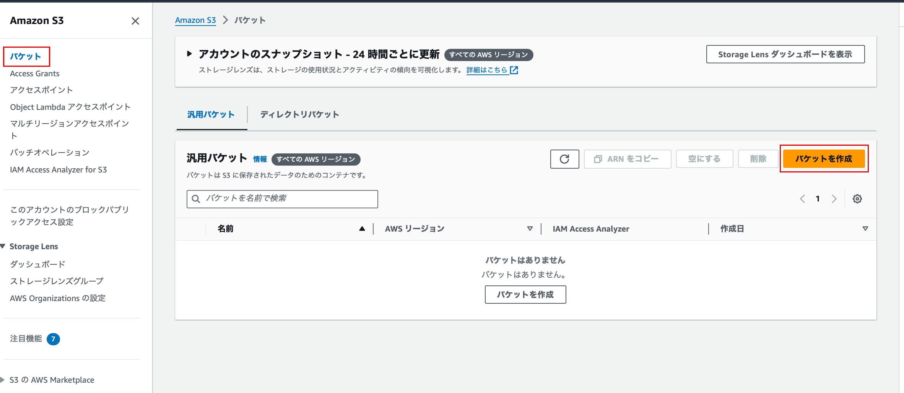
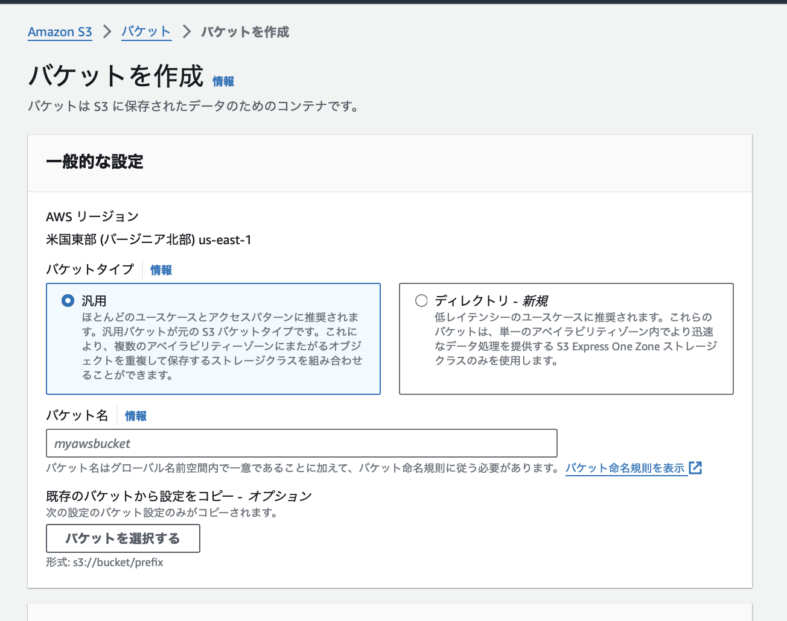
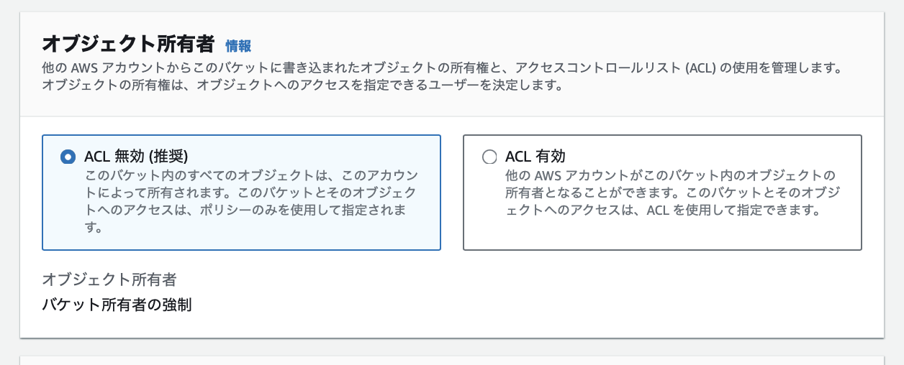
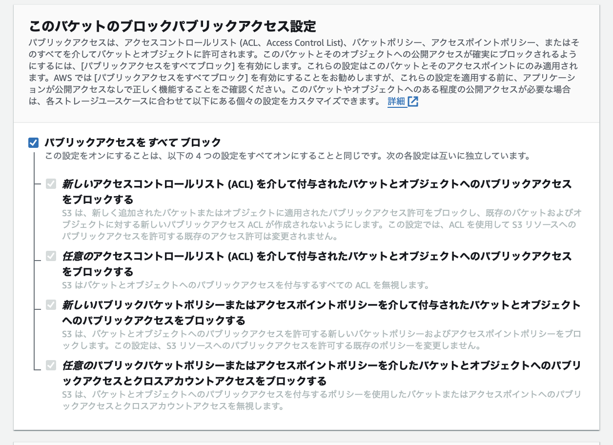
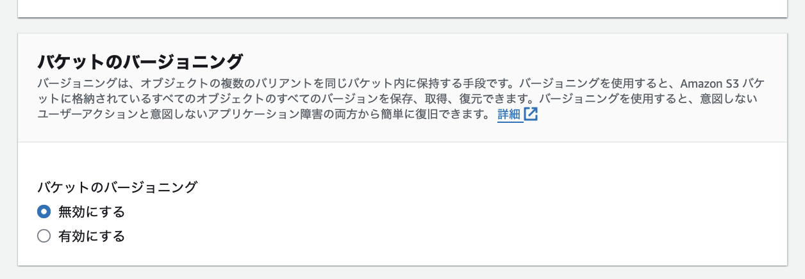
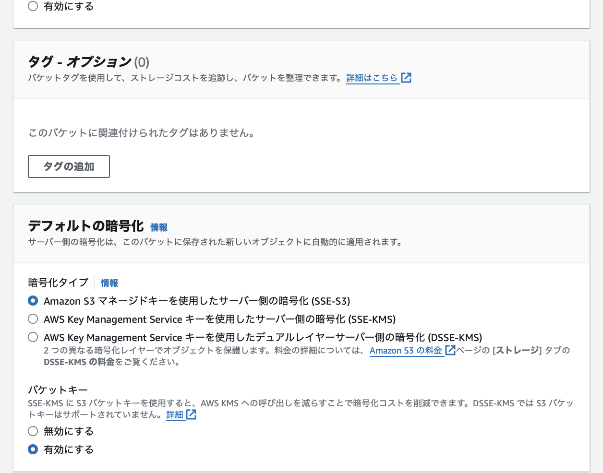
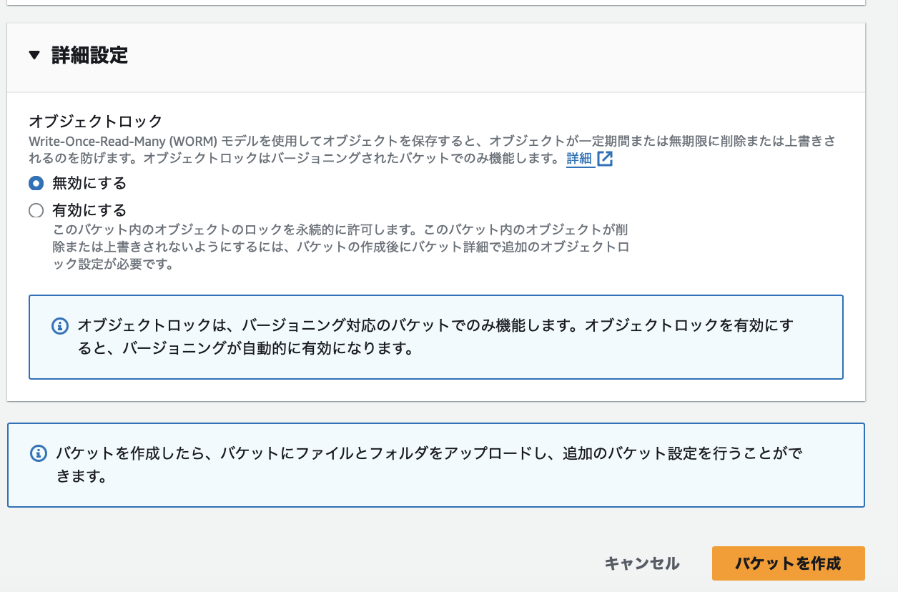
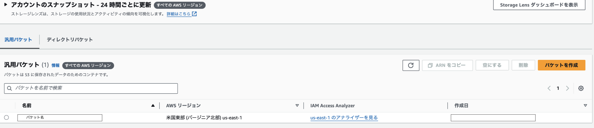

### S3 インスタンスの作成方法

1. AWS コンソールから S3 ダッシュボード画面に遷移

 

2. ナビゲーションから「バケット」を選択し、「バケットの作成」をクリック

 

3. S3 の作成に必要な項目を設定する

- 一般的な設定
    - バケットタイプ
        - 汎用: 通常のオブジェクトストレージの
        構造。データ(オブジェクト)は階層的なディレクトリ構造を持たず、フラットな構造で保存される

        - ディレクトリ: ディレクトリというフォルダとはまた別の概念でデータ構造を階層化するバケットタイプ (ディレクトリタイプを利用できるストレージクラスはS3 Express One Zone に限定される)

- バケット名: 全てのアカウント、全てのリージョンのなかで一意である必要がある

 

- オブジェクト所有者: S3 へのアクセスをアクセスコントロールリスト（ACL）で制御するかどうかの設定

    *VPC全体に適用するネットワーク ACL と S3 の ACL は別物

    - 元々は S3 へのアクセスを S3 の
     ACL で制御していたが、のちに IAM ができ、IAM ポリシーでアクセス制御もできるようになった。

    - 以下の参考サイトによると、 S3 へのアクセス制御は IAM のポリシーで行う方がいいらしい
        - [AWS入門ブログリレー2024〜Amazon S3編〜](https://dev.classmethod.jp/articles/introduction-2024-amazon-s3/)
        - [AWS S3 「オブジェクト所有者」について](https://qiita.com/miriwo/items/b243a2bb8fe83dc21f53)

    - アップロードされたデータ(オブジェクト)の所有者がバケットの所有者になるのが「ACL を無効」

    - 「ACL を有効」は、データ(オブジェクト)をアップロードしたユーザーがそのオブジェクトの所有者にすることもできる

 

- パブリックアクセス設定: TODO: 詳しい説明を追加

 

- バケットのバージョニング: 保存するオブジェクトのバージョン管理をする (古いバージョンのオブジェクトも保持するので、ストレージを圧迫する)

 

- タグ: 作成するバケットにつけるタグ名

- デフォルトの暗号化
    - 暗号化タイプ: TODO: 詳しい説明を追加

    - バケットキー: TODO: 詳しい説明を追加

 

- 詳細設定
     - オブジェクトロック (バージョニングを有効にしたバケットのみで設定可能): 保存されたオブジェクトの削除と上書きを禁止する機能

        TODO: 詳しい説明を追加

 

4. バケットが作成されていることを確認

 
 

参考サイト

バケットタイプについて
- [AWS入門ブログリレー2024〜Amazon S3編〜](https://dev.classmethod.jp/articles/introduction-2024-amazon-s3/)

オブジェクト所有者の項目に関する説明
- [AWS入門ブログリレー2024〜Amazon S3編〜](https://dev.classmethod.jp/articles/introduction-2024-amazon-s3/)

- [AWS S3 「オブジェクト所有者」について](https://qiita.com/miriwo/items/b243a2bb8fe83dc21f53)

- [[アップデート] オブジェクト所有権でもう悩まない！S3 バケット所有者がアップロード時に自動的にオブジェクト所有権を引き継げるようになりました。](https://dev.classmethod.jp/articles/amazon-s3-object-ownership-enables-bucket-owners-to-automatically-assume-ownership/)

S3のACLについて
- [【S3のACL設定について】](https://qiita.com/Ueken3pei/items/d5fca5bf364e1094a089)

オブジェクトロックについて
- [Amazon S3のオブジェクトロック機能についてあらためて調べてみた](https://dev.classmethod.jp/articles/amazon-s3-object-lock-research/)

---

### S3 のアクセスコントロール

3つのアクセスコントロール方法

- ACL
    - 現在は ACL を無効にし、アクセス管理はバケットポリシーと IAMロール(ポリシー)で行うように推奨されている
    - AWS アカウント単位もしくは、事前定義済み S3グループ単位でのアクセス管理しかできない
    - 詳しくは[S3のACL](./S3_ACL.md) を参照

- バケットポリシー
    - 

- IAM ポリシー

---

### オブジェクトロックとは

保存されたオブジェクトの削除と上書きを一定期間もしくは無期限で禁止する機能

*ロックの対象はオブジェクト (バケット全体をロックするのではない)

2つの機能
- リテンションモード
    - 保持期限を設定する = 一定期間オブジェクトへの上書きと削除を禁止する

- リーガルホールド
    - 無期限に上書きと削除を禁止する

 

2つのモード

- ガバナンスモード
- コンプライアンスモード