### AWS VPC とは

AWS 上に仮想的なプライベートネットワークを構築できるサービス (Virtual Private Cloud)

VPC は リージョンごとに作成することができる

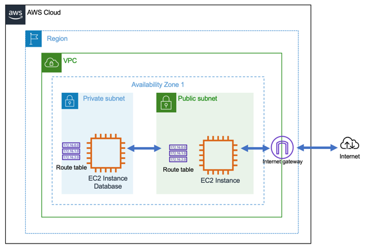

[【AWS入門】仮想ネットワークのAmazon VPCとは？アクセス制御の仕組みと料金](https://cloudnavi.nhn-techorus.com/archives/3893)

---

### 料金

無料
- VPC/サブネット/[インターネットゲートウェイ](#internet-gateway)などの作成には料金はかからない

有料
- [NATゲートウェイ](#nat-gateway)

---

### VPC の作成方法

VPCインスタンス作成に必要な情報
- インスタンスにつけるタグ名
- IPv4 での [CIDRブロック](#cidr-block)
- IPv6 での CIDRブロック (IPv6のIPアドレスが必要な場合)
- [テナンシー](#tenancy)

作成手順

1\. VPC コンソール画面 より VPC の作成を選択

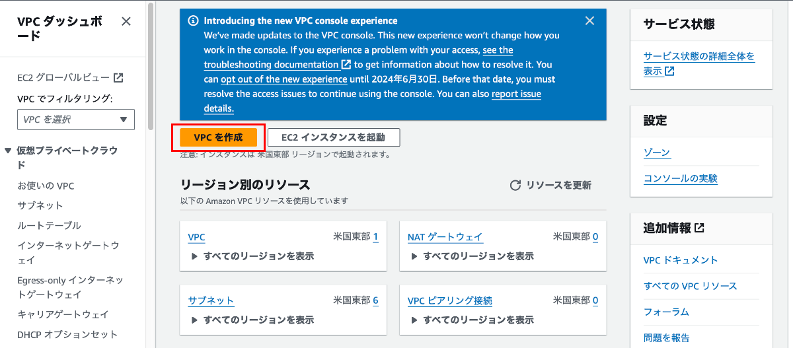

 
 

2\. IPv4/v6 での CIDR ブロックの設定

ここでの IP アドレスは **プライベートIPアドレス** の設定となるため、まだインターネットには接続できない

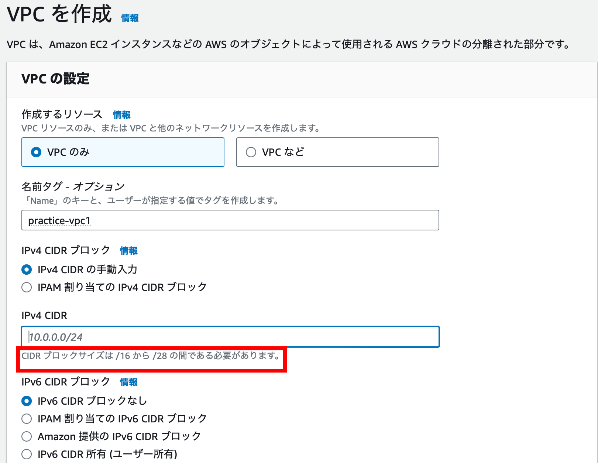

 

$\color{red}{ネットワーク部は最低16ビットから最長28ビットの間で設定する}$

 

注意点

- IPv4 CIDR ブロックとは、この VPC インスタンスに付与する **ネットワークアドレス(IPv4)** なので、**ホスト部ビットは全て0でなければならない**

- もし、ホストビットに1が含まれた IP アドレスを設定しようとするとエラーが起きる

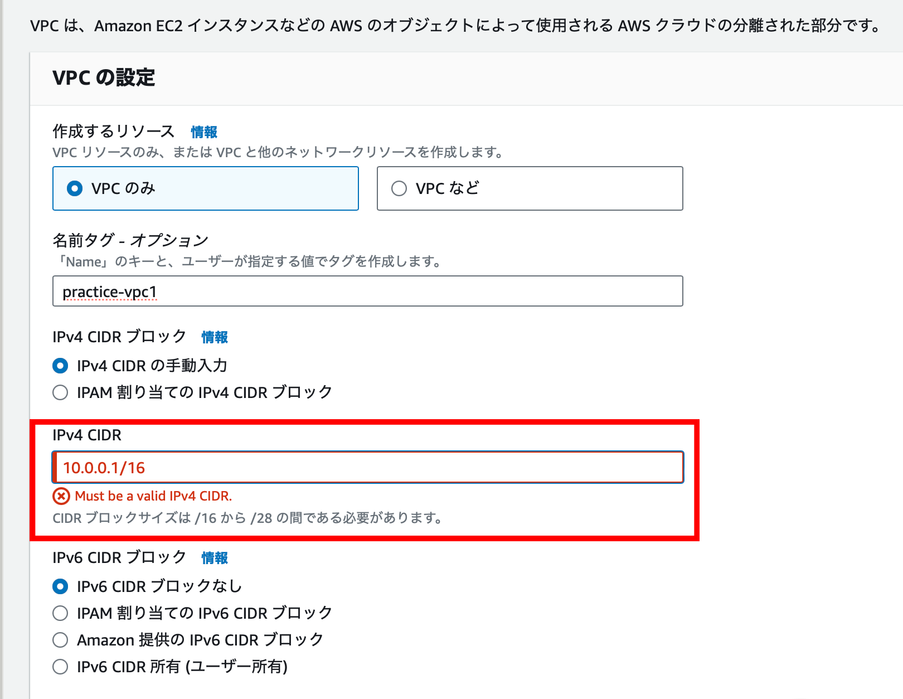

 
 

3\. VPC作成をクリック

各項目の設定を記入したら、 VPC 作成ボタンをクリックする

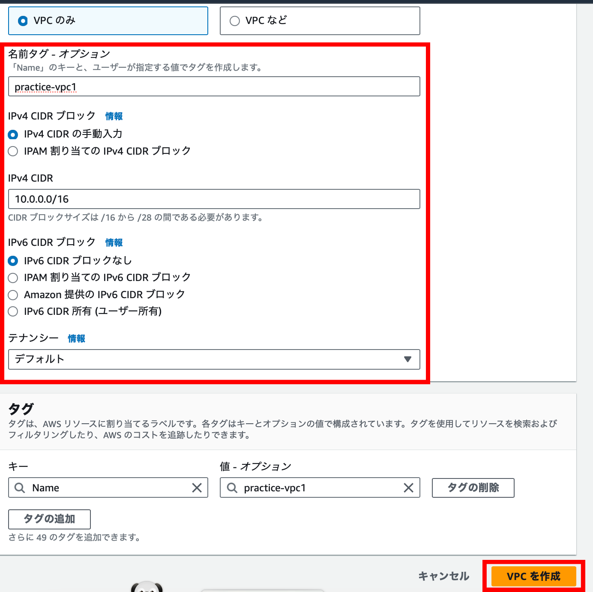

 

作成された VPC を確認する

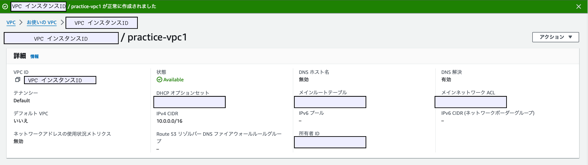

---

### サブネット

作成した VPC 内でさらに　仮想的なプライベートネットワークを作る

- 具体例
    - 外部からのアクセス(インターネットからのアクセス)可能なサービスは Public Subnet に配置

    - 外部からのアクセスを許可したくないサービス(DBなど)は Private Subnet に配置

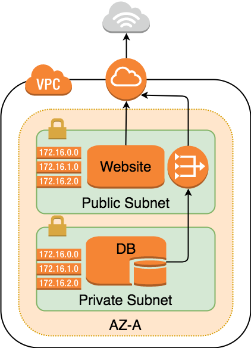

[AWS入門者向け 初心者が最初に理解すべきEC2とVPCの基本的な用語解説](https://avinton.com/academy/aws/)

---

### サブネットの作成方法

前提条件
- VPC インスタンスは作成済み

1\. VPC コンスールダッシュボードよりサブネットをクリックし、サブネット一覧画面からサブネットを作成をクリック

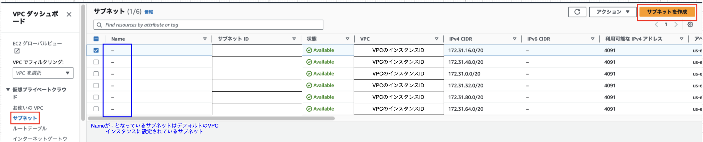

 

2\. 作成するサブネットの情報を設定する

- アベイラビリティゾーン
    - 選択された VPC のリージョンの AZ

- IPv4 CIDR ブロック
    - 選択された VPC の CDIR ブロック(=ネットワークアドレス)

- IPv4 サブネット CIDR ブロック
    - サブネットの CIDR　ブロック(ネットワークアドレス)
    - 今回はVPCのホスト部から4ビットをサブネットのネットワーク部に割り当てるので /20 で作成

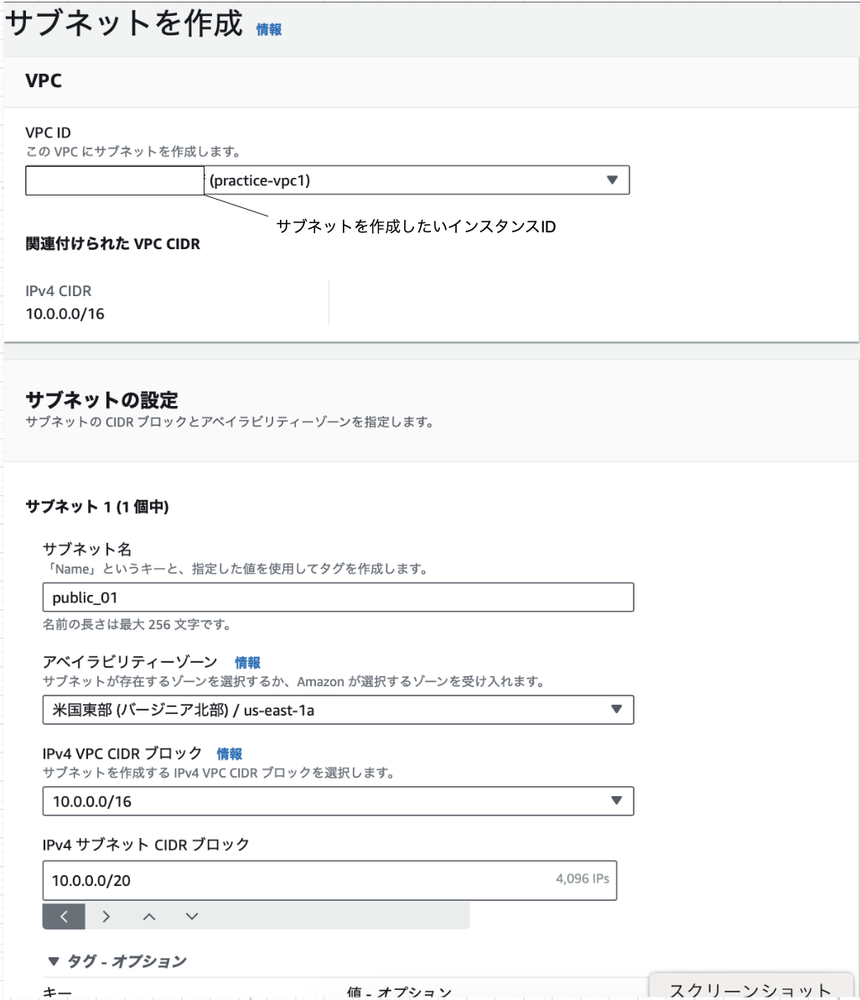

 

3\. 作成完了後はサブネット一覧画面に表示される

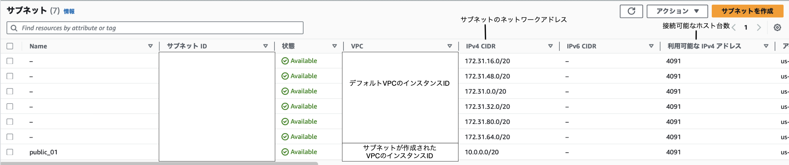

$\color{red}{この段階ではただサブネット(プライベートなサブネット)を作成しただけ}$

$\color{red}{作成したサブネットをインターネットに接続したい場合はインターネットゲートウェイを作成する}$

 
 

**サブネット作成時の注意点**

サブネットのネットワークアドレスは異なる AZ であっても重複してはいけない

例: 下記は
- AZ1 の Subnet01 と AZ2 の Subnet03 の IP アドレスが重複
- AZ1 の Subnet02 と AZ2 の Subnet04 の IP アドレスが重複

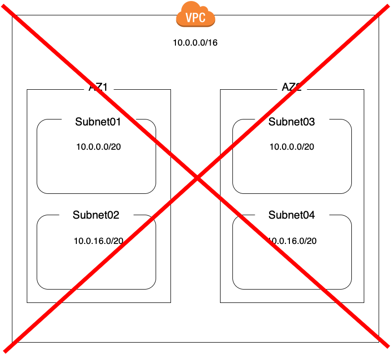

 
 

VPC 内のサブネットの IP アドレスは AZ 関係なく重複してはいけない

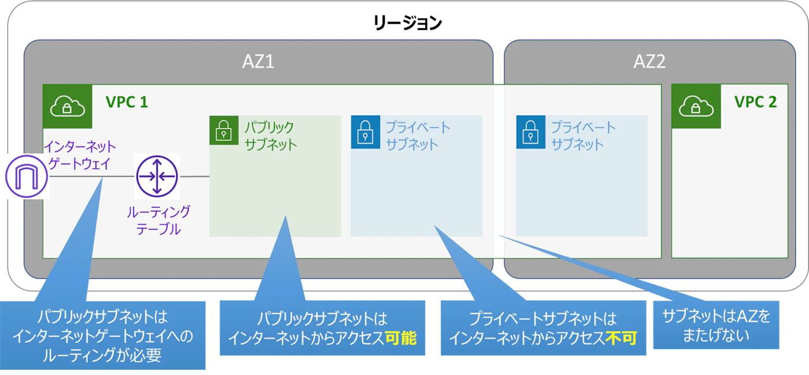

参考: [Amazon VPCを「これでもか！」というくらい丁寧に解説: VPCとサブネット](https://qiita.com/c60evaporator/items/2f24d4796202e8b06a77#vpcとサブネット)

---

### テナンシー

VPC は専用テナンシー (dedicated tenancy) か 共有テナンシー (shared tenancy) で作ることができる

*デフォルトは共有テナンシー

- 専用テナンシー: 物理サーバーの1台を占有する

- 共有テナンシー: 物理サーバーの1台を他の利用者と共有する

---

### インターネットゲートウェイ

VPC でネットワークを作成しただけでは外部と通信できない

VPC で作成したネットワークとインターネットを通信できるようにするサービス

---

### Nat Gateway

プライベートサブネット内のインスタンスがVPC外部ネットワークへ接続するために必要なサービス

また、VPC外部からの通信はプライベートサブネットに到達することができないので、セキュリティ面でも安心

---

### CIDR ブロック

CIDR ブロックとは

- AWS によると、"同じネットワークプレフィックスとビット数を共有する IP アドレスの集まり"

 
たぶん以下のように理解していい

- VPC 内のサブネットをまとめたスーパーネットの IP アドレス(CIDR表記)
- もしくは、 VPC 自体に割り当てるIPアドレス(それを CIDR でサブネットに分けていくから)

参考: [CIDR とは?](https://aws.amazon.com/jp/what-is/cidr/#:~:text=CIDR%20ブロックは、同じネットワーク,サフィックスで構成されます%E3%80%82)

---

### Regions と Avaiability Zones

Region

- 名前の通り地域: 利用するクラウドコンピューティングのサービスが実際に運用されている地域

- 1つの Region は複数の　Availability Zones から構成されている

- もし、特定の Region のうち1つの Availability Zone で障害が発生しても、他の Availability Zone は無事なように冗長化されている

- $\color{red}もし、自分のサービスが障害が発生した Availability Zone で運用されていた場合は影響を受けてしまう$

- $\color{red}また、リージョン全体の障害の場合はどうしようもない$

 

Availability Zones (AZ)

- 複数のデータセンター(実際のコンピューターリソースが運用されている所)からなるグループのこと

- 1つの AZ は複数のデータセンターで構成されている

- もし特定の AZ のうち1つのデータセンターで障害が発生しても、他のデータセンターは無事にするため冗長化されている

- $\color{red}もし、自分のサービスがその障害が発生したデータセンター内のサーバーで運用されていた場合は影響を受けてしまう$

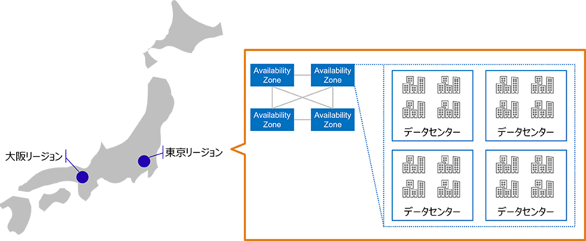

[AWSの可用性について考える ～AZ構成やAuto Recoveryなどの仕組みを解説～](https://www.fujitsu.com/jp/products/software/resources/feature-stories/cloud-operation/aws-availability/#chapter01)

---

###  複数 AZ 構成

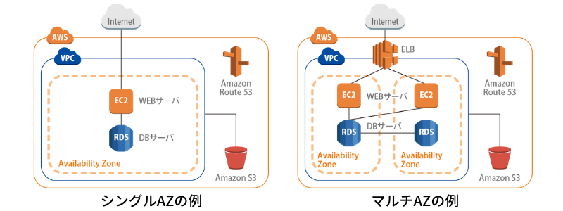

[Multi-AZとは?マルチAZ構成のメリット・デメリットについても解説](https://www.rworks.jp/cloud/aws/aws-column/aws-entry/22067/)

Web サービス等を AWS 上で運用したい場合、一番シンプルで簡単な構成は以下のように**1つのリージョンの1つのAZの中で全てを構成すること**

[AWS入門者向け 初心者が最初に理解すべきEC2とVPCの基本的な用語解説](https://avinton.com/academy/aws/)

上記の構成の問題点
- 自社の サービスが動いているAvailability Zone: AZ-A で障害が発生した際、その影響をもろに受ける

 
 

上記問題を回避するために
- 同じ内容を他の AZ にも構築する (AZ レベルでの冗長化)

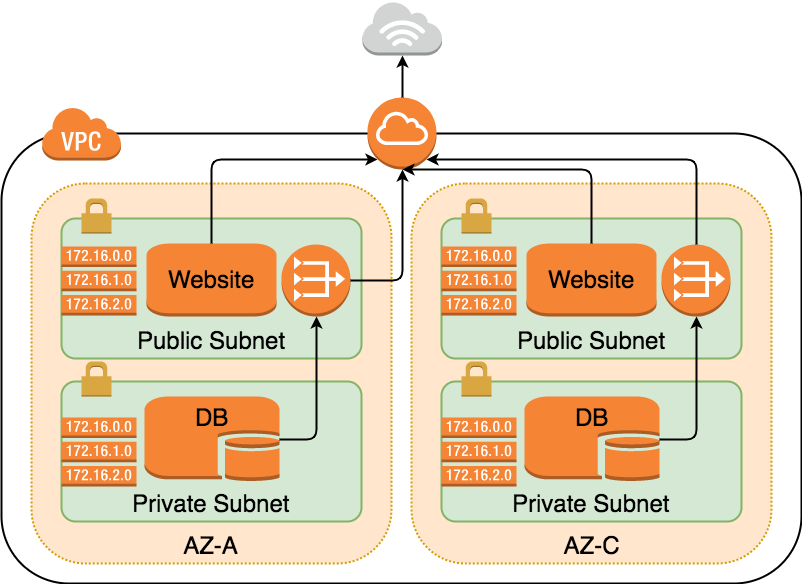

[AWS入門者向け 初心者が最初に理解すべきEC2とVPCの基本的な用語解説](https://avinton.com/academy/aws/)

AZ-A で障害が発生しても、 AZ-C でサービスが生きているので、サービス自体は提供し続けることが可能

\* AZ-A, AZ-C のあるリージョン全体で障害は起きた場合はアウト

---

### 複数 Region (クロスリージョン) 構成

名前の通り、同じ構成を複数のリージョンに設ける (リージョンレベルでの冗長化)

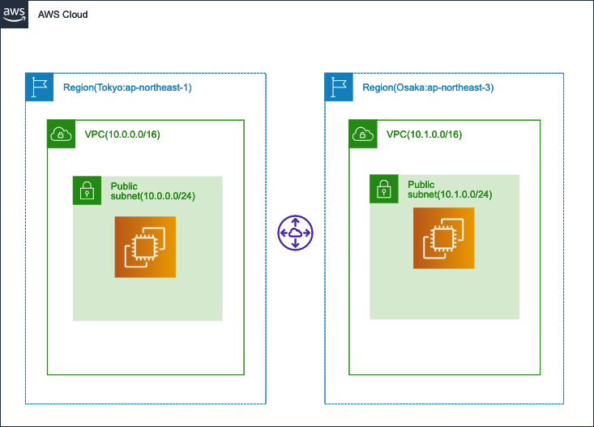

 

各 VPC 間の(レプリケーションの為などの)接続は VPC Peering か、Transit Gateway を利用する

- VPC Peering
    - 2つの VPC 間での接続を確立するためのサービス

- Transit Gateway
    - 3つ以上の複数の VPC 間を繋ぐためのサービス

---

### シングルリージョンとクロスリージョンの比較

シングルリージョン(複数 AZ) と　クロスリージョン 構成の比較(メリット/デメリット)

- シングルリージョン(複数 AZ)
    - メリット
        - 1つの AZ で障害が発生してもサービスを提供し続けることができる
        - AWSコンソール1画面で管理できるので、操作/管理が楽
        - クロスリージョンよりもデータ転送などのコストが抑えられる

    - デメリット
        - リージョン全体レベルの障害が発生した場合はアウト

 

- クロスリージョン
    - メリット
        - リージョン全体レベルでの障害が発生してもサービスを提供し続けることができる

    - デメリット
        - VPC Peering や Transit Gateway などの 異なるリージョンにある VPC 間での接続にコストが掛かる
        - AWSコンソールで操作できるのは現在選択されているリージョンの操作なので、1画面での管理ができないため、操作/管理が複雑になる
        - よっぽどグローバルに展開してるサービスでない限り、資源を無駄に余らせてしまう可能大

    
- AWSコンソールで表示/操作できるのは、選択されたリージョンに関してのみ
    
    - 以下はバージニア北部リージョンでの操作/管理が可能

    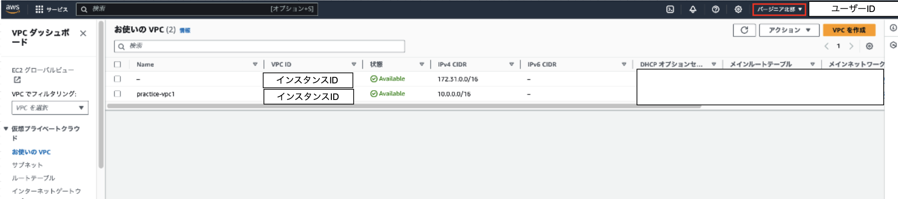

    - 以下は東京リージョンでの操作/管理が可能

    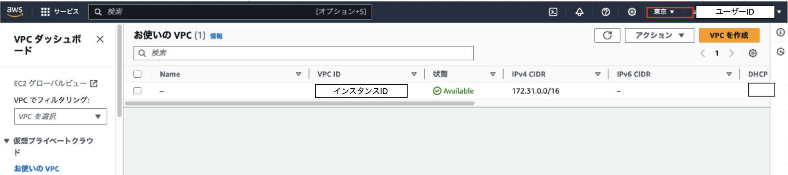

 
 

よっぽどグローバルなサービスでない限り、シングルリージョン(複数 AZ) で十分