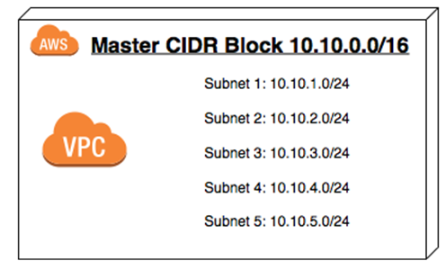

### AWS VPC とは

AWS 上に仮想的なプライベートネットワークを構築できるサービス (Virtual Private Cloud)

VPC は リージョンごとに作成することができる

[【AWS入門】仮想ネットワークのAmazon VPCとは？アクセス制御の仕組みと料金](https://cloudnavi.nhn-techorus.com/archives/3893)

---

### 料金

無料
- VPC/サブネット/[インターネットゲートウェイ](#internet-gateway)などの作成には料金はかからない

有料
- [NATゲートウェイ](#nat-gateway)

---

### VPC の作成方法

VPCインスタンス作成に必要な情報
- インスタンスにつけるタグ名
- IPv4 での [CIDRブロック](#cidr-block)
- IPv6 での CIDRブロック (IPv6のIPアドレスが必要な場合)
- [テナンシー](#tenancy)

作成手順

1\. VPC コンソール画面 より VPC の作成を選択

 
 

2\. IPv4/v6 での CIDR ブロックの設定

ここでの IP アドレスは **プライベートIPアドレス** の設定となるため、まだインターネットには接続できない

 

$\color{red}{ネットワーク部は最低16ビットから最長28ビットの間で設定する}$

 

注意点

- IPv4 CIDR ブロックとは、この VPC インスタンスに付与する **ネットワークアドレス(IPv4)** なので、**ホスト部ビットは全て0でなければならない**

- もし、ホストビットに1が含まれた IP アドレスを設定しようとするとエラーが起きる

 
 

3\. VPC作成をクリック

各項目の設定を記入したら、 VPC 作成ボタンをクリックする

 

作成された VPC を確認する

---

### サブネット

作成した VPC 内でさらに　仮想的なプライベートネットワークを作る

---

### サブネットの作成方法

---

### テナンシー

VPC は専用テナンシー (dedicated tenancy) か 共有テナンシー (shared tenancy) で作ることができる

*デフォルトは共有テナンシー

- 専用テナンシー: 物理サーバーの1台を占有する

- 共有テナンシー: 物理サーバーの1台を他の利用者と共有する

---

### インターネットゲートウェイ

VPC でネットワークを作成しただけでは外部と通信できない

VPC で作成したネットワークとインターネットを通信できるようにするサービス

---

### Nat Gateway

プライベートサブネット内のインスタンスがVPC外部ネットワークへ接続するために必要なサービス

また、VPC外部からの通信はプライベートサブネットに到達することができないので、セキュリティ面でも安心

---

### CIDR ブロック

CIDR ブロックとは

- AWS によると、"同じネットワークプレフィックスとビット数を共有する IP アドレスの集まり"

 
たぶん以下のように理解していい

- VPC 内のサブネットをまとめたスーパーネットの IP アドレス(CIDR表記)
- もしくは、 VPC 自体に割り当てるIPアドレス(それを CIDR でサブネットに分けていくから)

参考: [CIDR とは?](https://aws.amazon.com/jp/what-is/cidr/#:~:text=CIDR%20ブロックは、同じネットワーク,サフィックスで構成されます%E3%80%82)

---

### Regions と Avaiability Zones

Region

- 名前の通り地域: 利用するクラウドコンピューティングのサービスが実際に運用されている地域

- 1つの Region は複数の　Availability Zones から構成されている

- もし、特定の Region のうち1つの Availability Zone で障害が発生しても、他の Availability Zone は無事なように冗長化されている

- $\color{red}もし、自分のサービスが障害が発生した Availability Zone で運用されていた場合は影響を受けてしまう$

- $\color{red}また、リージョン全体の障害の場合はどうしようもない$

 

Availability Zones (AZ)

- 複数のデータセンター(実際のコンピューターリソースが運用されている所)からなるグループのこと

- 1つの AZ は複数のデータセンターで構成されている

- もし特定の AZ のうち1つのデータセンターで障害が発生しても、他のデータセンターは無事にするため冗長化されている

- $\color{red}もし、自分のサービスがその障害が発生したデータセンター内のサーバーで運用されていた場合は影響を受けてしまう$

[AWSの可用性について考える ～AZ構成やAuto Recoveryなどの仕組みを解説～](https://www.fujitsu.com/jp/products/software/resources/feature-stories/cloud-operation/aws-availability/#chapter01)

