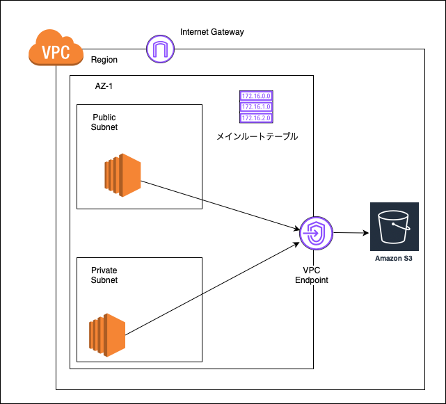
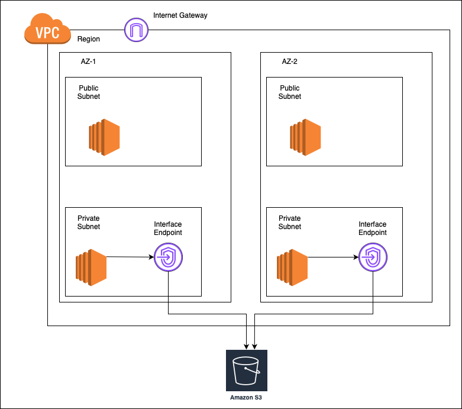

### VPC エンドポイントとは

- VPC内のインスタンスとVPC外の AWS サービスをプライベート接続で通信できるようにする仕組み

    *プライベート接続のため、インターネット経由の接続よりも安全

    - イメージ的には、対象のエンドポイント(接続先のサービス) を呼び出すためのゲートウェイを VPC に設置する

    

 

- VPC エンドポイントには以下の種類がある
    - [ゲートウェイ型](#ゲートウェイ型-vpc-エンドポイント)
    - [インターフェース型](#インターフェース型-vpc-エンドポイント)
    - (Gateway Loadbalancer型)

 

**知らなかったこと**
- VPC エンドポイントを利用しないで VPC 内の EC2 などのインスタンスが S3 にアクセスするには、インターネットゲートウェイを出てネット経由でアクセスする必要がある

 
 

参考サイト

- [VPCエンドポイント ってなんのこと？](https://qiita.com/miyuki_samitani/items/9d9f7a0c417cb75a6c85)
- [VPCエンドポイントについて整理してみた](https://qiita.com/charita/items/fe94680133419a03aade)

- [Amazon VPC エンドポイントについて整理してみる](https://blog.usize-tech.com/aws-vpc-endpoints-summary/)

---

### ゲートウェイ型 VPC エンドポイント

- 接続対象は S3 と Dynamo DB のみ

- 利用料金はかからない

- ゲートウェイ型 VPC エンドポイントにパブリック IP が付与される
    - 接続先側から見ると、パブリック IP でアクセスされる

- ゲートウェイ型 VPC エンドポイントは、作成時に指定する $\color{red} \text{VPC 内に設置される}$

- ゲートウェイ型 VPC エンドポイント作成後、作成時に指定するルートテーブルに、自動で VPC エンドポイントのルートが追記される

- ゲートウェイ型 VPC エンドポイントは接続先のサービスごとに作成する必要がある

 

 

#### ゲートウェイ型 VPC エンドポイントのポイント

- ゲートウェイ型エンドポイントとインターフェース型エンドポイントでは接続方法が違うので注意

- ゲートウェイ型 VPC エンドポイントのルートを追記するルートテーブルを選び間違えるとうまく動かないことがある

    - パブリックサブネットルートテーブルにゲートウェイ型 VPC エンドポイントへのルーティングを追記した場合

        - プライベートサブネットからゲートウェイエンドポイントへのアクセスはできない
        
            → VPC 外部の AWS サービス (S3 or Dynamo DB) へは接続できない

        
    
     

    - プライベートサブネットルートテーブルにゲートウェイ型 VPC エンドポイントへのルーティングを追記した場合

        - プライベートサブネットからはゲートウェイ型 VPC を通して、S3 や Dynamo DB にアクセスができる

        - パブリックサブネットからはインターネットゲートウェイを出てインターネット経由で S3 やDynamo DB にアクセスできる

        

     

    - メインルートテーブルにゲートウェイ型 VPC エンドポイントへのルーティングを追記した場合

        - パブリックサブネット、プライベートサブネットのどちらもゲートウェイ型 VPC エンドポイントを通して S3 や Dynamo DB にアクセスすることができる

        

 
 

参考サイト

ゲートウェイ型 VPC エンドポイントについて
- [【ゲートウェイ VPC エンドポイント】EC2からプライベート経路でS3などのAWSサービスへアクセスする](https://blog.serverworks.co.jp/2022/07/08/122037#ゲートウェイ-VPC-エンドポイントの作成今回選んだタイプ)

- 実際の作成と動作確認を載せている記事: [VPCエンドポイント経由で S3 にアクセスする](https://www.aws-room.com/entry/s3-gateway-endpoint)

ゲートウェイ型とインターフェース型エンドポイントの比較

- [Amazon S3のVPCエンドポイントゲートウェイ型・インターフェース型を使ってみた](https://qiita.com/AWS11077/items/8332bd476124bc534c52)

---

### インターフェース型 VPC エンドポイント

- S3 や Dynamo DB はもちろん、それ以外の多くの AWS サービスに接続できる

- 利用料金がかかる

- インターフェース型 VPC エンドポイントは作成時に、対象の VPC と AZ を指定する
    - 作成後、$\color{red}\text{指定した AZ のサブネットにプライベートIPアドレスを持つ}$ [ENI](./ENI.md) が作成される

    - その ENI へのアクセスは、接続先のエンドポイントへのアクセスになる

- いくつかの Web ページでは インターフェース型 VPC エンドポイント = AWS PrivateLink のような書かれ方をしているが、$\color{red}別物$

- インターフェース型 VPC エンドポイントも接続先のサービスごとに作成する必要がある

 

 

#### インターフェース型エンドポイントのポイント

- ゲートウェイ型エンドポイントとインターフェース型エンドポイントでは接続方法が違うので注意

- インターフェースエンドポイントは設置されるサブネット内のプライベート IP を1つ消費する

- 基本的には VPC の各 AZ ごとの1つのサブネットを選択してインターフェース型エンドポイントを作成する

    - 実は、VPC内の1つAZの1つのサブネットにだけインターフェースエンドポイントを作成しても、問題無く、どのインスタンスからも対象エンドポイント(サービス)に接続することができる by [こちらの記事](https://dev.classmethod.jp/articles/interface-endpoint-vpc-one-ok/)

        - 理由: VPC 内の CIDR 範囲は local を送信先とするため、 AZ 内のどこかにあれば、AZをまたいだ通信ができるから (こちらの[記事](https://zenn.dev/collabostyle/articles/c0dfcea8873965#vpc-内の通信)を参照)

            
        
         

        - しかし、インターフェースエンドポイントを作成したAZで障害は発生した場合、他 AZ のインスタンスにも影響が出てしまうので、基本は各 AZ ごとに 1つのサブネットに作成するのが普通

            
    
     

    - そもそも、同一 AZ 内の複数のサブネットにインターフェース型エンドポイントを作成することはできない

        

 
 

参考サイト

- わかりやすかった記事: [【初心者向け】VPCエンドポイントとAWS PrivateLinkの違いを実際に構築して理解してみた](https://dev.classmethod.jp/articles/aws-vpcendpoint-privatelink-beginner/)

- [VPCエンドポイント（インターフェースエンドポイント）はVPCの中に1つあれば動作するという話](https://dev.classmethod.jp/articles/interface-endpoint-vpc-one-ok/)

- [[アップデート] インターフェイス型 VPC エンドポイントの作成時にサブネット範囲内のプライベート IP アドレスを指定出来るようになりました](https://dev.classmethod.jp/articles/defined-ip-vpc-endpoints/)

- [AWS インターフェース型 VPC エンドポイントにどのようにアクセスしているのか？](https://blog.usize-tech.com/route-to-aws-interface-endpoint/)

- 実際の作成と動作確認を載せている記事: [VPCエンドポイント経由で S3 にアクセスする ~インターフェイスエンドポイント編~](https://www.aws-room.com/entry/s3-interface-endpoint)

---

### VPC エンドポイントの利用料金

- ゲートウェイ型は無料で利用できる

 

- インターフェース型では以下の料金が発生する

    - 時間単位の使用料金
        - リージョンにもよるが、だいたい0.01 ~ 0.015 (USD / h) の間

    - データ処理料金
        - こちらはリージョン関係なく以下の通り

    
