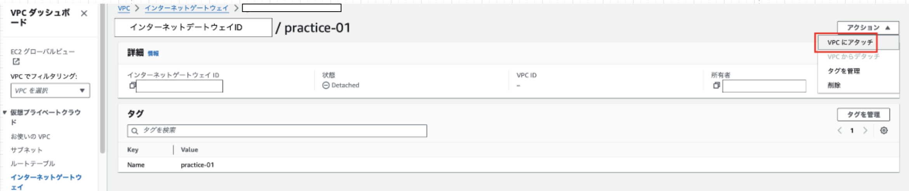
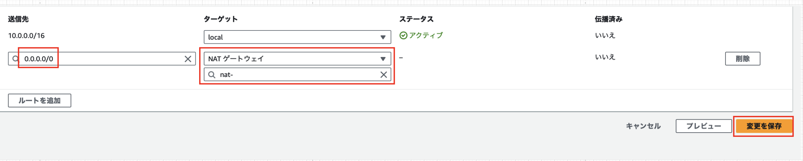

### VPC にて作成したサブネットをネットワークに接続したい (Internet Gateway)

作成したサブネットをパブリックサブネットにするには

- ~~Internet Gateway を作成し、サブネットとインターネットを接続する必要がある~~

    ↑間違いではないが、具体的なイメージが間違っていた[勘違いしていたこと参照](#misunderstand)

<br>

Internet Gateway を利用することで、 **パブリックサブネット内のリソース(EC2インスタンスなど)が外部からインターネット経由でアクセス可能になる**

---
<div id="misunderstand"></div>

### インターネットゲートウェイについて勘違いしていたこと

インターネットゲートウェイと VPC 内のパブリックにしたいサブネットを接続すると思っていた


<br>

実際は
$\color{red}{Internet Gateway は VPC 自体にアタッチされる}$

<br>

Internet Gateway の役割は
$\color{red}{VPC 内部サブネットに配置されたインスタンスのプライベート IP アドレスとそのインスタンスのパブリックIP/Elastic IP を1対1で変換すること
}$

\* パブリック IP / Elastic IP は 一見インスタンスに付与されているように見えるが、実際はインスタンスが自身のパブリック IP を知っていることはなく、インターネットゲートウェイの方で変換を行なっている


[【AWS】VPCとは？【使用する上で避けられない基礎知識を徹底解説。】](https://katsuya-place.com/what-is-vpc/)

参考1: [インフラエンジニアに贈るAmazon VPC入門 #3 インターネット接続(前編): Elastic IP ≒ Static NAT!!](https://dev.classmethod.jp/articles/vpcfor-infra-engineer-3/#toc-11)

参考2: [インターネットゲートウェイ部分](https://katsuya-place.com/what-is-vpc/)

---

### Internet Gateway の作成方法

1\. VPC ダッシュボードより「インターネットゲートウェイ」を選択し、インターネットゲートウェイ一覧画面より「インターネットゲートウェイの作成」ボタンをクリックする


<br>

2. 作成画面にて、インターネットゲートウェイにつけるタグ名を設定し、「インターネットゲートウェイの作成」ボタンをクリック


<br>

3\. 作成したインターネットゲートウェイから 「VPCにアタッチ」ボタンをクリックする



<br>

4\. VPC にアタッチ画面にてアタッチする VPC を選択し、「インターネットゲートウェイにアタッチ」ボタンをクリックする


<br>

$\color{red}{インターネットゲートウェイの作成だけでは、まだインターネットに接続することはできない}$

---

### NAT Gateway

役割: プライベートサブネット内の IP を NAPT 変換する

```
ルーターの NAPT のように  

- プライベートIP + ポート <=> グローバルIP + ポート  

の変換ではなく

- サブネット内のプライベートIP + ポート　<=> NATゲートウェイのプライベートIP + ポート

の変換を行う
```

<br>

必要なケース

**サブネット側からインターネット接続はできても、インターネットからサブネットにアクセスできないような**

$\color{red}{1方向のインターネット接続}$

**を確立したい場合**


\*上記画像はあくまでイメージ図で、実際のNATゲートウェイの配置位置は違う

---

### NAT Gateway について追記

NAT ゲートウェイは パブリックサブネットに配置する必要がある

- プラーベートサブネット内のインスタンスの代わりにインターネットにアクセスする為、 NAT ゲートウェイはインターネット接続可能なサブネットに配置される必要がある


[NAT ゲートウェイのユースケース](https://docs.aws.amazon.com/ja_jp/vpc/latest/userguide/nat-gateway-scenarios.html)

---

### Internet Gateway と NAT Gateway の違い

利用金額や使用料金が発生する条件なども違う

- Internet Gateway
    - 作成、アタッチだけでは使用料金は発生しない
    - 実際にインターネット通信が発生した場合に資料料金が発生

- NAT Gateway
    - 作成、配置しただけで使用料金が発生する
    - 上記の料金に加え、NATゲートウェイ経由の通信が発生するとその通信量に応じて課金される

参考: [VPCと外部ネットワーク・サービスとの接続](https://qiita.com/c60evaporator/items/2f24d4796202e8b06a77#vpcと外部ネットワークサービスとの接続)

---

### Roueting Table

ルートテーブルとはルーターがルーティング(他のネットワークへのデータの送受信)の際に宛先を決めるために参照する情報テーブル

参考: [Routing](https://www.infraexpert.com/study/routing.html)

AWS でルートテーブルの作成は無料

<br>

ルートテーブルを作成&設定しないと...

- 各サブネットにて、他のサブネットへの宛先がわからないため、サブネット間での通信ができない

- また各サブネットにて、インターネットへの接続先がわからないため、インターネット通信ができない


<br>

**ルーティングテーブルは各サブネットに作成する**

\*複数のサブネットは同じルートテーブルを共有することもできる

<br>

サブネットをインターネットに接続するために、インターネットゲートウェイや NAT ゲートウェイへのルートをルートテーブルに登録する必要がある

<br>
<br>

**AWS のルーティングテーブルには2種類ある**

- メインルートテーブル: その VPC 内の全てのサブネットがデフォルトで参照するルートテーブル (後述するサブネットテーブルがあればそちらから参照)

- サブネットルートテーブル: サブネットに明示的に関連づけるルートテーブル

デフォルト状態で設定したいルートテーブルをメインルートテーブルに記述し、このルールから外れたサブネット独自のルートテーブルを作成したい場合に、サブネットルートテーブルを作成するのが良いらしい

参考: [サブネットごとのルートテーブル指定方法](https://qiita.com/c60evaporator/items/2f24d4796202e8b06a77#サブネットごとのルートテーブル指定方法)

---

### ルーティングテーブルの作成

1\. AWS コンソールの VPC ダッシュボードのルートテーブル画面より、「ルートテーブルの作成」をクリック


<br>

2\. どの VPC で使うルートテーブル設定なのかを選択し、「ルートテーブルの作成」をクリック


<br>

3\. メインルートテーブルとサブネットテーブルが作成されていることを確認


<br>

4\. パブリックサブネットにはデフォルトルートにインターネットゲートウェイを設定することがほとんど

$\color{red}{サブネットルートテーブルに設定する}$

=> メインルートテーブルに設定してしまった場合、プライベートなサブネットもデフォルトルートはインターネットゲートウェイに向かってしまう

- サブネットテーブルを選択し、「ルート」タブを選び、「ルートの編集」をクリック


<br>

- デフォルトルートに作成&アタッチ済みのインターネットゲートウェイを設定し、「設定を保存」をクリック


<br>

- **デフォルトルートをインターネットゲートウェイに設定したサブネットルートテーブルをパブリックサブネットに適用するため**、「サブネットの関連づけ」タブを選択し、「サブネットの関連づけを編集」をクリック


<br>

- パブリックネットワークとして利用したいサブネットを選択し、「関連づけを保存」をクリック


<br>

5\. 次はプライベートサブネットで参照するルートテーブルを作成する

- ルートテーブル画面より、新しくルートテーブルの作成を行う (サブネットルートテーブル)


<br>

- 新しいルートテーブルを選択し、ルートの編集から**デフォルトルートを NAT ゲートウェイ**に設定する




<br>

- 設定したサブネットテーブルをプライベートサブネットに関連づける


<br>
<br>

ちなみに、メインルートテーブルを見てみると VPC 自体のプライベートIPアドレスが登録されている

(サブネットルートテーブルにも VPC のプライベートIPアドレスが登録されているが、多分同じこと)


<br>

これは VPC 内での通信ができるよう設定されているっぽい


参考: [【図解AWS】ルートテーブルとは？初心者にもわかりやすく解説！](https://en-junior.com/routetable/#index_id7)

---

### ルーティングテーブルについて追記

$\color{red}{ルーティングテーブルに登録されるIPアドレスはネットワークアドレス}$

*画像はあくまでもイメージ


---

### VPC をインターネットに接続する

1\. VPC インスタンスを作成する

2\. インターネットに接続するサブネットを作成する

3\. インターネットゲートウェイを作成し、 VPC インスタンスにアタッチする

4\. パブリックサブネットのルーティングテーブル (サブネットルートテーブル) のデフォルトルートにインターネットゲートウェイを登録する

5\. サブネットに配置するインスタンスに付与するパブリックIPを取得する

<br>

*必要に応じて...

\- プライベートサブネットの作成

- NAT ゲートウェイの作成 & **パブリックサブネットに配置**

- プライベートサブネットのルーティングテーブル(サブネットルートテーブル) にて、デフォルトルートにNATゲートウェイを登録する
