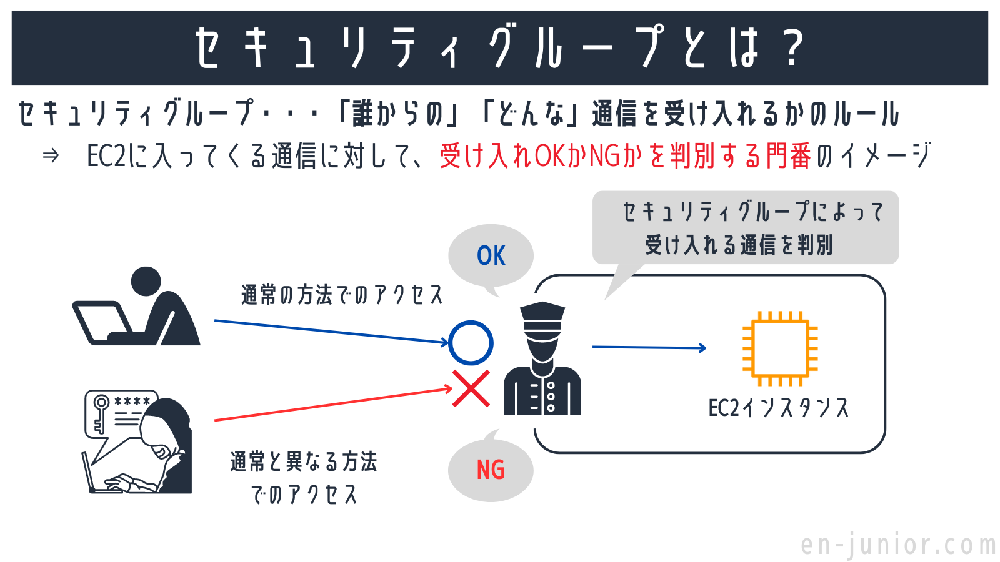
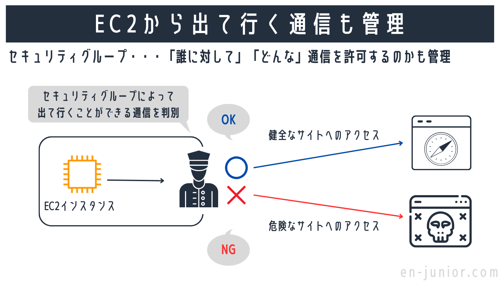
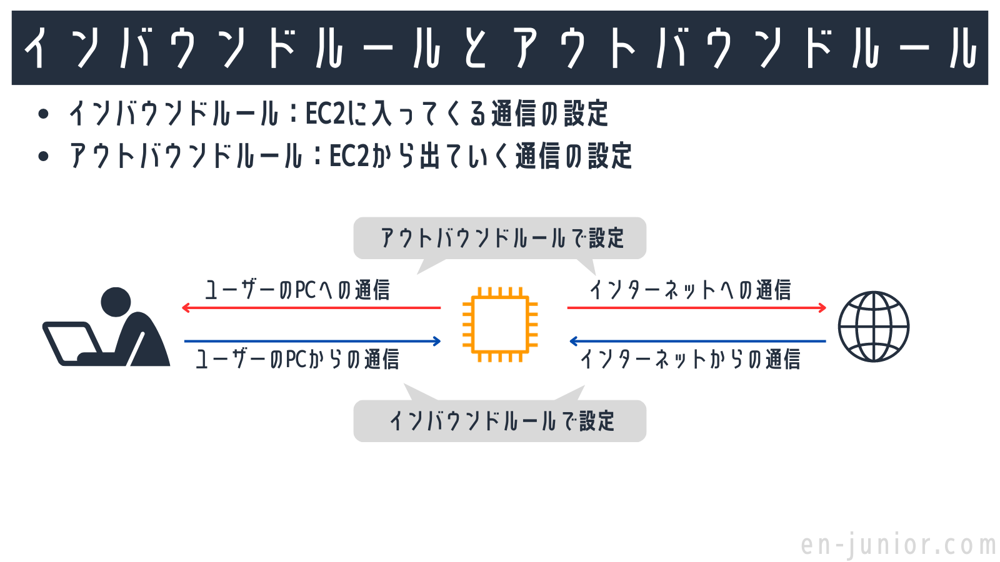
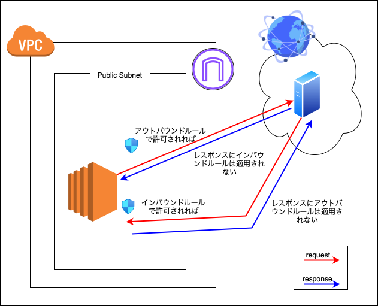

### セキュリティグループ

VPC 上のリソースを悪意のあるアクセスから守る仮想ファイヤーウォール機能

セキュリティグループの作成自体に料金はかからない

セキュリティグループは$\color{red}{許可設定のみ可能}$

[セキュリティグループの概要と目的](https://en-junior.com/security-group/#index_id0)

 

同様に VPC 上のリソースからのアクセスもコントロールできる

[セキュリティグループの概要と目的](https://en-junior.com/security-group/#index_id0)

---

### セキュリティグループ ~ インバウンド/アウトバウンドルール

セキュリティグループの設定には以下の2種類がある

- インバウンドルール
    - 外部から VPC 上のリソースへのアクセス

- アウトバウンドルール
    - VPC 上のリソースから外部へのアクセス

[インバウンドルールとアウトバウンドルール](https://en-junior.com/security-group/#index_id2)

 
 

$\color{red}{}$
セキュリティグループは $\color{red}{ステートフル (stateful)}$ なファイヤーウォール

- ステートフル: 許可されたリクエストへのレスポンスはルールの適用がされない

    - VPC 上のインスタンからのリクエストに対するレスポンスは **インバウンドルールに関係なく** 許可される

    - 同様に外部からのアクセスがインバウンドルールで許可されていれば、 VPC インスタンスからのレスポンスは **アウトバウンドルールに関係なく** 許可される

---

### セキュリティグループの作成

---

### ネットワーク ALC

---

### セキュリティグループとネットワーク ALC

セキュリティグループとネットワーク ALC の違い

- セキュリティグループ
    - VPC 上の**リソースに対して**設定する
    - ステートフルインスぺクション
    - 許可設定のみ可能

- ネットワーク ALC
    - VPC 上の**サブネットに対して**設定する
    - 設定したサブネット上の全てのリソースに適用される
    - ステートレスインスペクション
    - 許可/拒否両方の設定が可能
---
