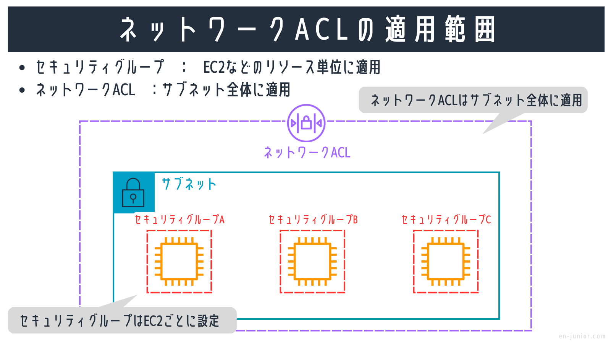

### セキュリティグループ

VPC 上のリソースを悪意のあるアクセスから守る仮想ファイヤーウォール機能

セキュリティグループの作成自体に料金はかからない

セキュリティグループは$\color{red}{許可設定のみ可能}$


引用: [セキュリティグループの概要と目的](https://en-junior.com/security-group/#index_id0)

<br>

同様に VPC 上のリソースからのアクセスもコントロールできる


引用: [セキュリティグループの概要と目的](https://en-junior.com/security-group/#index_id0)

---

### セキュリティグループ ~ インバウンド/アウトバウンドルール

セキュリティグループの設定には以下の2種類がある

- インバウンドルール
    - 外部から VPC 上のリソースへのアクセス

- アウトバウンドルール
    - VPC 上のリソースから外部へのアクセス


引用: [インバウンドルールとアウトバウンドルール](https://en-junior.com/security-group/#index_id2)

<br>
<br>

$\color{red}{}$
セキュリティグループは $\color{red}{ステートフル (stateful)}$ なファイヤーウォール

- ステートフル: 許可されたリクエストへのレスポンスはルールの適用がされない

    - VPC 上のインスタンからのリクエストに対するレスポンスは **インバウンドルールに関係なく** 許可される

    - 同様に外部からのアクセスがインバウンドルールで許可されていれば、 VPC インスタンスからのレスポンスは **アウトバウンドルールに関係なく** 許可される


---

### セキュリティグループの見方

1\. VPC ダッシュボードから「セキュリティグループ」を選択し、対象セキュリティグループを選択する

- VPC を作成すると、デフォルトのセキュリティグループが1つ作成される

- 今回は練習で作成した VPC のデフォルトのセキュリティグループを見てみる


<br>

2\. 見たいセキュリティグループ (デフォルトのセキュリティグループ) を選択する

3\. まずはインバウンドルールから見ていくので、「インバウンドルール」タブを選択し、「インバウンドルールの編集」をクリック


<br>

4\. インバウンドルールは、外部から VPC 内のインスタンに対するアクセスの許可を定義している

```
インバウンドルールの各項目

- タイプ: どのような通信か? (SSHやHTTPSなど)

- プロトコル: 各通信のベースとなるTCP/IP層のプロトコルのこと。 *タイプを決めると、プロトコルが自動で決まることが多い

- ポート範囲: 外部からの通信を待ち受けるポート番号。 *タイプを決めるとポート範囲も自動で決まることが多い

- ソース: 「誰から」の通信を許可するかの項目。

*ソースには "特定のIPアドレス" や "ネットワークIPアドレス"、 "セキュリティグループID" が指定できる

*ソースにセキュリティグループIDが制定された場合
-> そのセキュリティグループが設定されたリソース(EC2インスタンスなど)からの通信は許可する
```

<br>

- デフォルトのセキュリティルールでは、外部からのアクセスは以下ルールでの受信を許可している

    - タイプ: HTTPSでもSSHでもOK

    - ポート: どのポートでも OK (受信する VPC 上のインスタンスのポート)

    - ソース: 送信元にこのセキュリティグループのIDが設定されているため、 $\color{red}{このセキュリティグループがアタッチされた送信元であればOK}$


<br>


<br>

5\. アウトバウンドルールを確認するため、「アウトバウンドルール」タブを選択し、「アウトバウンドのルールを編集」をクリック


<br>

6\. アウトバウンドルール、VPC 内のインスタンからの送信許可を定義している

```
アウトバウンドルールの各項目

- タイプ: どのような通信の送信を許可するか? (SSHやHTTPSなど)

- プロトコル: 各通信のベースとなるTCP/IP層のプロトコルのこと。 *タイプを決めると、プロトコルが自動で決まることが多い

- ポート範囲: 外部へ送信する時に指定したポート番号。 *タイプを決めるとポート範囲も自動で決まることが多い

- 送信先: 「誰へ」の通信を許可するかの項目。

*ソースには "特定のIPアドレス" や "ネットワークIPアドレス"、 "セキュリティグループID" が指定できる

*ソースにセキュリティグループIDが制定された場合
-> そのセキュリティグループが設定されたリソース(EC2インスタンスなど)からの通信は許可する
```

- デフォルトのセキュリティルールでは、外部へのアクセスは以下ルールでの送信を許可している

    - タイプ: どのような種類の送信でも許可

    - ポート: どのポートでも OK (VPC 上のインスタンスが送信時に使用するポート)

    - 送信先: 送信先に0.0.0.0/0が設定されているため、 $\color{red}{送信先がどのようなIPアドレスでもOK}$


<br>
<br>

(参考)インバウンドルールのソースにセキュリティグループIDを指定したときのイメージ: [AWSのセキュリティグループの許可ソースにセキュリティグループを設定するパターンとは](https://ent.iij.ad.jp/articles/1486/#:~:text=インバウンドルールはインスタンスへ,グループを指定できます%E3%80%82)

---

### セキュリティグループの作成

デフォルトのセキュリティグループを編集して使うよりも、自分でセキュリティグループを作成して利用することがほとんどらしい


1\. VPC ダッシュボードから「セキュリティグループ」を選択し、「セキュリティループの作成」をクリック


<br>

2\. セキュリティグループを作成する VPC を選択する


<br>

3\. インバウンドルールを設定する

- SSH によるアクセスを許可したい場合

    - タイプにて SSH を選択

    - アクセス元を限定したい場合は、ソースに任意のIPアドレス。そうでなければ 0.0.0.0/0を設定する


<br>

- Web サーバーインスタンスに HTTP / HTTPS によるアクセスを許可したい場合

    - タイプにて HTTP と HTTPS を選択 (80ポートで待ち受けることになる
    
    - ソースにアクセスを許可したい IP アドレスを設定する (基本的にどこからでもアクセスを受けたいので 0.0.0.0/0を設定)


<br>

4\. アウトバウンドルールを設定する

- 今回の例ではアクセスだけ受け付けるのでアウトバウンドの設定はなし

- もし、DB にアクセスする場合などは DB へのアクセスルール (アウトバウンドルール) を設定する必要あり

<br>

*この段階ではまだインスタンスにセキュリティグループを割り当てていので何の効果もない

<br>
<br>

インスタンス作成時にセキュリティルールを適用する方法 -> [プロが教えるAmazon EC2インスタンスを立ち上げる方法とは？](https://www.cloudsolution.tokai-com.co.jp/white-paper/2021/0927-257.html#anc-01-02)

インスタンス立ち上げ後にセキュリティルールを変更する方法 -> [AWS EC2インスタンス作成後にセキュリティグループを変更する方法](https://qiita.com/aws-obenkyo/items/06ff4fc2be3e7560a9ce)

---

### セキュリティグループ & ネットワーク ACL の設定で勘違いしていたこと

- タイプはあくまでも、ラベルとそのプリセットのイメージ

- プロトコルとポートが正しく設定されていれば良い

3000などのポートを解放する方法 -> [ポート開放](https://qiita.com/RikuMoto/items/d2d886e29dbd3a4e9606)

---

### ネットワーク ACL

ネットワーク ALC の作成には料金はかからない

<br>

ネットワーク ACL は
$\color{red}{許可と拒否の両方設定可能}$

<br>

ネットワーク ACL は $\color{red}{ステートレス}$

- ステートレス: 
    - 許可されたリクエストへのレスポンスであってもアウトバウンドルールを適用する


<br>

ネットワーク ACL のルールはサブネットに適用される

-> インスタンスに到達する前に通信の可否が判断される



引用: [セキュリティグループとネットワークACLの相違点](https://en-junior.com/security-group/#index_id13)

設定項目はルール番号以外セキュリティグループと同じ

- ルール番号とは、(サブネットで送信/受信の際に)1から順番にチェックされる

    - 例
        - ルール番号の早い方で許可されていれば -> 以降に同じ設定の拒否のルールがあってもその通信は許可される

        - ルール番号の早い方で拒否されていれば　-> 以降に同じ設定の許可のルールがあってもその通信は拒否される


<br>

ルール番号に関するわかりやすい説明 -> [セキュリティグループとネットワークACLの相違点](https://en-junior.com/security-group/#index_id13)

---

### ネットワーク ACL の作成方法

1\. VPC コンソールより、「ネットワーク ACL」タブから「ネットワーク ACL を作成」をクリック


<br>

2\. ネットワーク ACL を作成する VPC を選択し、「ネットワーク ACL を作成」をクリック


<br>

3\. 作成したネットワーク ACL を選択


<br>

4\. インバウンド / アウトバウンド ルールーの設定を行う (セキュリティグループと同様)


<br>

5\. 「サブネットの関連付け」タブからネットワーク ACL を適用したいサブネットを選択する


<br>


<br>

しかし、基本的にはセキュリティグループを使ってインスタンス単位でのアクセス管理を行うのが一般的なケースらしい

---

### セキュリティグループとネットワーク ACL

セキュリティグループとネットワーク ACL の違い

- セキュリティグループ
    - VPC 上の**リソースに対して**設定する
    - ステートフルインスぺクション
    - 許可設定のみ可能

- ネットワーク ACL
    - VPC 上の**サブネットに対して**設定する
    - 設定したサブネット上の全てのリソースに適用される
    - ステートレスインスペクション
    - 許可/拒否両方の設定が可能
