### WAF とは

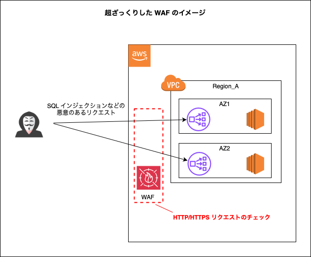

 

- Web Application Firewall の略

 

- グローバルサービス

 

- Web サイトを含めた Web アプリケーションをサイバー攻撃から守るサービス

    - HTTP / HTTPS リクエストを監視、検知、ブロックすることができるサービス

 

- ★WAF はすべての AWS のリソースを保護できるわけではない (HTTP / HTTPS リクエストを対象とするので当然と言えば当然)

    - 例: EC2 を直接保護することはできない

    - ★一般的には [CloudFront](./CloudFront.md) や [ALB](./AWS_ELB.md)、[REST API の API Gateway](./API_Gateway.md) を保護するケースが多い

 
 

参考サイト

[AWS WAFとは？メリットや機能、設定方法、運用の大変さとその対策をまとめて解説](https://www.wafcharm.com/jp/blog/aws-waf-for-beginners/)

[AWS サービスがどこにあるのかまとめ](https://qiita.com/saitotak/items/d2ede050e7a2224da46d)

[AWS WAF で保護できるリソース](https://docs.aws.amazon.com/ja_jp/waf/latest/developerguide/how-aws-waf-works-resources.html)

---

### WAF を構成する概念

#### Web ACL

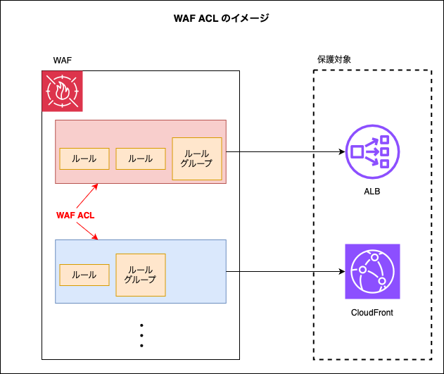

 

- [Rule](#rule)、[Rule Group](#rule-group) のコンテナのようなもの

    - WAF 内の Rule、Rule Group に優先度をつけることができる ≒ リクエストのチェック項目の順番を設定することができる

- WAF は Web ACL のコンテナのようなもの

- ★WAF は **Web ACL を保護対象のリソース (ALB や CloudFrontなど) に設定する**

    - Web ACL はリージョンを指定して作成する = 保護対象のリソースがそのリージョンに存在する必要がある

 
 

#### Rule

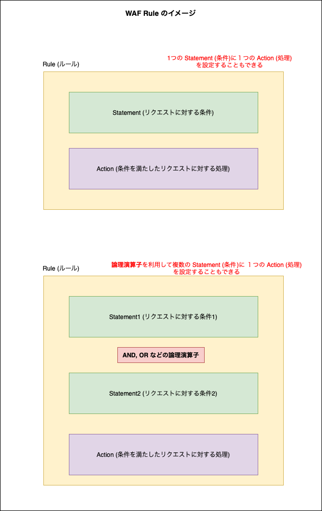

 

- リクエストに対する条件 ([Statement](#statement)) とその条件を満たした時の処理 ([Action](#action)) の組み合わせ

- ★論理演算を利用して複数の条件 (Statement) を設定することもできる

    - 一方、処理 (Action) は1ルールに1つ

- 以下の種類のルールがある

    - カスタムルール

        - 自分で Statement と Action を選択して作成するルール

     

    - [レートベースルール](#rate-based-rule)

 
 

#### Statement

- ★リクエストに対する条件

    - 例1: リクエスト元の IP アドレス (CIDR での範囲指定)

    - 例2: リクエストのヘッダーや body に特定の値を含んでいるかどうか

- 実際に設定できる Statement の種類については[こちら](#statement-1)を参照

 
 

#### Action (Rule Action)

- ★リクエストが [Statement](#statement) を満たした時に、**WAF がそのリクエストに対して行う処理のこと**

- 実際に設定できる Action の種類については[こちら](#action-1)を参照

 
 

#### Rule Group

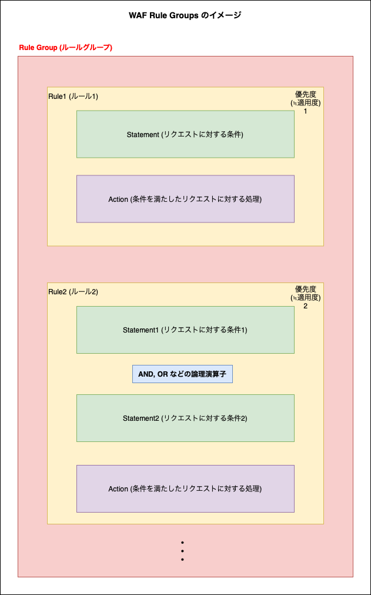

 

- ルールの集まり

- ルールグループを構成しているルールに対して個別に優先度を設定することができる

- ルールグループは再利用可能 = 複数の Web ACL に設定されることができる

 
 

#### デフォルトアクション

- リクエストが Web ACL のどのルールにも一致しない場合、もしくは Web ACL の全ルールの評価後、何のアクションも適用されなかった場合に WAF がそのリクエストに対して実行するアクションのこと

- デフォルトアクションは Web ACL に設定する

- ★デフォルトアクションには Allow か Block しか設定できない

 
 

#### Managed Rule

- AWS が提供するルールセット (= [ルールグループ](#rule-group)) のこと

- 一般的な攻撃に対する保護ルールを組んでくれているが、カスタマイズできないことに注意

 
 

#### Rate-based Rule

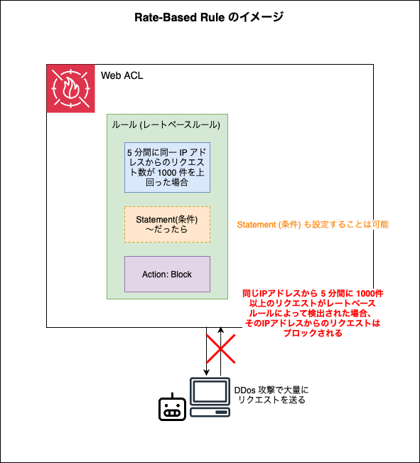

 

- 同一 IP アドレスからのリクエスト数をカウントし、最後の x 分間のリクエスト数が設定したしきい値を超えると、その IP アドレスからのリクエストを Block/Countする

- x 分間あたりのリクエスト数のしきい値は 100 ~ 20,000,000 で設定可能

- 同一 IP アドレスからのリクエストをカウントする間隔 (Evaluation Window) は 1,2,5,10 分から選ぶことができる

- ルール作成の際に Rated Based Rule を選択して作成する必要がある

- ★全てのリクエストを対象にするか、[Statement](#statement) 内の条件に一致したリクエストだけを対象にするかを選択可能

- ★★Rate Based Rule によってブロックされる IP アドレスはしばらくするとまたアクセスできるようになる

 
 

#### WafCharm

- サードパーティ製の WAF のルール運用を最適化させる WAF 自動運用サービス

- AWS WAF だけではなく、Azure WAF や Google Cloud Armor にも対応

- ★WafCharm を利用する場合、WAF の利用料とは別に WafCharm の料金も発生することに注意

    - WafCharm のサイバー攻撃を検知した際のメール通知を受信するために、別途 Kinesis Data Firehose、Lambda を自分で設定する必要があり、それらの利用料金も別途発生することに注意

 
 

参考サイト

[AWS WAFの基礎！リクエスト評価の仕組みとは？](https://youtu.be/GtLTcUwGPS0?si=tthVWGQS2S4VY_EY)

[\[AWS Black Belt Online Seminar\] AWS WAF アップデート](https://pages.awscloud.com/rs/112-TZM-766/images/20200324_AWS_BlackBelt_AWS_WAF_Update.pdf)

[WafCharmとは？AWS WAF、Azure WAF自動運用サービス](https://www.shadan-kun.com/blog/measure/5774/)

[WafCharmを始めるときに知っておきたいTips](https://qiita.com/lighthawk/items/9a9cbe6c790698dc67e9)

[AWS WAF でのレートベースのルールステートメントの使用](https://docs.aws.amazon.com/ja_jp/waf/latest/developerguide/waf-rule-statement-type-rate-based.html)

---

### Statement

#### リクエストについてチェックの対象にできるもの

- #### IP アドレス

- #### [ラベル](#ラベルとは)

- #### リクエストコンポーネント (= リクエストの構成要素)

    - HTTP メソッド

    - リクエストヘッダー

        - クッキーなど

    - クエリパラメーター (?でリクエスト URL に連結されるパラメーター)

    - リクエストボディ

    - JA3 フィンガープリント

 
 

#### チェック条件の種類

- #### IP アドレスに対して

    - リクエス元の国

    - リクエスト元 IP アドレスが指定したアドレス範囲 (CIDR 表記) のものと一致しているかどうか

 

- #### ラベルに対して

    - 対象の文字列に一致するかどうか

 

- #### リクエストコンポーネントに対して

    - 文字列マッチング

        - 対象のリクエストコンポーネント (リクエストヘッダー/リクエストボディなど) に対象の文字列が含まれているかどうか

        - 対象のリクエストコンポーネントに対象の文字列が完全に一致するかどうか

        - 対象のリクエストコンポーネントが対象の文字列で 始まっている/終わっている かどうか

            など

     

    - サイズ

        - 対象のリクエストコンポーネントが指定のサイズかどうか

        - 対象のリクエストコンポーネントが指定のサイズよりも 大きい/小さい かどうか

            など

     

    - 攻撃的な内容を含んでいるか

        - SQL インジェクション

            - 対象のリクエストコンポーネントに SQL 文が含まれているかどうか
        
         

        - XSS (クロスサイトスクリプティング)

            - 対象のリクエストコンポーネントにスクリプトなどが含まれているかどうか

 
 

#### 利用できる論理演算子

- #### AND

    - そのルールに設定した [Statement](#statement-1) が全て条件に一致するとアクションが実行される

 

- #### OR

    - そのルールに設定した [Statement](#statement-1) のうちどれか1つでも条件に一致するとアクションが実行される

 

- #### NOT

    - そのルールに設定した [Statement](#statement-1) が条件に一致しない場合、アクションが実行される

 
 

参考サイト

[AWS WAF のリクエストコンポーネント](https://docs.aws.amazon.com/ja_jp/waf/latest/developerguide/waf-rule-statement-fields-list.html)

[【アップデート】AWS WAFでXSSに対応しました](https://dev.classmethod.jp/articles/aws-waf-xss/)

---

### Action

#### 終了アクションと非終了アクション

- 終了アクション

    - 終了アクションが実行されると、Web ACL にまだ評価されていない後続のルールが残っていたとしても、残りのルールの評価を停止する

 

- 非終了アクション

    - 非終了アクションが実行されても後続のルールによる評価が継続される

 

#### アクションの種類

- #### Allow (許可)

    - リクエストを許可するアクション

    - 終了アクション

 

- #### Block (拒否)

    - リクエストを拒否するアクション

    - 終了アクション

    - 403 (Forbidden) を返す

 

- #### Count 

    - リクエストの許可も拒否も行わないアクション

         - Count アクションが実行された場合、記録が残り CloudWatch メトリクスなどで確認できる

     

    - 非終了アクション

     

    - 設定した Web ACL のルールで正しく運用できるかどうかをテスト/確認したい場合などに役立つルールアクション

 

- #### CAPTCHA

    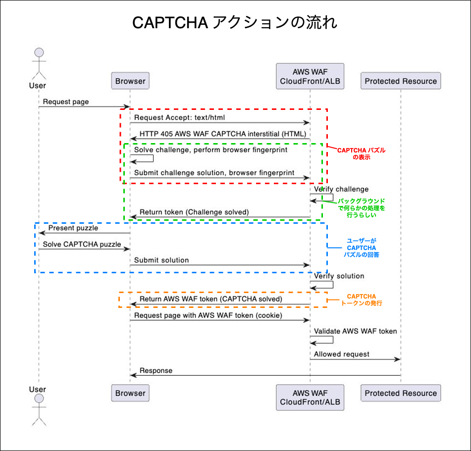

    引用: [AWS WAF の Challenge と CAPTCHA アクションを用いてボットから保護する](https://aws.amazon.com/jp/blogs/news/protect-against-bots-with-aws-waf-challenge-and-captcha-actions/)

     

    - bot からのリクエストかどうかを判定する目的で利用される

     

    - bot ではないことが確認される (= ユーザーがCAPTCHA パズルを解く) と、CAPTCHA トークンを返す

        - トークンの有効期間はデフォルトで 300 秒 (変更も可能) 

     

    - ★CAPTCHA アクションは、リクエスト内の CAPTCHA トークンの有無や内容によって以下のアクションをとる

        - トークンが有効の場合、Count アクションと同様に後続のルールの評価を続ける非終了アクションが実行される

        - トークンが無効もしくは有効期限切れの場合、Block アクションと同様にリクエストを拒否し、以降のルール評価を中止する

 

- #### Challenge

    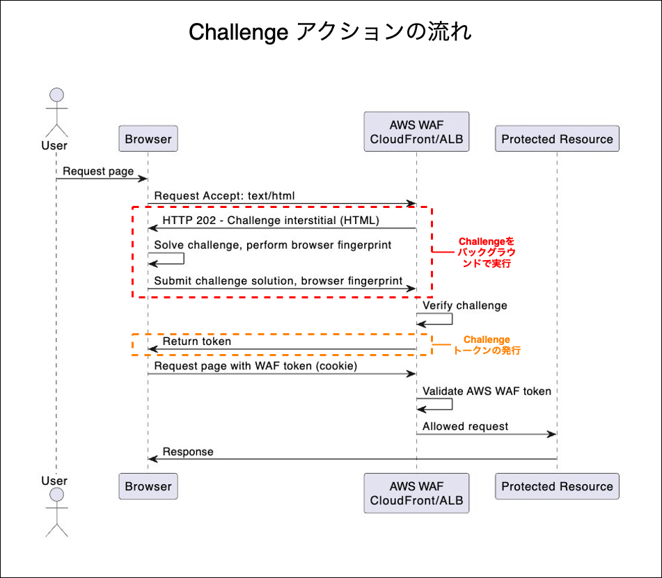

    引用: [AWS WAF の Challenge と CAPTCHA アクションを用いてボットから保護する](https://aws.amazon.com/jp/blogs/news/protect-against-bots-with-aws-waf-challenge-and-captcha-actions/)

     

    - ブラウザからのリクエストかどうかを判定する目的で利用される

     

    - ★CAPTCHA とは異なり、ユーザーが何かをする必要はなく、ブラウザのバックグランドで実行される

     

    - ブラウザからのリクエストであること (= ブラウザで Challenge がバックグラウンドで処理される) が確認されると、Challenge トークンを返す
        
        - トークンの有効期間はデフォルトで 300 秒 (変更も可能) 

     

    - ★Challenge アクションは、リクエスト内の Challenge トークンの有無や内容によって以下のアクションをとる

        - トークンが有効の場合、Count アクションと同様に後続のルールの評価を続ける非終了アクションが実行される

        - トークンが無効もしくは有効期限切れの場合、Block アクションと同様にリクエストを拒否し、以降のルール評価を中止する

 
 

参考サイト

ルールアクション全般について
- [AWS WAFの基礎！リクエスト評価の仕組みとは？](https://youtu.be/GtLTcUwGPS0?si=tthVWGQS2S4VY_EY)
- [AWS WAF でのルールアクションの使用](https://docs.aws.amazon.com/ja_jp/waf/latest/developerguide/waf-rule-action.html)

Count アクションについて
- [AWS WAFカウントモードの調査方法を整理してみた](https://dev.classmethod.jp/articles/waf-count-research)

CAPTCHA と Challenge アクションについて
- [AWS WAFの概念を分かりやすく説明してみた](https://yugaraxy.hatenablog.com/entry/2023/09/24/135224)
- [AWS WAF の Challenge と CAPTCHA アクションを用いてボットから保護する](https://aws.amazon.com/jp/blogs/news/protect-against-bots-with-aws-waf-challenge-and-captcha-actions/)
- [AWS WAFのChallengeアクションの動作を見てみる](https://dev.classmethod.jp/articles/aws-waf-what-is-challenge-action/)

---

### ラベルとは

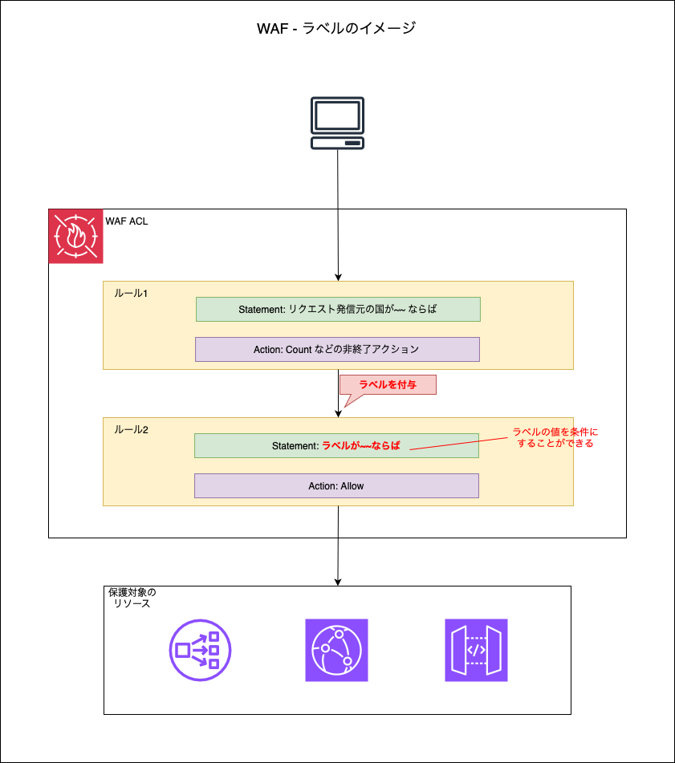

 

- ルールアクション実行後に、リクエストに付与することができるメタデータ

- 後続のルールにて、付与されたラベルに対するチェックを行うことができる

 
 

参考サイト

[AWS WAF ラベル機能の利用方法](https://www.wafcharm.com/jp/blog/aws-waf-label-usage-ja/)

[AWS WAF でのウェブリクエストのラベル付け](https://docs.aws.amazon.com/ja_jp/waf/latest/developerguide/waf-rule-label-overview.html)

---

### WAF の評価の仕組み

- Web ACL 内のルールやルールグループに優先度を付けることができる

- ルールグループ内のルールにも優先度をつけることができる

- ★★優先度の値が低いほど優先順位は高くなる

 

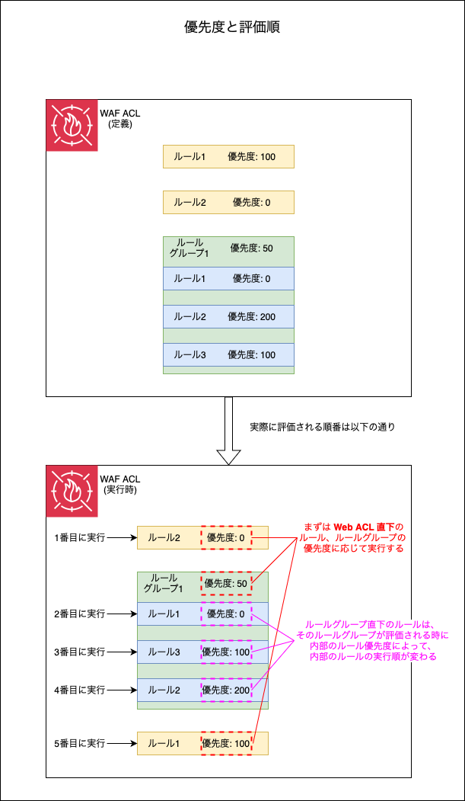

 
 

参考サイト

[AWS WAFの基礎！リクエスト評価の仕組みとは？](https://youtu.be/GtLTcUwGPS0?si=tthVWGQS2S4VY_EY)

[ウェブ ACL でのルール優先度の設定](https://docs.aws.amazon.com/ja_jp/waf/latest/developerguide/web-acl-processing-order.html)

---

### WAF で防ぐことのできる攻撃

1. XSS (クロスサイトスクリプティング)

2. SQL インジェクション

3. HTTP(S) での大量リクエスト (DDos の1種) であれば [Rate-based Rule](#rate-based-rule) で防げることもある

    - 大量のゾンビコンピュータ (= ウィルスに感染し、遠隔操作されてしまう PC) での DDos には対応しきれないかも

 

#### WAF では防げない攻撃

1. ネットワーク層 (L3) やトランスポート層 (L4) への攻撃

    - ping を大量に送りつける DDos (L3)

    - SYN フラッド攻撃 (L4)

        - TLS で TCP 3 way handshake の際にクライアントが SYN メッセージを送り、サーバから応答される SYN-ACK メッセージに、AKC を応答しないことでコネクションのリソースを占有する。これを大量に行う攻撃のこと (DDos の1種)

    - ★ネットワーク層やトランスポート層への DDos 攻撃は AWS Shield で防ぐことができる

 

2. OS・ミドルウェアへの攻撃

    - サーバーに侵入されてマシンの権限が奪われたり、不正プログラムを含んだファイルを実行させて、ソフトウェアの脆弱性を突くサイバー攻撃など

 
 

参考サイト

[WAFでDDoS攻撃を対策可能？防げない可能性とその対策も併せて解説](https://www.shadan-kun.com/waf_websecurity/waf_ddos/)

[WAFとIPS／IDSの違いとは？そもそも防御できる攻撃も違う！](https://www.shadan-kun.com/waf_websecurity/difference_between_waf_and_ips/)

[第3層 DDoS攻撃の仕組みとは？| L3 DDoS](https://www.cloudflare.com/ja-jp/learning/ddos/layer-3-ddos-attacks/)

[SYNフラッド攻撃](https://www.cloudflare.com/ja-jp/learning/ddos/syn-flood-ddos-attack/)

---

### AWS Shield との違い

#### WAF

- アプリケーション層 (L) への攻撃

- ネットワーク層 (L3) とトランスポート層 (L4) への攻撃や、OS への攻撃には対応できない

 

#### [AWS Shield](./AWS_Shield.md)

- ネットワーク層 (L3) とトランスポート層 (L4) の DDos から保護するサービス

 
 

参考サイト

---

### ログの出力

- Web ACL が受け取ったリクエストを `CloudWatch Logs`、 `S3`、 `Kinesis Data Firehouse Stream` に出力することができる

    - `CloudWatch Logs` のユースケース

        - ログをすぐ確認できるようにしたい場合

        - ログによってはアラートを受け取りたい場合

        - 大量のログを長期保存する場合、S3 よりもコストがかかる点に注意
    
     

    - `S3` のユースケース

        - 大量のログを長期に保存する必要がある場合

        - ログデータを分析するためには、Amazon Athena などの別サービスが必要な点に注意

        - リアルタイムにログ分析したいケースなどには向かないことに注意

     

    - `Kinesis Data Firehouse Stream` のユースケース

        - 他のストレージサービス(Amazon RedshiftやAmazon OpenSearch Service など)にログを保存したい場合

        - Data Firehoseはストレージサービスではないため、保存先を指定する必要があることに注意

 

- ログとして出力する内容をフィルタリングすることができる

- ログとして出力するリクエスト (Allow/Block/Count) を選択することができる

 
 

参考サイト

ログ出力全般について
- [AWS WAF ＋ API Gateway構成をカウントモードで構築し、ルールに該当するリクエストのログを取得してみた](https://dev.classmethod.jp/articles/output-requestlog-cloudwatch-aws-waf-api-gateway-count-mode)

- [[アップデート] AWS WAFのログを直接CloudWatch LogsおよびS3に出力可能になりました](https://dev.classmethod.jp/articles/aws-waf-log-support-s3-and-cloudwatch-logs/)

ログ出力先のユースケースについて
- [AWS WAFのログ出力先をS3バケットにした場合、リージョン集約が可能です](https://dev.classmethod.jp/articles/aws-waf-log-output-s3-bucket-region-aggregation/)

---

### コスト

#### 基本的なコスト

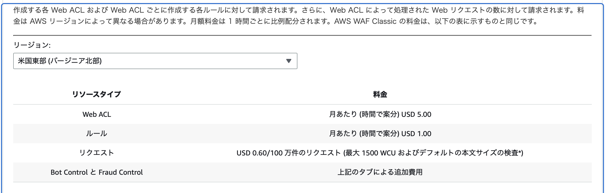

 

1. [作成した Web ACL に対する料金](#作成した-web-acl-に対する料金)

2. [Web ACL に含めるルールに対する料金](#web-acl-に含めるルール数に対する料金)

3. [AWS WAF が処理するクエスト数に対する料金](#aws-waf-が処理するクエスト数に対する料金)

4. [その他追加機能に対する料金](#その他追加機能に対する料金)

 

#### 作成した Web ACL に対する料金

- Web ACL 1 つにつき 5.0 USD (月額)

 

#### Web ACL に含めるルールに対する料金

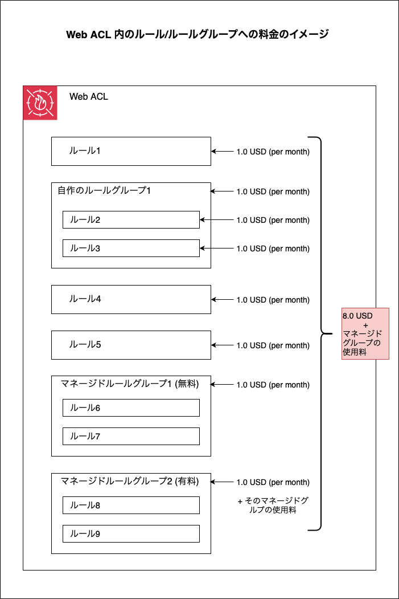

 

- Web ACL 内のルールやルールグループ 1 つにつき 1.0 USD (月額)

    - 自作のルールグループの場合、ルールグループ内のルールも 1 つにつき 1.0 USD (月額) の料金が発生する

    - ★★★マネージドルールグループの場合、そのルールグループ自体に 1.0 USD (月額) かかるが、マネージルールドルール内のルールに対しての料金は発生しない

        - ★★マネージドルールグループが有料の場合、上記のルールグループ自体にかかる料金 + 利用料金が発生する

 

#### AWS WAF が処理するクエスト数に対する料金

- リクエスト100万件につき 0.6 USD (月額)

    - ★★★ Web ACL の消費 [WCU](#web-acl-capacity-unit-wcu) が 1500 WCU を超えると、超過 500 WCU ごとに、100 万件のリクエストあたり 0.2 USD の追加料金が課金される

 

#### その他追加機能に対する料金

- [Bot Control](#bot-control)

    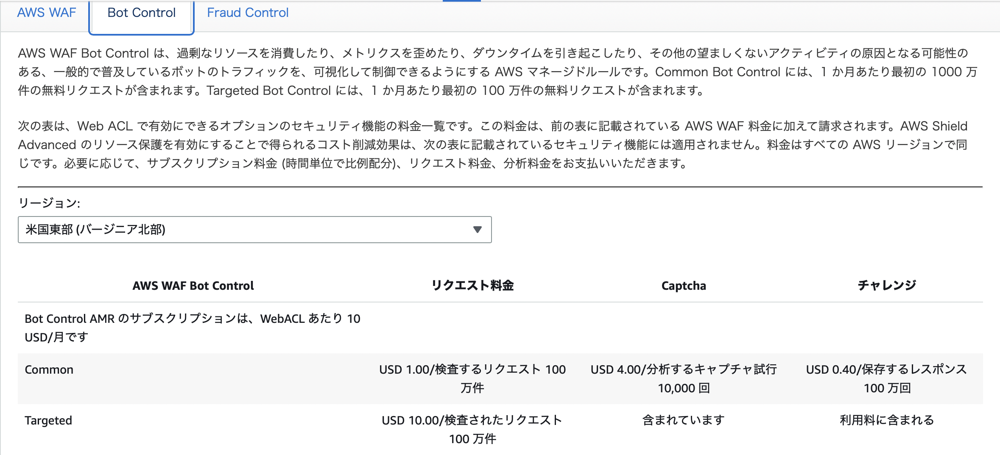

    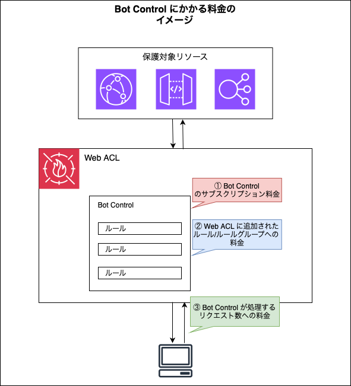

     

    - Bot Control のサブスクリプション料金がかかる

    - 画像の表にある Common レベルの Captcha、チャレンジの料金は基本無視していいっぽい

    - ★[Web ACL に含まれるルールグループへの料金](#web-acl-に含めるルールに対する料金)もかかる

    - ★★Bot Control で処理するリクエスト数に対する料金が発生する

        - [AWS WAF が処理するクエスト数に対する料金](#aws-waf-が処理するクエスト数に対する料金)とは別に上記料金が発生する

        - Common レベルの場合、その月の最初の 1,000 万リクエスト分の料金は無料枠で提供される

        - Targeted レベルの場合、その月の最初の 100 万リクエスト分の料金は無料枠で提供される

 

- [Fraud Control](#fraud-control)

    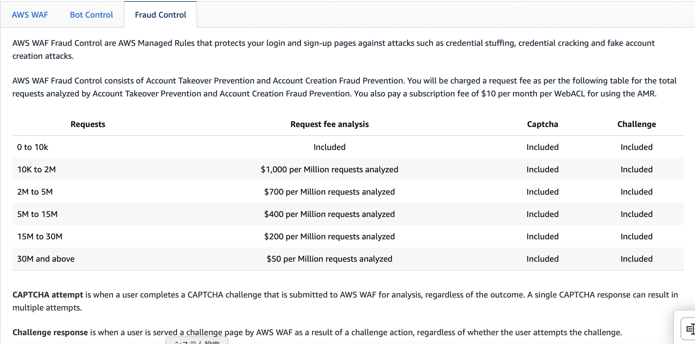

    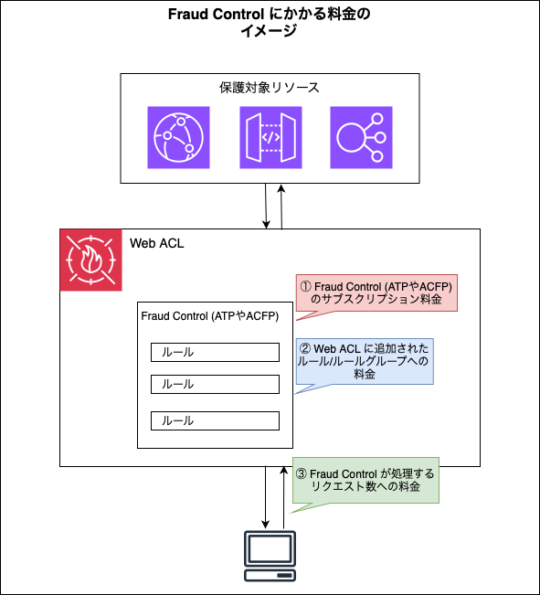

     

    - ATP / ACFP のサブスクリプション料金がかかる

    - ★[Web ACL に含まれるルールグループへの料金](#web-acl-に含めるルールに対する料金)もかかる

    - ★★Frud Control で処理するリクエスト数に対する料金が発生する

        - その月の最初の 1 万リクエスト分の料金は無料枠で提供される

 
 

参考サイト

WAF のコスト全般について
- [AWS WAF の料金](https://aws.amazon.com/jp/waf/pricing/?nc1=h_ls)

Bot Control について
- [AWS WAF Bot Controlとは？悪意あるBotへの対策！設定方法や料金も含めて解説](https://www.wafcharm.com/jp/blog/aws-waf-bot-control/)

Fraud Control について
- [re:Invent 2024: AWS WAFチームが語るBot対策とDeception技術](https://zenn.dev/kiiwami/articles/6286df3d7355880b#aws-wafの高度な機能とbot対策戦略)

---

### Web ACL Capacity Unit (WCU)

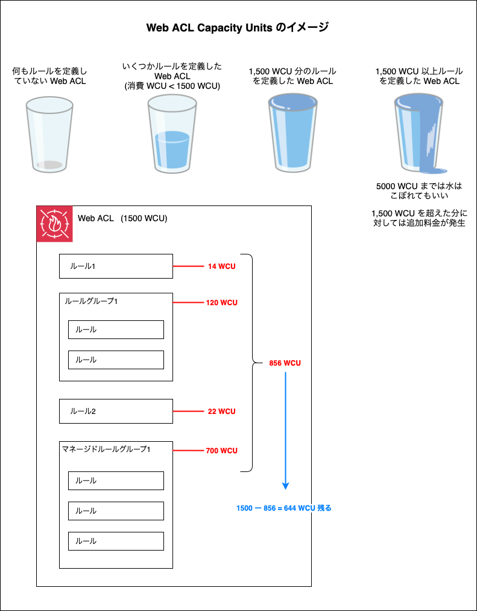

 

- Web ACL Capacity Unit (WCU) とは

    - ★Web ACL に定義されるルールの処理コストのようなもの

        - Web ACL に定義される[ルール](#rule)は WCU を消費する

            - イメージ的にはゲームでよく見られるような、キャラクターにコストがあり、キャラクター達で編成するチームにはチーム全体のコスト上限があるみたいな感じ

                - 編成するキャラクターのコスト = WCU

                - チームのコスト上限 Web ACL の WCU 上限

 

- ★★★1つの Web ACL WCU の上限は 1,500

    - ★WAF のサービスクォータの上限緩和の申請を行えば、最大 5,000 WCU まで引き上げることができる

    - ★★1,500 WCU 以上のルールを定義すると、その Web ACL で[処理するリクエストに対する料金](#aws-waf-が処理するクエスト数に対する料金)に追加料金が発生する

 
 

参考サイト

[AWS WAF マネージドルールの選び方](https://blog.serverworks.co.jp/choosing-aws-waf-managed-rules#Web-ACL-Capacity-Unit-WCU)

[\[AWS Black Belt Online Seminar\] AWS WAF アップデート](https://pages.awscloud.com/rs/112-TZM-766/images/20200324_AWS_BlackBelt_AWS_WAF_Update.pdf)

[AWS WAF(v2) の WCUsの上限緩和をサービスクォータで実施してみた](https://dev.classmethod.jp/articles/aws-wafv2-wcus-limit-increase/)

---

### Bot Control

- AWS マネージドルールグループの1つ (有料)

- ★ボット検出・対策のためのルールグループ

- Bot Control には Common と Targeted の2つのレベルがある

 

#### Common と Targeted の違い

- Targeted は標的型 Bot 攻撃への防御ルールを含んだルールグループ

- ★Targeted レベルの Bot Control ルールグループは Common レベルのルールを全て含んでいる

- ★Targeted レベルの Bot Control ルールグループの利用には[追加料金](#その他追加機能に対する料金)が発生する

 
 

参考サイト

[[アップデート] AWS WAF のマネージドルールグループ「Bot Control」に新しいバージョンが追加され Targeted ルールが強化されました](https://dev.classmethod.jp/articles/waf-managed-bot-targeted-v-2-3/)

[[アップデート]AWS WAFのBot Controlルールグループに検査レベル「Targeted」が追加され、新たに4つのインテリジェントなルールが利用可能になりました](https://dev.classmethod.jp/articles/aws-waf-targeted-bot/)

[AWS WAF BotControlを本番環境に導入してみた](https://speakerdeck.com/yama1998/aws-waf-botcontrolwoben-fan-huan-jing-nidao-ru-sitemita)

[新機能 – AWS WAF Bot Control でウェブサイトの不要なトラフィックを削減](https://aws.amazon.com/jp/blogs/news/reduce-unwanted-traffic-on-your-web-site-with-aws-bot-control/)

---

### Fraud Control

- ★★★Fraud Control というマネージドルールグループはない

    - 以下の AWS マネージドルールグループ (有料) を Fraud Control とラベリングしているイメージ

        - ★Account Takeover Prevention (ATP)

         

        - ★Account Creation Fraud Prevention (ACFP)

 

#### ATP と ACFP の違い

- ##### ATP

    - ★**アカウント乗っ取りを防ぐ目的**のルールグループ

    - ログインリクエストをチェックするのが主な使われ方

- ##### ACFP 

    - ★**不正なアカウント作成を防ぐ目的**のルールグループ

    - アカウント作成へのリクエストをチェックするのが主な使われ方

 

#### レスポンスの検知

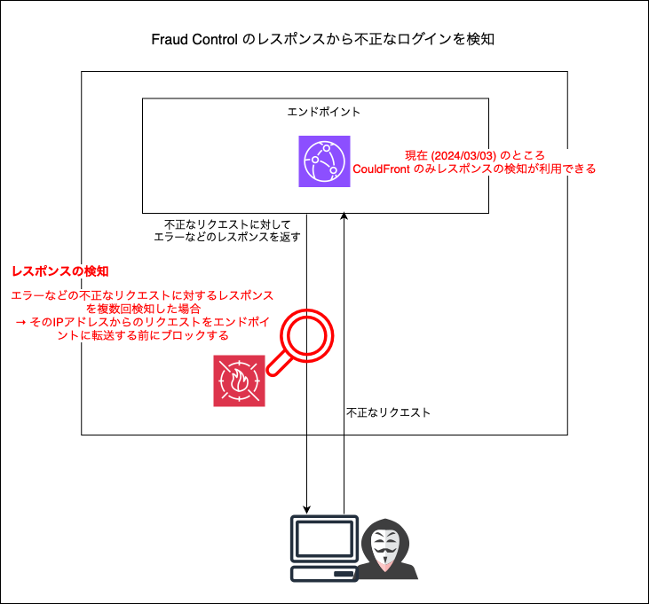

 

- リクエストだけではなくレスポンスに対してもチェックを行い、不正なレスポンスを複数回検知したらその IP アドレスからのリクエストをブロックするようになる機能

    - リクエストではなくレスポンスに対して別途条件を設定し、不正であると判断する条件に一致したアクセスをブロックすることができる

    - ★もちろん Fraud Control (ATP/ACFP) でのリクエストに対する条件も設定できる

- ★保護対象のリソースが CloudFront の時にしか使えない機能であることに注意 (2024/03/03 時点)

 
 

参考サイト

[re:Invent 2024: AWS WAFチームが語るBot対策とDeception技術](https://zenn.dev/kiiwami/articles/6286df3d7355880b#aws-wafの高度な機能とbot対策戦略)

[AWS WAFルールの基本をわかりやすく解説！マネージドルールも併せて紹介](https://www.wafcharm.com/jp/blog/aws-waf-rule/#:~:text=AWS%20WAF%20Fraud%20Controlアカウント,制御するルールグループです%E3%80%82)

[AWS WAFでAccount Takeover Prevention (ATP)機能を使ってログインページを保護する ](https://dev.classmethod.jp/articles/aws-waf-account-takeover-prevention-atp/)

[[アップデート] AWS WAF の Account Takeover Protection (ATP) 機能でオリジンレスポンスから不正なログイン試行を検知出来るようになりました](https://dev.classmethod.jp/articles/aws-waf-fraud-control-account-takeover-prevention-cloudfront-origin-responses/)

---

### スコープダウンステートメント (Scope Down Statement)

- 条件付けにより検査対象リクエストを絞る機能

 

#### マネージドルールグループと組み合わせる

- スコープダウンステートメントに一致するリクエストがそのマネージドルールグループに評価される

    - マネージドルールグループで評価されたリクエスト数に対して料金が発生する場合、スコープダウンステートメントはコストカットに寄与する可能性がある

 

#### レートベースルールと組み合わせる

- スコープダウンステートメントに一致するリクエストのレートをカウントするようになる

 
 

参考サイト

[AWS WAF マネージドルールグループにおける誤検知を回避する方法](https://techblog.nhn-techorus.com/archives/35651)

[Azoop Tech Blog AWS WAF完全に理解した](https://tech.azoop.co.jp/entry/2023/09/29/112523)

[AWS WAF のスコープダウンステートメントを使ってブロックされたリクエストを通す](https://sadayoshi-tada.hatenablog.com/entry/2022/10/05/235119)

[AWS WAF でのスコープダウンステートメントの使用](https://docs.aws.amazon.com/ja_jp/waf/latest/developerguide/waf-rule-scope-down-statements.html)

[AWS WAF での SQL インジェクション対策と誤検知への対応方法]()

[AWS WAF 導入時に考えた5つのこと](https://zenn.dev/prayd/articles/a9442b38fb57b9#誤検知の防止---scope-down-statement)