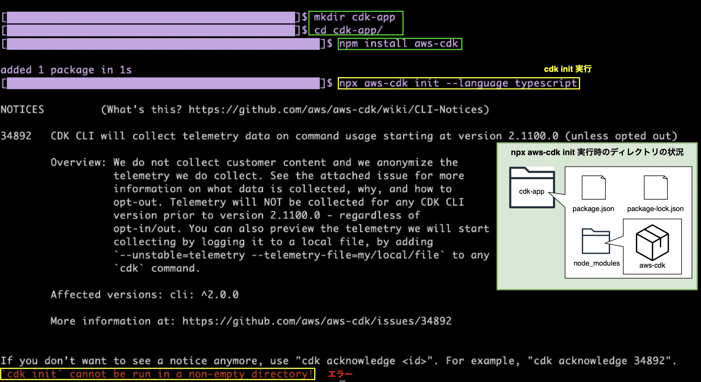
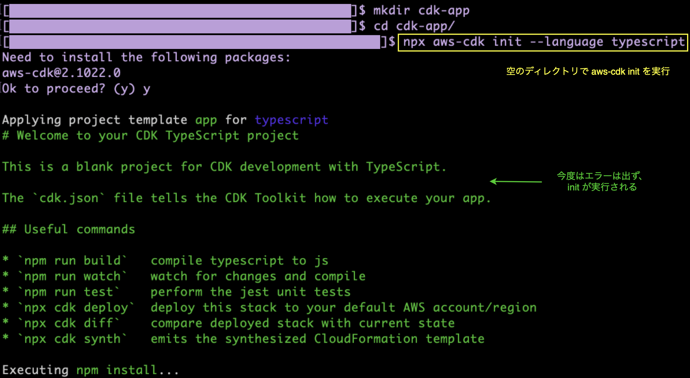

### 事象

cdk init で　CDK プロジェクトを作成しようとしてもエラーが発生して作成できない

---

### 原因

- cdk init を実行する際のディレクトリが空になっていなかった

    → `` `cdk init` cannot be run in a non-empty directory! ``

---

### 解決策

- そもそも aws-cdk をローカルインストールする必要はない。

- 空のディレクトリで `npx aws-cdk init` を実行すれば良い

    

 

- もしくは aws-cdk をグローバルインストールすることでどこからでも `cdk init` を実行できる

    -　↑はお勧めしない (プロジェクト毎に違うバージョンの aws-cdk を使っている場合などはめんどくさくなるから)