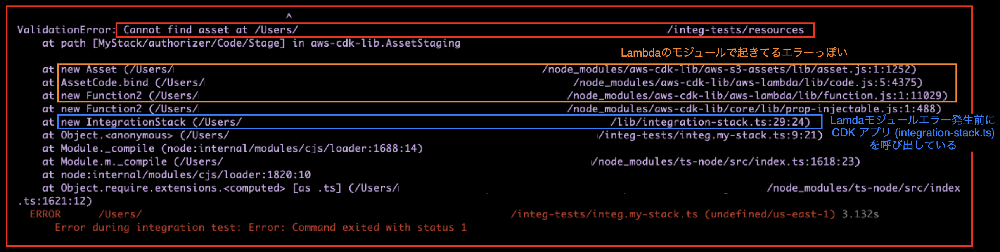

### 

- 以下は、[CDK の Integration Test のサンプルを作成&実施]()する際に発生したエラー達

    1. [そもそも Integration Test ファイルが実行できない](#そもそも-integration-test-ファイルが実行できない)

    <br>

    2. [Integration Test 実行時に Profile 情報を渡していなかった](#integration-test-実行時に-profile-情報を渡していなかった)

    <br>

    3. [API Gateway への GET リクエストにリクエストボディを設定していた](#api-gateway-への-get-リクエストにリクエストボディを設定していた)

    <br>

    4. [テスト対象のテーブル名やパーティションキー名の間違い](#テスト対象のテーブル名やパーティションキー名の間違い)

    <br>

    5. [Lambda 関数のコードを別ファイルから読み込む際のパスの指定が間違っていた](#lambda-関数のコードを別ファイルから読み込む際のパスの指定が間違っていた)

    <br>

    6. [テストするレスポンスのデータ型の間違い](#テストするレスポンスのデータ型の間違い)

    <br>

    7. [API Gateway にカスタム Authorizer (自作の Lambda 関数)を紐づけられていなかった](#api-gateway-にカスタム-authorizer-自作の-lambda-関数を紐づけられていなかった)

    <br>

    8. [DynamoDB に登録したデータが取得できない](#dynamodb-に登録したデータが取得できない)

    <br>

    9. [API Gateway (HTTP API) のカスタムオーソライザーにて IAM 形式のレスポンスを返そうとしたらエラーになる part1](#api-gateway-http-api-のカスタムオーソライザーにて-iam-形式のレスポンスを返そうとしたらエラーになる-part1)

    <br>

    10. [API Gateway (HTTP API) のカスタムオーソライザーにて IAM 形式のレスポンスを返そうとしたらエラーになる part2](#api-gateway-http-api-のカスタムオーソライザーにて-iam-形式のレスポンスを返そうとしたらエラーになる-part2)

---

### そもそも Integration Test ファイルが実行できない

#### 事象

- integ-runner コマンドを実行してもテストファイルが実行されない

    

<br>

#### 原因

- 複数の原因がある

1. --directory オプションでテストファイルがあるディレクトリを指定していない

    - --directory オプションを省略すると `test` ディレクトリを見に行く

<br>

2. ★Integartion テストファイル名は `integ.` で始まる必要がある

    - --test-regex オプションで他の正規表現も指定することができる

<br>

#### 解決策

- --directory オプションでテストファイルがあるディレクトリを指定する + テストファイル名を `integ.` から始まるように修正

    ```bash
    # テストファイル名の修正
    mv integ-test/integ-test.ts integ-test/integ.my-test.ts

    # テストファイルがあるディレクトリを指定して Integration Test 実行
    npx integ-runner --directory integ-tests --parallel-regions us-east-1 --clean
    ```

<br>
<br>

参考サイト

[@aws-cdk/integ-runner](https://www.npmjs.com/package/%40aws-cdk/integ-runner/v/2.119.0-alpha.0?utm_source=chatgpt.com)

---

### Integration Test 実行時に Profile 情報を渡していなかった

#### 事象

- integ-runner コマンドで Integration Test を実施したところ `Unable to resolve AWS account to use. ~~` というエラーメッセージが表示されテストが実行されない

    ```json
    // package.json
    {
        "scripts": {
            "integ-test": "integ-runner --directory ./integ-tests --parallel-regions us-east-1 --clean"
        },
    }
    ```

    ```bash
    # 初回のテストなので、snapshotテストは失敗しても、次のIntegration Testに進ませるために --update-on-failed を付与
    npm run integ-test -- --update-on-failed
    ```

    

<br>

#### 原因

- テスト実施時に　AWS アカウント情報が渡されていなかった

<br>

#### 解決策

- integ-runner コマンド実行時に環境変数 `AWS_PROFILE` に利用したいプロファイル名を指定する

    ```bash
    env AWS_PROFILE=<プロファイル> npm run integ-test -- --update-on-failed
    ```

<br>

- ★★`AWS_PROFILE` とは AWS CLI や SDK で使用する認証情報プロファイルを指定する環境変数

    

    <br>

    - integ-runner コマンドは --profile オプションがなく、実行時にコマンドからプロファイル情報を指定することができない → AWS_PROFILE を設定しておくことで、CLI や SDK はそこから環境情報を取得する

    - cdk deploy などのコマンドも、 --profile オプションが指定されていなければ AWS_PROFILE を次に参照する

---

### API Gateway への GET リクエストにリクエストボディを設定していた

#### 事象

- API Gateway に GET リクエストを送る Integration Test を実施したが、`Request with GET/HEAD method cannot have body` というエラーメッセージが表示され、テストが失敗した

    ```js
    // テストコード
    import * as cdk from "aws-cdk-lib";
    import { IntegrationStack } from "../lib/integration-stack";
    import * as it from "@aws-cdk/integ-tests-alpha";

    //Step1. 空のAppを作成
    const app = new cdk.App();

    //Step2. テスト対象のスタックを生成
    const targetStack = new IntegrationStack(app, "MyStack");

    //Step3. IntegTestインスタンス (コンストラクトを生成)
    const integTest = new it.IntegTest(app, "TestStack", {
        testCases: [targetStack] //testCasesにテスト対象のスタックを指定
    });

    //Step3.5 dynamoに認証用ユーザーの登録
    const userID = "100";
    const putItemCall = integTest.assertions.awsApiCall('DynamoDB', 'putItem', {
    TableName: "UserTable",
    Item: {
        user_id: { S: userID },
        name: { S: 'UserA' }
    },
    });

    //Step4. Lambda関数(/greetingに統合したLambda関数を呼び出す)
    integTest.assertions.httpApiCall(`${targetStack.endpointURL}`, {
        method: "GET",
        headers: {
            "Auth": "Allow"
        },
        body: "100", //★★★ここが原因★★★
    }).expect(it.ExpectedResult.objectLike({
        status: "200",
        body: "Hello From Lambda"
    }));
    ```

    

<br>

#### 原因

- GET メソッドでのリクエストにはリクエストボディを使ってはいけないらしい

    - ★★多くのライブラリや CDN、プロキシ、API ゲートウェイが GET メソッドのボディを無視したり、エラーになったりするため、GET メソッドにリクエストボディを利用してはいけない

        - 今回のエラーの原因: JavaScript の fetch や axios を利用する際、GET メソッドでリクエストボディを使うとエラーが発生する

    <br>

    - GETリクエストは安全に再送信でき、何度送信しても結果が変わらない冪等性を担保するべきとされている

<br>

- API Gateway がリクエストを受け取る前に、テストスタック側の HTTP リクエストを生成するときにエラーが発生した

    ```js
    //テストコード
    ...

    //Step4. Lambda関数(/greetingに統合したLambda関数を呼び出す)
    integTest.assertions.httpApiCall(`${targetStack.endpointURL}`, {
        method: "GET",
        headers: {
            "Auth": "Allow"
        },
        body: "100", //★★★ここが原因★★★
    }).expect(it.ExpectedResult.objectLike({
        status: "200",
        body: "Hello From Lambda"
    }));
    ```

<br>

#### 解決策

1. API Gateway　へのリクエストを GET から POST に修正する

    - CDK アプリ側でも API Gateway のコードを修正する必要が出てくる

        ```ts
        //アプリ側のコード
        ...

        //API Gateway(HTTP APIタイプ)
        const apiGateway = new ApiGateway.HttpApi(this, "MyHttpApi");

        //統合先(接続先のバックエンドリソース)の定義
        const integrationConfig = new HttpLambdaIntegration("Target", targetFunction);

        //パスの追加+統合先の設定
        apiGateway.addRoutes({
            path: "", //エンドポイントのパスを設定
            methods: [ApiGateway.HttpMethod.POST], //★★★ここをPOSTにする必要がある★★★
            integration: integrationConfig,
        });
        ```
        
        ```js
        //テストコード
        ...

        //Step4. Lambda関数(/greetingに統合したLambda関数を呼び出す)
        integTest.assertions.httpApiCall(`${targetStack.endpointURL}`, {
            method: "POST", //★★★ここをPOSTに修正★★★
            headers: {
                "Auth": "Allow"
            },
            body: "100",
        }).expect(it.ExpectedResult.objectLike({
            status: "200",
            body: "Hello From Lambda"
        }));
        ```

or

2. GET メソッドのまま、**リクエストボディではなくクエリパラメータでデータを渡す**ように修正する

    - 認証用 Lambda 関数側のコードも修正する必要がある (リクエストボディからデータを取得する代わりにクエリパラメーターから取得するように修正)

        ```js
        /**
         * 認証関数 (REQUESTオーソライザー)
        * 呼び出し元から渡されるユーザーIDでDynamoユーザーテーブルに検索をかる
        * → hitしたらOK、hitしなかったら401エラー
        * @param {*} event 呼び出し元から渡されるデータ
        * @param {*} context Lambda の 実行環境に関する情報を持つオブジェクト
        */

        import { DynamoDBClient, GetItemCommand } from "@aws-sdk/client-dynamodb";
        import { DynamoDBDocumentClient } from "@aws-sdk/lib-dynamodb";

        export const handler = async(event, context) => {

            let response = {
                "principalId": "test",
                "policyDocument": {
                    "Version": "2012-10-17",
                    "Statement": [
                        {
                            "Action": "execute-api:Invoke",
                            "Effect": "",
                            "Resource": event.routeArn
                        }
                    ]
                }
            }
            //認可ヘッダーを取得
            const auth = event.headers["Auth"] || event.headers["auth"];
            console.log("↓ヘッダー");
            console.log(auth);

            //★★★クエリパラメーターからユーザーIDを取得★★★
            const userID = event.queryStringParameters?.user_id;

            //認可ヘッダーにallowが設定されていない もしくは クエリパラメーターにユーザーIDがなければ401エラー
            if (auth !== "Allow" || !userID) {
                response.policyDocument.Statement.Effect = "Deny"
                return response;
            }


            //ダイナモDBクライアントの作成
            const client= new DynamoDBClient();
            const ddbDocClient = DynamoDBDocumentClient.from(client);
            //データ取得
            const result = await ddbDocClient.send(
                new GetItemCommand({
                    TableName: process.env.TABLE_NAME,
                    // Item: {
                    Key: {
                        // id: userID //送られてきたユーザーIDをキーに検索
                        user_id: userID //送られてきたユーザーIDをキーに検索
                    }
                })
            );


            //送られてきたユーザーIDがhitしなかった場合は404
            if (Object.keys(result.Item).length > 0) {
                //送られたユーザーIDを持つユーザーがいた場合OK(200:成功)
                response.policyDocument.Statement.Effect = "Allow"
            } else {
                response.policyDocument.Statement.Effect = "Deny"
            }

            return response;
        };
        ```

        ```js
        //テストコード
        ...

        //Step4. Lambda関数(/greetingに統合したLambda関数を呼び出す)
        integTest.assertions.httpApiCall(`${targetStack.endpointURL}?user_id=100`, { //★★★エンドポイントURL+クエリパラメーターでアクセス★★★
            method: "GET", //★GETのままでいい
            headers: {
                "Auth": "Allow"
            },
        }).expect(it.ExpectedResult.objectLike({
            status: "200",
            body: "Hello From Lambda"
        }));
        ```

<br>
<br>

参考サイト

[GET APIを作る時の教訓](https://zenn.dev/yuji/articles/8618a7e35da2e7)

---

### テスト対象のテーブル名やパーティションキー名の間違い

#### 事象

- Integration Test コードの中で、DynamoDB にデータを事前登録しようとしたら `CREATE_FAILED` というエラーで失敗した

    

<br>

#### 原因

- DynamoDB への putIteme 操作に失敗した

    - → `resource not found` というエラーメッセージから、putItem 対象のリソース (=Dynamo DB テーブル) が見つからなかったことがわかる

<br>

- テストコード中に指定した DynamoDB のテーブル名が、CDK アプリ側の DynamoDB のテーブルと合っていなかった

<br>

- 厳密には CDK アプリ側のコードの中で、DynamoDB のテーブル名を明示的にしていなかったため、デプロイ時にハッシュ値を含むテーブル名に自動的に解決されてしまっていた

    ```ts
    /**
     * API Gatewat + カスタムオーソライザー(Lambda) + Dynamo + 本体となるLambda関数 で構成するスタックモジュール
     */
    import * as cdk from 'aws-cdk-lib';
    import { Construct } from 'constructs';
    import { aws_apigatewayv2 as ApiGateway } from 'aws-cdk-lib';
    import { HttpLambdaIntegration } from 'aws-cdk-lib/aws-apigatewayv2-integrations';
    import { aws_lambda as lambda } from 'aws-cdk-lib';
    import { aws_dynamodb as db, RemovalPolicy } from "aws-cdk-lib";
    import * as path from 'path';

    export class IntegrationStack extends cdk.Stack {
    public readonly endpointURL: string;

        constructor(scope: Construct, id: string, props?: cdk.StackProps) {
            super(scope, id, props);

            // ユーザーテーブル
            const table = new db.TableV2(this, "UserTable", {
                //★★★このテーブルのTableNameを明示的に指定していなかった★★★
                partitionKey: {
                    name: "user_id",
                    type: db.AttributeType.STRING
                },
                removalPolicy: RemovalPolicy.DESTROY
            });

            //以下省略
        }
    }
    ```

    ```js
    //テストコード
    ...
    
    //Step3.5 dynamoに認証用ユーザーの登録
    const userID = "100";
    const putItemCall = integTest.assertions.awsApiCall('DynamoDB', 'putItem', {
    TableName: "UserTable", //★★★この指定したテーブル名のDynamoDBテーブルが存在しなかった
    Item: {
        user_id: { S: userID },
        name: { S: 'UserA' }
    },
    });
    ```
    
<br>

#### 解決策

- CDK アプリ側の DynamoDB リソースを定義している箇所でテーブル名も明示的に指定する

    ```ts
    /**
     * API Gatewat + カスタムオーソライザー(Lambda) + Dynamo + 本体となるLambda関数 で構成するスタックモジュール
     */
    import * as cdk from 'aws-cdk-lib';
    import { Construct } from 'constructs';
    import { aws_apigatewayv2 as ApiGateway } from 'aws-cdk-lib';
    import { HttpLambdaIntegration } from 'aws-cdk-lib/aws-apigatewayv2-integrations';
    import { aws_lambda as lambda } from 'aws-cdk-lib';
    import { aws_dynamodb as db, RemovalPolicy } from "aws-cdk-lib";
    import * as path from 'path';

    export class IntegrationStack extends cdk.Stack {
    public readonly endpointURL: string;

        constructor(scope: Construct, id: string, props?: cdk.StackProps) {
            super(scope, id, props);

            // ユーザーテーブル
            const table = new db.TableV2(this, "UserTable", {
                partitionKey: {
                    name: "user_id",
                    type: db.AttributeType.STRING
                },
                tableName: "UserTable", //★★★tableNameプロパティでテーブル名を明示★★★
                removalPolicy: RemovalPolicy.DESTROY
            });

            //以下省略
        }
    }
    ```

---

### Lambda 関数のコードを別ファイルから読み込む際のパスの指定が間違っていた

#### 事象

- Integration Test 実行時に `Cannot find asset` エラーでテストが実行されない

    

<br>

#### 原因

- CDK アプリにて Lambda 関数のコードファイルのパス指定を**相対パスで指定していた**

    ```ts
    /**
     * API Gatewat + カスタムオーソライザー(Lambda) + Dynamo + 本体となるLambda関数 で構成するスタックモジュール
     */
    import * as cdk from 'aws-cdk-lib';
    import { Construct } from 'constructs';
    import { aws_apigatewayv2 as ApiGateway } from 'aws-cdk-lib';
    import { HttpLambdaIntegration } from 'aws-cdk-lib/aws-apigatewayv2-integrations';
    import { aws_lambda as lambda } from 'aws-cdk-lib';
    import { aws_dynamodb as db, RemovalPolicy } from "aws-cdk-lib";

    export class IntegrationStack extends cdk.Stack {
        public readonly endpointURL: string;
        
        constructor(scope: Construct, id: string, props?: cdk.StackProps) {
        super(scope, id, props);

            // ユーザーテーブル
            const table = new db.TableV2(this, "UserTable", {
                partitionKey: {
                    name: "user_id",
                    type: db.AttributeType.STRING
                },
                tableName: "UserTable",
                removalPolicy: RemovalPolicy.DESTROY
            });

            // 認証用Lambda関数の定義
            const authorizer = new lambda.Function(this, "authorizer", {
                handler: "authorizer.handler",
                runtime: lambda.Runtime.NODEJS_22_X,
                code: lambda.Code.fromAsset('resources'), //★★★ここが原因★★★
                environment: {
                    TABLE_NAME: table.tableName
                }
            });

            //認証関数にdynamoへのアクセス(getObject)を許可
            table.grantReadData(authorizer);


            //API Gatewayの接続先となるLambda関数
            const targetFunction = new lambda.Function(this, "TargetLambda", {
            handler: "index.handler",
            runtime: lambda.Runtime.NODEJS_LATEST,
            code: lambda.Code.fromAsset('resources'), //★★★ここが原因★★★
            functionName: "Greeting"
            });

            //以下省略
        }
    }
    ```

<br>

- ★「Code.fromAsset() に相対パスを指定していた」+「integ-runner コマンドの --diretory オプションで指定したディレクトリがテスト実行中のカレントディレクトリになる」の組み合わせが悪かったためエラーが発生した


<br>

- ★`aws_lambda.Code.fromAsset(path: string, options?: AssetOptions))` の path には相対パスでも絶対パス でも指定可能

    - ★★`fromAsset()` は内部的に `path.resolve()` を使ってファイルパスを解決する

        - ★★★path に相対パスを指定した場合、**実行時のディレクトリまでの絶対パス + 指定されたパス**でファイルパスの解決を行う

        <br>

        - ★★★path に絶対パスを指定した場合、絶対パスの `/(ルート)` を見つけたとき、それより前のパスを無視するので実質指定された絶対パスでファイルパスの解決を行う

<br>

#### 解決策

1. Lambda コンストラクトで指定している関数コードのファイルパスの指定方法を絶対パスにする

    ```ts
    /**
     * API Gatewat + カスタムオーソライザー(Lambda) + Dynamo + 本体となるLambda関数 で構成するスタックモジュール
     */
    import * as cdk from 'aws-cdk-lib';
    import { Construct } from 'constructs';
    import { aws_apigatewayv2 as ApiGateway } from 'aws-cdk-lib';
    import { HttpLambdaIntegration } from 'aws-cdk-lib/aws-apigatewayv2-integrations';
    import { aws_lambda as lambda } from 'aws-cdk-lib';
    import { aws_dynamodb as db, RemovalPolicy } from "aws-cdk-lib";
    import * as path from 'path';

    export class IntegrationStack extends cdk.Stack {
        public readonly endpointURL: string;
        
        constructor(scope: Construct, id: string, props?: cdk.StackProps) {
        super(scope, id, props);

            // ユーザーテーブル
            const table = new db.TableV2(this, "UserTable", {
                partitionKey: {
                    name: "user_id",
                    type: db.AttributeType.STRING
                },
                tableName: "UserTable",
                removalPolicy: RemovalPolicy.DESTROY
            });

            // 認証用Lambda関数の定義
            const authorizer = new lambda.Function(this, "authorizer", {
                handler: "authorizer.handler",
                runtime: lambda.Runtime.NODEJS_22_X,
                code: lambda.Code.fromAsset(path.resolve(__dirname, "../resources")), //★★★ここを絶対パスで指定する★★★
                environment: {
                    TABLE_NAME: table.tableName
                }
            });

            //認証関数にdynamoへのアクセス(getObject)を許可
            table.grantReadData(authorizer);

            //API Gatewayの接続先となるLambda関数
            const targetFunction = new lambda.Function(this, "TargetLambda", {
            handler: "index.handler",
            runtime: lambda.Runtime.NODEJS_LATEST,
            code: lambda.Code.fromAsset(path.resolve(__dirname, "../resources")), //★★★ここを絶対パスで指定する★★★
            functionName: "Greeting"
            });

            //以下省略
        }
    }
    ```

or

2. Integration Test ファイルを /integ-tests からプロジェクトルート直下に移動し、integ-runner コマンドを --directory オプションをつけずに実行する

    - ★テストファイルが増えると、プロジェクトルートに複数のテストファイルが保存されることになり、管理性が良く無いためこの方法は取らないほうがいい

---

### テストするレスポンスのデータ型の間違い

#### 事象

- API Gateway のエンドポイントに紐づけられている Lambda 関数からのレスポンスをテストしようとしたところ、テストは実施できたが、テスト結果としては意図した結果が返ってこなかったためテスト失敗

    ```ts
    //テストコード
    import * as cdk from "aws-cdk-lib";
    import { IntegrationStack } from "../lib/integration-stack";
    import * as it from "@aws-cdk/integ-tests-alpha";

    //Step1. 空のAppを作成
    const app = new cdk.App();

    //Step2. テスト対象のスタックを生成
    const targetStack = new IntegrationStack(app, "MyStack");

    //Step3. IntegTestインスタンス (コンストラクトを生成)
    const integTest = new it.IntegTest(app, "TestStack", {
        testCases: [targetStack] //testCasesにテスト対象のスタックを指定
    });

    //Step3.5 dynamoに認証用ユーザーの登録
    const userID = "100";
    const putItemCall = integTest.assertions.awsApiCall('DynamoDB', 'putItem', {
    TableName: "UserTable",
    Item: {
        user_id: { S: userID },
        name: { S: 'UserA' }
    },
    });

    //Step4. Lambda関数(/greetingに統合したLambda関数を呼び出す)
    integTest.assertions.httpApiCall(`${targetStack.endpointURL}?user_id=${userID}`, {
        method: "GET",
        headers: {
            "Auth": "Allow"
        },
    }).expect(it.ExpectedResult.objectLike({
        status: "200",
        body: "Hello From Lambda"
    }));

    //Step5. リクエストボディに含めるユーザーIDが登録されていない(=404エラー)ケース
    integTest.assertions.httpApiCall(`${targetStack.endpointURL}/user_id=200`, {
        method: "GET",
        headers: {
            "Auth": "Allow"
        },
    }).expect(it.ExpectedResult.objectLike({
        status: "404",
    }));
    ```

    

<br>

#### 原因

- Lamnda 関数からのレスポンスにある status (ステータスコード) が文字列として評価していたが、実際は Number で返ってくる

<br>

#### 解決策

- Lambda 関数からのレスポンスの status を Nummber 型のデータで評価する

    ```ts
    //テストコード
    import * as cdk from "aws-cdk-lib";
    import { IntegrationStack } from "../lib/integration-stack";
    import * as it from "@aws-cdk/integ-tests-alpha";

    //Step1. 空のAppを作成
    const app = new cdk.App();

    //省略

    //Step4. Lambda関数(/greetingに統合したLambda関数を呼び出す)
    integTest.assertions.httpApiCall(`${targetStack.endpointURL}?user_id=${userID}`, {
        method: "GET",
        headers: {
            "Auth": "Allow"
        },
    }).expect(it.ExpectedResult.objectLike({
        status: 200, //★★★satusはnumberで評価★★★
        body: "Hello From Lambda"
    }));

    //Step5. リクエストボディに含めるユーザーIDが登録されていない(=404エラー)ケース
    integTest.assertions.httpApiCall(`${targetStack.endpointURL}/user_id=200`, {
        method: "GET",
        headers: {
            "Auth": "Allow"
        },
    }).expect(it.ExpectedResult.objectLike({
        status: 404, //★★★satusはnumberで評価★★★
    }));
    ```

---

### API Gateway にカスタム Authorizer (自作の Lambda 関数)を紐づけられていなかった

#### 事象

- これまで発生したエラーたちを修正しても、期待するテストが通らない

    ```ts
    /**
    * API Gatewat + カスタムオーソライザー(Lambda) + Dynamo + 本体となるLambda関数 で構成するスタックモジュール
    */
    import * as cdk from 'aws-cdk-lib';
    import { Construct } from 'constructs';
    import { aws_apigatewayv2 as ApiGateway } from 'aws-cdk-lib';
    import { HttpLambdaIntegration } from 'aws-cdk-lib/aws-apigatewayv2-integrations';
    import { aws_lambda as lambda } from 'aws-cdk-lib';
    import { aws_dynamodb as db, RemovalPolicy } from "aws-cdk-lib";
    import * as path from 'path';

    export class IntegrationStack extends cdk.Stack {
        public readonly endpointURL: string;
        public readonly userTable: string;
    
        constructor(scope: Construct, id: string, props?: cdk.StackProps) {
            super(scope, id, props);

            //ユーザーテーブル
            const table = new db.TableV2(this, "MyDynamoable", {
                partitionKey: {
                    name: "user_id",
                    type: db.AttributeType.STRING
                },
                tableName: "UserTable",
                removalPolicy: RemovalPolicy.DESTROY
            });
            this.userTable = table.tableName;

            //カスタムオーソライザー
            const authorizer = new lambda.Function(this, "MyAuthorizer", {
                handler: "authorizer.handler",
                runtime: lambda.Runtime.NODEJS_22_X,
                code: lambda.Code.fromAsset(path.join(__dirname, '../resources')),
                environment: {
                    TABLE_NAME: table.tableName
                }
            });

            //カスタムオーソライザーにdynamoへのアクセス(getObject)を許可
            table.grantReadData(authorizer);

            //API Gatewayの接続先となるLambda関数
            const targetFunction = new lambda.Function(this, "TargetLambda", {
                handler: "index.handler",
                runtime: lambda.Runtime.NODEJS_LATEST,
                code: lambda.Code.fromAsset(path.join(__dirname, '../resources')),
                functionName: "Greeting"
            });

            //API Gateway(HTTP APIタイプ)
            const apiGateway = new ApiGateway.HttpApi(this, "MyHttpApi");
            //統合先(接続先のバックエンドリソース)の定義
            const integrationConfig = new HttpLambdaIntegration("Target", targetFunction);

            //パスの追加+統合先の設定
            apiGateway.addRoutes({
                path: "/greeting",
                methods: [ApiGateway.HttpMethod.GET],
                integration: integrationConfig,
                authorizer: lambdaAuthorizerConfig
            });
        }
    }
    ```

    ```ts
    //テストコード
    import * as cdk from "aws-cdk-lib";
    import { IntegrationStack } from "../lib/integration-stack";
    import * as it from "@aws-cdk/integ-tests-alpha";

    //Step1. 空のAppを作成
    const app = new cdk.App();

    //Step2. テスト対象のスタックを生成
    const targetStack = new IntegrationStack(app, "MyStack");

    //Step3. IntegTestインスタンス (コンストラクトを生成)
    const integTest = new it.IntegTest(app, "TestStack", {
        testCases: [targetStack] //testCasesにテスト対象のスタックを指定
    });

    //Step3.5 dynamoに認証用ユーザーの登録
    const userID = "100";
    const putItemCall = integTest.assertions.awsApiCall('DynamoDB', 'putItem', {
    TableName: targetStack.userTable,
    Item: {
        user_id: { S: userID },
        name: { S: 'UserA' }
    },
    });

    //Step4. Lambda関数(/greetingに統合したLambda関数を呼び出す)
    integTest.assertions.httpApiCall(`${targetStack.endpointURL}?user_id=${userID}`, {
        method: "GET",
        headers: {
            "Auth": "Allow"
        },
    }).expect(it.ExpectedResult.objectLike({
        status: 200,
        body: "Hello From Lambda"
    }));

    //Step5. ヘッダーにAuthを含まない(=401エラー)ケース
    integTest.assertions.httpApiCall(`${targetStack.endpointURL}?user_id=${userID}`, {
        method: "GET",
    }).expect(it.ExpectedResult.objectLike({
        status: 401,
    }));
        
    //Step6. クエリパラメーターにuser_idを含まない(=401)ケース
    integTest.assertions.httpApiCall(`${targetStack.endpointURL}`, {
        method: "GET",
    }).expect(it.ExpectedResult.objectLike({
        status: 401,
    }));

    //Step7. リクエストボディに含めるユーザーID(999)が登録されていない(=403エラー)ケース
    integTest.assertions.httpApiCall(`${targetStack.endpointURL}?user_id=999`, {
        method: "GET",
        headers: {
            "Auth": "Allow"
        },
    }).expect(it.ExpectedResult.objectLike({
        status: 403,
    }));
    ```

<br>

- CloudWatch Logs でカスタムオーソライザーのログを見てみると何も出力されていない = カスタムオーソライザーが実行されていない

    

<br>

#### 原因

- 考えられる問題はいくつかある

    - API Gateway とカスタムオーソライザーの紐付けの箇所で、[Identity Source]() の指定がうまくいってない

        - API Gateway では Identity Source に指定したパラメーターが渡ってこないと、カスタムオーソライザーを呼び出す前に 401 エラーを返す

<br>

- カスタムオーソライザーが紐づけられていなかった

<br>

- 今回は CDK アプリ側のコードにてカスタムオーソライザーを API Gateway に紐づけていなかったのが原因

    - `APIGateway.addRoutes()` にてオーソライザーの設定をしていなかった

        ```ts
        /**
        * API Gatewat + カスタムオーソライザー(Lambda) + Dynamo + 本体となるLambda関数 で構成するスタックモジュール
        */
        import * as cdk from 'aws-cdk-lib';
        import { Construct } from 'constructs';
        import { aws_apigatewayv2 as ApiGateway } from 'aws-cdk-lib';
        import { HttpLambdaIntegration } from 'aws-cdk-lib/aws-apigatewayv2-integrations';
        import { aws_lambda as lambda } from 'aws-cdk-lib';
        import { aws_dynamodb as db, RemovalPolicy } from "aws-cdk-lib";
        import * as path from 'path';

        export class IntegrationStack extends cdk.Stack {
            public readonly endpointURL: string;
            public readonly userTable: string;
        
            constructor(scope: Construct, id: string, props?: cdk.StackProps) {
                super(scope, id, props);

                //省略

                //API Gateway(HTTP APIタイプ)
                const apiGateway = new ApiGateway.HttpApi(this, "MyHttpApi");
                //統合先(接続先のバックエンドリソース)の定義
                const integrationConfig = new HttpLambdaIntegration("Target", targetFunction);

                //パスの追加+統合先の設定
                apiGateway.addRoutes({
                    path: "/greeting",
                    methods: [ApiGateway.HttpMethod.GET],
                    integration: integrationConfig,
                    //★★★authorizer: ~~ が必要だった★★★
                });
            }
        }
        ```

<br>

#### 解決策

- カスタムオーソライザーを紐づける

    1. より簡単なカスタムオーソライザーの定義ができる `aws_apigatewayv2_authorizers.HttpLambdaAuthorizer` を利用する

        - `aws_apigatewayv2_authorizers.HttpLambdaAuthorizer` はカスタムオーソライザーに指定する Lambda 関数、カスタムオーソライザーのレスポンス形式、 Identity Source の指定などを定義する L2 コンストラクト

            - ★HTTP API (aws_apigatewayv2.httpAPI) の カスタムオーソライザーは2種類の Response Types (IAM / Simple)を選択できる

                - Response Type V1

                    - IAM 形式

                        - `policyDocument.Statement[i].Effect` プロパティで認可、拒否を設定

                        - `context` プロパティでカスタムオーソライザーから統合先に渡したいデータを追加できる

                            ```json
                            {
                                "principalId": "abcdef", // The principal user identification associated with the token sent by the client.
                                "policyDocument": {
                                    "Version": "2012-10-17",
                                    "Statement": [
                                    {
                                        "Action": "execute-api:Invoke",
                                        "Effect": "Allow|Deny",
                                        "Resource": "arn:aws:execute-api:{regionId}:{accountId}:{apiId}/{stage}/{httpVerb}/[{resource}/[{child-resources}]]"
                                    }
                                    ]
                                },
                                "context": {
                                    "exampleKey": "exampleValue"
                                }
                            }
                            ```

                <br>

                - Response Type V2

                    - IAM 形式
                        - V1と同じ

                    <br>

                    - Simple 形式

                        - `isAuthorized` プロパティで認可、拒否を設定

                        - `context` プロパティでカスタムオーソライザーから統合先に渡したいデータを追加できる

                            ```json
                            {
                                "isAuthorized": true/false,
                                "context": {
                                    "exampleKey": "exampleValue"
                                }
                            }
                            ```

        <br>

        - `aws_apigatewayv2_authorizers.HttpLambdaAuthorizer` インスタンスを作成する

            ```ts
            /**
            * API Gatewat + カスタムオーソライザー(Lambda) + Dynamo + 本体となるLambda関数 で構成するスタックモジュール
            */
            import * as cdk from 'aws-cdk-lib';
            import { Construct } from 'constructs';
            import { aws_apigatewayv2 as ApiGateway, aws_apigatewayv2_authorizers as ApiGatewayAuthorizer } from 'aws-cdk-lib';
            import { HttpLambdaIntegration } from 'aws-cdk-lib/aws-apigatewayv2-integrations';
            import { aws_lambda as lambda } from 'aws-cdk-lib';
            import { aws_dynamodb as db, RemovalPolicy } from "aws-cdk-lib";
            import * as path from 'path';

            export class IntegrationStack extends cdk.Stack {
                public readonly endpointURL: string;
                public readonly userTable: string;
            
                constructor(scope: Construct, id: string, props?: cdk.StackProps) {
                    super(scope, id, props);

                    //省略

                    //API Gateway(HTTP APIタイプ)
                    const apiGateway = new ApiGateway.HttpApi(this, "MyHttpApi");
                    //統合先(接続先のバックエンドリソース)の定義
                    const integrationConfig = new HttpLambdaIntegration("Target", targetFunction);

                    //★★★カスタムオーソライザー設定★★★
                    const lambdaAuthorizerConfig = new ApiGatewayAuthorizer.HttpLambdaAuthorizer("AuthorizerForGreeting", authorizer, {
                        responseTypes: [ApiGatewayAuthorizer.HttpLambdaResponseType.SIMPLE],
                        identitySource: [
                            //★★★API Gatewayの種類がHTTP APIなので $requestでidentity sourceを指定する★★★
                            '$request.header.Auth',
                            '$request.querystring.user_id'
                            ]
                    });

                    //パスの追加+統合先の設定
                    apiGateway.addRoutes({
                        path: "/greeting",
                        methods: [ApiGateway.HttpMethod.GET],
                        integration: integrationConfig,
                        //authorizer: ~~ が必要だった
                    });
                }
            }
            ```

    <br>

    2. `aws_apigatewayv2.HttpApi.addRoutes()` の対象パスに対するカスタムオーソライザーとして作成した `aws_apigatewayv2_authorizers.HttpLambdaAuthorizer` インスタンス指定する

        ```ts
        /**
        * API Gatewat + カスタムオーソライザー(Lambda) + Dynamo + 本体となるLambda関数 で構成するスタックモジュール
        */
        import * as cdk from 'aws-cdk-lib';
        import { Construct } from 'constructs';
        import { aws_apigatewayv2 as ApiGateway, aws_apigatewayv2_authorizers as ApiGatewayAuthorizer } from 'aws-cdk-lib';
        import { HttpLambdaIntegration } from 'aws-cdk-lib/aws-apigatewayv2-integrations';
        import { aws_lambda as lambda } from 'aws-cdk-lib';
        import { aws_dynamodb as db, RemovalPolicy } from "aws-cdk-lib";
        import * as path from 'path';

        export class IntegrationStack extends cdk.Stack {
            public readonly endpointURL: string;
            public readonly userTable: string;
        
            constructor(scope: Construct, id: string, props?: cdk.StackProps) {
                super(scope, id, props);

                //省略

                //API Gateway(HTTP APIタイプ)
                const apiGateway = new ApiGateway.HttpApi(this, "MyHttpApi");
                //統合先(接続先のバックエンドリソース)の定義
                const integrationConfig = new HttpLambdaIntegration("Target", targetFunction);

                //カスタムオーソライザー設定
                const lambdaAuthorizerConfig = new ApiGatewayAuthorizer.HttpLambdaAuthorizer("AuthorizerForGreeting", authorizer, {
                    responseTypes: [ApiGatewayAuthorizer.HttpLambdaResponseType.SIMPLE],
                    identitySource: [
                        '$request.header.Auth',
                        '$request.querystring.user_id'
                        ]
                });

                //パスの追加+統合先の設定
                apiGateway.addRoutes({
                    path: "/greeting",
                    methods: [ApiGateway.HttpMethod.GET],
                    integration: integrationConfig,
                    authorizer: lambdaAuthorizerConfig //★★★ここにカスタムオーソライザーの設定を追加★★★
                });
            }
        }
        ```

<br>
<br>

参考サイト

[API Gateway カスタムオーソライザーの挙動を確認してみた](https://dev.classmethod.jp/articles/api-gateway-lambda-custom-authorizer/    )

---

### DynamoDB に登録したデータが取得できない

#### 事象

- とあるカスタムオーソライザーにて、リクエスト中の user_id というパラメーラーで DynamoDB に検索をかけ、データがヒットすれば認可、ヒットしなければ拒否という処理を行っていたのだが、検索にヒットするべきテストケースにおいてもリクエストが認可されなかった

    ```js
    /**
     * カスタムオーソライザー
     * 呼び出し元から渡されるユーザーIDでDynamoユーザーテーブルに検索をかる
     * → hitしたらOK、hitしなかったら401エラー
     * @param {*} event 呼び出し元から渡されるデータ
     * @param {*} context Lambda の 実行環境に関する情報を持つオブジェクト
     */
    import { DynamoDBClient } from "@aws-sdk/client-dynamodb";
    import { DynamoDBDocumentClient, GetCommand } from "@aws-sdk/lib-dynamodb";

    //ダイナモDBクライアントの作成
    const client= new DynamoDBClient();
    const ddbDocClient = DynamoDBDocumentClient.from(client);

    export const handler = async(event, context) => {
        
        let response = {
            isAuthorized: false,
        };

        //認可ヘッダーを取得
        console.log("↓ヘッダー");
        console.log(event.headers);
        
        const auth = event.headers["Auth"] || event.headers["auth"];
        
        //クエリパラメーター中のユーザーIDを取得
        let userID = event.queryStringParameters?.user_id;

        //認可ヘッダーにallowが設定されていない もしくは クエリパラメーターにユーザーIDがなければ403エラー
        if (auth !== "Allow" || !userID) {
            response.isAuthorized = false;
            return response;
        }
        
        //データ取得
        console.log("↓テーブル名")
        console.log(process.env.TABLE_NAME);
        const result = await ddbDocClient.send(
            new GetCommand({
                TableName: process.env.TABLE_NAME,
                Key: {
                    user_id: userID
                }
            })
        );

        //★★★検索結果をログに出してみる★★★
        console.log("-------------------↓検索結果-------------------");
        console.log(result);

        //送られてきたユーザーIDがhitしなかった場合は403
        if (result.Item) {
            //送られたユーザーIDを持つユーザーがいた場合OK(200:成功)
            response.isAuthorized = true;
        } else {
            response.isAuthorized = false;
        }

        return response;
    };
    ```

    ```ts
    /**
     * API Gatewat + カスタムオーソライザー(Lambda) + Dynamo + 本体となるLambda関数 で構成するスタックモジュール
     */
    import * as cdk from 'aws-cdk-lib';
    import { Construct } from 'constructs';
    import { aws_apigatewayv2 as ApiGateway, aws_apigatewayv2_authorizers as ApiGatewayAuthorizer } from 'aws-cdk-lib';
    import { HttpLambdaIntegration } from 'aws-cdk-lib/aws-apigatewayv2-integrations';
    import { aws_lambda as lambda } from 'aws-cdk-lib';
    import { aws_dynamodb as db, RemovalPolicy } from "aws-cdk-lib";
    import * as path from 'path';

    export class IntegrationStack extends cdk.Stack {
    public readonly endpointURL: string;
    public readonly userTable: string;

        constructor(scope: Construct, id: string, props?: cdk.StackProps) {
            super(scope, id, props);

            // ユーザーテーブル
            const table = new db.TableV2(this, "MyDynamoable", {
                partitionKey: {
                    name: "user_id",
                    type: db.AttributeType.STRING
                },
                tableName: "UserTable",
                removalPolicy: RemovalPolicy.DESTROY
            });
            this.userTable = table.tableName;

            // 認証用Lambda関数の定義
            const authorizer = new lambda.Function(this, "MyAuthorizer", {
                handler: "authorizer.handler",
                runtime: lambda.Runtime.NODEJS_22_X,
                code: lambda.Code.fromAsset(path.join(__dirname, '../resources')),
                environment: {
                    TABLE_NAME: table.tableName
                }
            });

            //認証関数にdynamoへのアクセス(getObject)を許可
            table.grantReadData(authorizer);

            //API Gatewayの接続先となるLambda関数
            const targetFunction = new lambda.Function(this, "TargetLambda", {
                handler: "index.handler",
                runtime: lambda.Runtime.NODEJS_LATEST,
                code: lambda.Code.fromAsset(path.join(__dirname, '../resources')),
                functionName: "Greeting"
            });

            //API Gateway(HTTP APIタイプ)
            const apiGateway = new ApiGateway.HttpApi(this, "MyHttpApi");
            //統合先(接続先のバックエンドリソース)の定義
            const integrationConfig = new HttpLambdaIntegration("Target", targetFunction);

            //Authorizer定義
            const lambdaAuthorizerConfig = new ApiGatewayAuthorizer.HttpLambdaAuthorizer("AuthorizerForGreeting", authorizer, {
                responseTypes: [ApiGatewayAuthorizer.HttpLambdaResponseType.SIMPLE],
                identitySource: [
                    '$request.header.Auth',
                    '$request.querystring.user_id'
                    ],
            });

            //パスの追加+統合先の設定
            apiGateway.addRoutes({
                path: "/greeting",
                methods: [ApiGateway.HttpMethod.GET],
                integration: integrationConfig,
                authorizer: lambdaAuthorizerConfig
            });

            this.endpointURL = `${apiGateway.apiEndpoint}/greeting`;
        }
    }
    ```

    ```ts
    //テストコード
    import * as cdk from "aws-cdk-lib";
    import { IntegrationStack } from "../lib/integration-stack";
    import * as it from "@aws-cdk/integ-tests-alpha";

    //Step1. 空のAppを作成
    const app = new cdk.App();

    //Step2. テスト対象のスタックを生成
    const targetStack = new IntegrationStack(app, "MyStack");

    //Step3. IntegTestインスタンス (コンストラクトを生成)
    const integTest = new it.IntegTest(app, "TestStack", {
        testCases: [targetStack] //testCasesにテスト対象のスタックを指定
    });

    //Step3.5 dynamoに認証用ユーザーの登録
    const userID = "100";
    const putItemCall = integTest.assertions.awsApiCall('DynamoDB', 'putItem', {
        TableName: targetStack.userTable,
        Item: {
            user_id: { S: userID },
            name: { S: 'UserA' }
        },
    });

    //Step4. ★★★カスタムオーソライザーの認証処理をパスする成功ケース★★★
    integTest.assertions.httpApiCall(`${targetStack.endpointURL}?user_id=${userID}`, {
        method: "GET",
        headers: {
            "Auth": "Allow"
        },
    }).expect(it.ExpectedResult.objectLike({
        status: 200,
        body: "Hello From Lambda"
    }));
    ```

    <br>

    
    

<br>

#### 原因

- テストコード中にて、DynamoDB へのデータ登録からカスタムオーソライザーへのリクエストが早過ぎた (DynamoDB へ登録データが反映されるよりも早かったのが原因)

    
    
<br>

#### 解決策

- カスタムオーソライザーへのリクエストに対して、waitForAssertions() 機能を利用する

    ```ts
    //テストコード
    import * as cdk from "aws-cdk-lib";
    import { IntegrationStack } from "../lib/integration-stack";
    import * as it from "@aws-cdk/integ-tests-alpha";

    //Step1. 空のAppを作成
    const app = new cdk.App();

    //Step2. テスト対象のスタックを生成
    const targetStack = new IntegrationStack(app, "MyStack");

    //Step3. IntegTestインスタンス (コンストラクトを生成)
    const integTest = new it.IntegTest(app, "TestStack", {
        testCases: [targetStack] //testCasesにテスト対象のスタックを指定
    });

    //Step3.5 dynamoに認証用ユーザーの登録
    const userID = "100";
    const putItemCall = integTest.assertions.awsApiCall('DynamoDB', 'putItem', {
    TableName: targetStack.userTable,
    Item: {
        user_id: { S: userID },
        name: { S: 'UserA' }
    },
    });

    //dynamoへのアクセス権付与
    putItemCall.provider.addToRolePolicy({
    Effect: 'Allow',
    Action: ['dynamodb:PutItem'],
    Resource: ['*'],
    });

    //Step4. Lambda関数(/greetingに統合したLambda関数を呼び出す)
    integTest.assertions.httpApiCall(`${targetStack.endpointURL}?user_id=${userID}`, {
        method: "GET",
        headers: {
            "Auth": "Allow"
        },
    }).expect(it.ExpectedResult.objectLike({
        status: 200,
        body: "Hello From Lambda"
    })).waitForAssertions({ //★★★再実行を設定★★★
        totalTimeout: cdk.Duration.seconds(10), //★★★再実行のタイムアウト時間★★★
        interval: cdk.Duration.seconds(5), //★★★再実行までの待機時間★★★
    });
    ```

---

### API Gateway (HTTP API) のカスタムオーソライザーにて IAM 形式のレスポンスを返そうとしたらエラーになる part1

#### 事象

- API Gateway は HTTP API (aws_apigatewayv2)

- カスタムオーソライザーのレスポンス形式を IAM 型で返却しようとすると、テスト結果が意図しない形で失敗する


    ```ts
    /**
     * API Gatewat + カスタムオーソライザー(Lambda) + Dynamo + 本体となるLambda関数 で構成するスタックモジュール
     */
    import * as cdk from 'aws-cdk-lib';
    import { Construct } from 'constructs';
    import { aws_apigatewayv2 as ApiGateway, aws_apigatewayv2_authorizers as ApiGatewayAuthorizer } from 'aws-cdk-lib';
    import { HttpLambdaIntegration } from 'aws-cdk-lib/aws-apigatewayv2-integrations';
    import { aws_lambda as lambda } from 'aws-cdk-lib';
    import { aws_dynamodb as db, RemovalPolicy } from "aws-cdk-lib";
    import * as path from 'path';

    export class IntegrationStack extends cdk.Stack {
    public readonly endpointURL: string;
    public readonly userTable: string;

        constructor(scope: Construct, id: string, props?: cdk.StackProps) {
            super(scope, id, props);

            // ユーザーテーブル
            const table = new db.TableV2(this, "MyDynamoable", {
                partitionKey: {
                    name: "user_id",
                    type: db.AttributeType.STRING
                },
                tableName: "UserTable",
                removalPolicy: RemovalPolicy.DESTROY
            });
            this.userTable = table.tableName;

            // 認証用Lambda関数の定義
            const authorizer = new lambda.Function(this, "MyAuthorizer", {
                handler: "authorizer.handler",
                runtime: lambda.Runtime.NODEJS_22_X,
                code: lambda.Code.fromAsset(path.join(__dirname, '../resources')),
                environment: {
                    TABLE_NAME: table.tableName
                }
            });

            //認証関数にdynamoへのアクセス(getObject)を許可
            table.grantReadData(authorizer);

            //API Gatewayの接続先となるLambda関数
            const targetFunction = new lambda.Function(this, "TargetLambda", {
                handler: "index.handler",
                runtime: lambda.Runtime.NODEJS_LATEST,
                code: lambda.Code.fromAsset(path.join(__dirname, '../resources')),
                functionName: "Greeting"
            });

            //API Gateway(HTTP APIタイプ)
            const apiGateway = new ApiGateway.HttpApi(this, "MyHttpApi");
            //統合先(接続先のバックエンドリソース)の定義
            const integrationConfig = new HttpLambdaIntegration("Target", targetFunction);

            //Authorizer定義
            const lambdaAuthorizerConfig = new ApiGatewayAuthorizer.HttpLambdaAuthorizer("AuthorizerForGreeting", authorizer, {
                responseTypes: [ApiGatewayAuthorizer.HttpLambdaResponseType.IAM], //★★★レスポンスの形式をIAM形式に指定★★★
                identitySource: [
                    '$request.header.Auth',
                    '$request.querystring.user_id'
                ],
            });

            //パスの追加+統合先の設定
            apiGateway.addRoutes({
                path: "/greeting",
                methods: [ApiGateway.HttpMethod.GET],
                integration: integrationConfig,
                authorizer: lambdaAuthorizerConfig
            });

            this.endpointURL = `${apiGateway.apiEndpoint}/greeting`;
        }
    }
    ```

    ```js
    /**
     * 認証関数 (REQUESTオーソライザー)
     * 呼び出し元から渡されるユーザーIDでDynamoユーザーテーブルに検索をかる
     * → hitしたらOK、hitしなかったら401エラー
     * @param {*} event 呼び出し元から渡されるデータ
     * @param {*} context Lambda の 実行環境に関する情報を持つオブジェクト
     */

    import { DynamoDBClient } from "@aws-sdk/client-dynamodb";
    import { DynamoDBDocumentClient, GetCommand } from "@aws-sdk/lib-dynamodb";

    //ダイナモDBクライアントの作成
    const client= new DynamoDBClient();
    const ddbDocClient = DynamoDBDocumentClient.from(client);

    export const handler = async(event, context) => {

        //★★★IAM形式のレスポンス★★★
        let response = {
            "principalId": "test",
            "policyDocument": {
                "Version": "2012-10-17",
                "Statement": [
                    {
                        "Action": "execute-api:Invoke",
                        "Effect": "Deny",
                        "Resource": event.version === '1.0' ? event.methodArn : event.routeArn
                    }
                ]
            }
        }

        //認可ヘッダーを取得
        const auth = event.headers["Auth"] || event.headers["auth"];

        //クエリパラメーター中のユーザーIDを取得
        let userID = event.queryStringParameters?.user_id;

        //認可ヘッダーにallowが設定されていない もしくは クエリパラメーターにユーザーIDがなければ401エラー
        if (auth !== "Allow" || !userID) {
            return response;
        }
        
        //データ取得
        const result = await ddbDocClient.send(
            new GetCommand({
                TableName: process.env.TABLE_NAME,
                Key: {
                    user_id: userID
                }
            })
        );

        //送られてきたユーザーIDがhitしなかった場合は401
        if (result.Item) {
            //送られたユーザーIDを持つユーザーがいた場合OK(200:成功)
            response.policyDocument.Statement.Effect = "Allow"
        }

        console.log("↓レスポンス");
        console.log(response);

        return response;
    };
    ```

    ```ts
    //テストコード
    import * as cdk from "aws-cdk-lib";
    import { IntegrationStack } from "../lib/integration-stack";
    import * as it from "@aws-cdk/integ-tests-alpha";

    //Step1. 空のAppを作成
    const app = new cdk.App();

    //Step2. テスト対象のスタックを生成
    const targetStack = new IntegrationStack(app, "MyStack");

    //Step3. IntegTestインスタンス (コンストラクトを生成)
    const integTest = new it.IntegTest(app, "TestStack", {
        testCases: [targetStack] //testCasesにテスト対象のスタックを指定
    });

    //Step3.5 dynamoに認証用ユーザーの登録
    const userID = "100";
    const putItemCall = integTest.assertions.awsApiCall('DynamoDB', 'putItem', {
    TableName: targetStack.userTable,
    Item: {
        user_id: { S: userID },
        name: { S: 'UserA' }
    },
    });

    //Step4. Lambda関数(/greetingに統合したLambda関数を呼び出す)
    integTest.assertions.httpApiCall(`${targetStack.endpointURL}?user_id=${userID}`, {
        method: "GET",
        headers: {
            "Auth": "Allow"
        },
    }).expect(it.ExpectedResult.objectLike({
        status: 200,
        body: "Hello From Lambda"
    })).waitForAssertions({
        totalTimeout: cdk.Duration.seconds(10),
        interval: cdk.Duration.seconds(5),
    });
    ```

<br>

- エラー内容は `Operation timed out`

    

<br>

#### 原因

- カスタムオーソライザーからのログ (CloudWatch Logs) を確認してみると、カスタムオーソライザーのレスポンス形式として IAM ポリシー型を返却していたつもりだったが、実際には間違った構造のレスポンスを返却していた

    
    
    <br>

    ```js
    /**
     * 認証関数 (REQUESTオーソライザー)
     * 呼び出し元から渡されるユーザーIDでDynamoユーザーテーブルに検索をかる
     * → hitしたらOK、hitしなかったら401エラー
     * @param {*} event 呼び出し元から渡されるデータ
     * @param {*} context Lambda の 実行環境に関する情報を持つオブジェクト
     */

    import { DynamoDBClient } from "@aws-sdk/client-dynamodb";
    import { DynamoDBDocumentClient, GetCommand } from "@aws-sdk/lib-dynamodb";

    //ダイナモDBクライアントの作成
    const client= new DynamoDBClient();
    const ddbDocClient = DynamoDBDocumentClient.from(client);

    export const handler = async(event, context) => {

        //★★★IAM形式のレスポンス★★★
        let response = {
            "principalId": "test",
            "policyDocument": {
                "Version": "2012-10-17",
                "Statement": [
                    {
                        "Action": "execute-api:Invoke",
                        "Effect": "Deny",
                        "Resource": event.version === '1.0' ? event.methodArn : event.routeArn
                    }
                ]
            }
        }

        //認可ヘッダーを取得
        const auth = event.headers["Auth"] || event.headers["auth"];

        //クエリパラメーター中のユーザーIDを取得
        let userID = event.queryStringParameters?.user_id;

        //認可ヘッダーにallowが設定されていない もしくは クエリパラメーターにユーザーIDがなければ401エラー
        if (auth !== "Allow" || !userID) {
            return response;
        }
        
        //データ取得
        const result = await ddbDocClient.send(
            new GetCommand({
                TableName: process.env.TABLE_NAME,
                Key: {
                    user_id: userID
                }
            })
        );

        //送られてきたユーザーIDがhitしなかった場合は401
        if (result.Item) {
            //送られたユーザーIDを持つユーザーがいた場合OK(200:成功)
            response.policyDocument.Statement.Effect = "Allow"; //★★★ここのEffect = Allow を追加する位置が間違っている★★★
        }

        console.log("↓レスポンス");
        console.log(response);

        return response;
    };
    ```

<br>

#### 解決策

- レスポンスの形式を修正する

    ```js
    /**
     * 認証関数 (REQUESTオーソライザー)
     * 呼び出し元から渡されるユーザーIDでDynamoユーザーテーブルに検索をかる
     * → hitしたらOK、hitしなかったら401エラー
     * @param {*} event 呼び出し元から渡されるデータ
     * @param {*} context Lambda の 実行環境に関する情報を持つオブジェクト
     */

    import { DynamoDBClient } from "@aws-sdk/client-dynamodb";
    import { DynamoDBDocumentClient, GetCommand } from "@aws-sdk/lib-dynamodb";

    //ダイナモDBクライアントの作成
    const client= new DynamoDBClient();
    const ddbDocClient = DynamoDBDocumentClient.from(client);

    export const handler = async(event, context) => {

        //★★★IAM形式のレスポンス★★★
        let response = {
            "principalId": "test",
            "policyDocument": {
                "Version": "2012-10-17",
                "Statement": [
                    {
                        "Action": "execute-api:Invoke",
                        "Effect": "Deny",
                        "Resource": event.version === '1.0' ? event.methodArn : event.routeArn
                    }
                ]
            }
        }

        //認可ヘッダーを取得
        const auth = event.headers["Auth"] || event.headers["auth"];

        //クエリパラメーター中のユーザーIDを取得
        let userID = event.queryStringParameters?.user_id;

        //認可ヘッダーにallowが設定されていない もしくは クエリパラメーターにユーザーIDがなければ401エラー
        if (auth !== "Allow" || !userID) {
            return response;
        }
        
        //データ取得
        const result = await ddbDocClient.send(
            new GetCommand({
                TableName: process.env.TABLE_NAME,
                Key: {
                    user_id: userID
                }
            })
        );

        //送られてきたユーザーIDがhitしなかった場合は401
        if (result.Item) {
            //★★★ここを修正★★★
        -   response.policyDocument.Statement.Effect = "Allow";
        +   response.policyDocument.Statement[0].Effect = "Allow";
        }

        return response;
    };
    ```

---

### API Gateway (HTTP API) のカスタムオーソライザーにて IAM 形式のレスポンスを返そうとしたらエラーになる part2

#### 事象

- API Gateway (HTTP API) + カスタムオーソライザー (レスポンス形式: SIMPLE) + DynamoDB + Lambda 関数 で構成されるスタックをデプロイ & Integration Test を実行し、テストをパスした後、 **カスタムオーソライザーのレスポンス形式を IAM 型に修正し**、再度デプロイ & Integration Test を実施したところ Integration Testが失敗する

<br>

- CDK アプリ + カスタムオーソライザーのコード

    ```ts
    /**
     * API Gatewat + カスタムオーソライザー(Lambda) + Dynamo + 本体となるLambda関数 で構成するスタックモジュール
     */
    import * as cdk from 'aws-cdk-lib';
    import { Construct } from 'constructs';
    import { aws_apigatewayv2 as ApiGateway, aws_apigatewayv2_authorizers as ApiGatewayAuthorizer, aws_apigateway as ApiGatewayV1 } from 'aws-cdk-lib';
    import { HttpLambdaIntegration } from 'aws-cdk-lib/aws-apigatewayv2-integrations';
    import { aws_lambda as lambda } from 'aws-cdk-lib';
    import { aws_dynamodb as db, RemovalPolicy } from "aws-cdk-lib";
    import * as path from 'path';

    export class IntegrationStack extends cdk.Stack {

        public readonly endpointURL: string;
        public readonly userTable: string;
        public readonly functionName: string;

        constructor(scope: Construct, id: string, props?: cdk.StackProps) {
            super(scope, id, props);

            // ユーザーテーブル
            const table = new db.TableV2(this, "MyDynamoable", {
                partitionKey: {
                    name: "user_id",
                    type: db.AttributeType.STRING
                },
                tableName: "UserTable",
                removalPolicy: RemovalPolicy.DESTROY
            });
            this.userTable = table.tableName;

            // 認証用Lambda関数の定義
            const authorizer = new lambda.Function(this, "MyAuthorizer", {
                handler: "authorizer.handler",
                runtime: lambda.Runtime.NODEJS_22_X,
                code: lambda.Code.fromAsset(path.join(__dirname, '../resources')),
                environment: {
                    TABLE_NAME: table.tableName
                }
            });

            //認証関数にdynamoへのアクセス(getObject)を許可
            table.grantReadData(authorizer);

            //API Gatewayの接続先となるLambda関数
            const targetFunction = new lambda.Function(this, "TargetLambda", {
            handler: "index.handler",
            runtime: lambda.Runtime.NODEJS_LATEST,
            code: lambda.Code.fromAsset(path.join(__dirname, '../resources')),
            functionName: "Greeting"
            });

            //API Gateway(HTTP APIタイプ)
            const apiGateway = new ApiGateway.HttpApi(this, "MyHttpApi");
            //統合先(接続先のバックエンドリソース)の定義
            const integrationConfig = new HttpLambdaIntegration("Target", targetFunction);

            //Authorizer定義
            const lambdaAuthorizerConfig = new ApiGatewayAuthorizer.HttpLambdaAuthorizer("AuthorizerForGreeting", authorizer, {
                responseTypes: [
                    //★★★レスポンス形式をSIMPLEからIAMに変更
                    + ApiGatewayAuthorizer.HttpLambdaResponseType.IAM
                    - ApiGatewayAuthorizer.HttpLambdaResponseType.SIMPLE 
                ],
                identitySource: [
                    '$request.header.Auth',
                    '$request.querystring.user_id'
                ],
            });

            //パスの追加+統合先の設定
            apiGateway.addRoutes({
                path: "/greeting",
                methods: [ApiGateway.HttpMethod.GET],
                integration: integrationConfig,
                authorizer: lambdaAuthorizerConfig
            });

            this.endpointURL = `${apiGateway.apiEndpoint}/greeting`;
        }
    }
    ```

    ```js
    /**
     * 認証関数 (REQUESTオーソライザー)
     * 呼び出し元から渡されるユーザーIDでDynamoユーザーテーブルに検索をかる
     * → hitしたらOK、hitしなかったら401エラー
     * @param {*} event 呼び出し元から渡されるデータ
     * @param {*} context Lambda の 実行環境に関する情報を持つオブジェクト
     */

    import { DynamoDBClient } from "@aws-sdk/client-dynamodb";
    import { DynamoDBDocumentClient, GetCommand } from "@aws-sdk/lib-dynamodb";

    //ダイナモDBクライアントの作成
    const client= new DynamoDBClient();
    const ddbDocClient = DynamoDBDocumentClient.from(client);

    export const handler = async(event, context) => {
        
        //★★★レスポンス形式をSIMPLE → IAMポリシーに変更★★★
        - let response = {
        -     isAuthorized: false,
        - };

        + let response = {
        +     "principalId": "test",
        +     "policyDocument": {
        +         "Version": "2012-10-17",
        +         "Statement": [
        +             {
        +                 "Action": "execute-api:Invoke",
        +                 "Effect": "Deny",
        +                 "Resource": event.version === '1.0' ? event.methodArn : event.routeArn
        +             }
        +         ]
        +     }
        + }
        
        //パラメーターを取得
        const auth = event.headers["Auth"] || event.headers["auth"];
        let userID = event.queryStringParameters?.user_id;

        //認可ヘッダーにallowが設定されていない もしくは クエリパラメーターにユーザーIDがなければ401エラー
        if (auth !== "Allow" || !userID) {
            return response;
        }
        
        //データ取得
        const result = await ddbDocClient.send(
            new GetCommand({
                TableName: process.env.TABLE_NAME,
                Key: {
                    user_id: userID
                }
            })
        );

        //送られてきたユーザーIDがhitした場合は200
        if (result.Item) {
            //★★★レスポンス形式をSIMPLE → IAMポリシーに変更★★★
            - response.isAuthorized = true;
            + response.policyDocument.Statement[0].Effect = "Allow"
        }

        return response;
    };
    ```

<br>

- エラーメッセージは `EnableSimpleResponses can only be set for AuthorizerPayloadFormatVersion "2.0".`

    

<br>

#### 原因 

- ★同様の操作を CloudFormation で行っても同じエラーが発生する

    1. カスタムオーソライザーのレスポンス形式が SIMPLE のテンプレートファイルをアップロードし、手動でスタック作成

        ```yml
        #CloudFormationテンプレート (カスタムオーソライザー定義部分)
        MyHttpApiAuthorizer:
            Type: AWS::ApiGatewayV2::Authorizer
            Properties:
            ApiId: !Ref MyHttpApi
            AuthorizerType: REQUEST
            AuthorizerUri: 
                Fn::Sub: >-
                arn:${AWS::Partition}:apigateway:${AWS::Region}:lambda:path/2015-03-31/functions/${MyAuthorizerFunction.Arn}/invocations
            IdentitySource:
                - $request.header.Authorization
            AuthorizerPayloadFormatVersion: '2.0' #★★★ここ★★★
            EnableSimpleResponses: true #★★★ここ★★★
            Name: LambdaAuthorizer
        ```

    <br>
    

    2. カスタムオーソライザーのレスポンス形式を IAM + カスタムオーソライザーの関数コードも IAM ポリシー型のレスポンスを返却するように修正し、手動でスタックを更新

        ```yml
        #CloudFormationテンプレート (カスタムオーソライザー定義部分)
        MyHttpApiAuthorizer:
            Type: AWS::ApiGatewayV2::Authorizer
            Properties:
            ApiId: !Ref MyHttpApi
            AuthorizerType: REQUEST
            AuthorizerUri: 
                Fn::Sub: >-
                arn:${AWS::Partition}:apigateway:${AWS::Region}:lambda:path/2015-03-31/functions/${MyAuthorizerFunction.Arn}/invocations
            IdentitySource:
                - $request.header.Authorization
            AuthorizerPayloadFormatVersion: '1.0'  #★★★ここ★★★
            #EnableSimpleResponses: true は削除
            Name: LambdaAuthorizer
        ```
    <br>

    3. 結果、`EnableSimpleResponses can only be set for AuthorizerPayloadFormatVersion "2.0".` でスタックの更新が失敗する

        = CDK のエラーではなく、CloudFormation 側のエラー

<br>

- ***おそらく***、`AWS::ApiGatewayV2::Authorizer` のプロパティ `EnableSimpleResponses` が存在する状態から A`uthorizerPayloadFormatVersion` プロパティを 1.0 に更新するパターンは CloudFormation 側でエラーになる模様

    - integ-runner + --update-on-failed オプションによる Integration Test の流れは以下の通り、CloudFormation でのスタック更新と同じなので `EnableSimpleResponses can only be set for AuthorizerPayloadFormatVersion "2.0".` が発生した
    
        1. **以前**のスナップショットを使って CloudFormation にスタックをデプロイ

        2. 今回の変更を反映したスナップショットを使って Cloudformation のスタックを更新
        
        3. テストがすべてパスすれば今回のスナップショットを保存」

<br>

#### 解決策

- 以下の2つの解決策がある

1. 以前 (カスタムオーソライザーのレスポンスタイプが SIMPLE) のスナップショットを削除してから integ-runner でテストを実行する

    - Integrtion Test に成功すると、テストファイルがあるディレクトリにスナップショットが出力される

    - ↑のスナップショットが存在するため、レスポンス形式を IAM に変更して Integration Test を実行しても、最初にデプロイされるのは以前のスナップショットベースのスタック → よってスタックの更新時にエラー

        

<br>

2. [エスケープハッチ](https://docs.aws.amazon.com/ja_jp/cdk/v2/guide/cfn-layer.html)的ハックで、カスタムオーソライザーの EnableSimpleResponses を false に上書きする

    - ★`HttpLambdaAuthorizer` の `responseTypes` を IAM にすると、自動でペイロード形式バージョンが1.0になってしまうが、エスケープハッチを利用することで明示的に `CfnAuthorizer.AuthorizerPayloadFormatVersion` (=カスタムオーソライザーへ渡ってくるデータの形式) を2.0に上書きすることができる

    ```ts
    /**
     * API Gatewat + カスタムオーソライザー(Lambda) + Dynamo + 本体となるLambda関数 で構成するスタックモジュール
     */
    import * as cdk from 'aws-cdk-lib';
    import { Construct } from 'constructs';
    import { aws_apigatewayv2 as ApiGateway, aws_apigatewayv2_authorizers as ApiGatewayAuthorizer, aws_apigateway as ApiGatewayV1 } from 'aws-cdk-lib';
    import { HttpLambdaIntegration } from 'aws-cdk-lib/aws-apigatewayv2-integrations';
    import { aws_lambda as lambda } from 'aws-cdk-lib';
    import { aws_dynamodb as db, RemovalPolicy } from "aws-cdk-lib";
    import * as path from 'path';

    export class IntegrationStack extends cdk.Stack {
    public readonly endpointURL: string;
    public readonly userTable: string;
    public readonly functionName: string;

        constructor(scope: Construct, id: string, props?: cdk.StackProps) {
            super(scope, id, props);

            // ユーザーテーブル
            const table = new db.TableV2(this, "MyDynamoable", {
                partitionKey: {
                    name: "user_id",
                    type: db.AttributeType.STRING
                },
                tableName: "UserTable",
                removalPolicy: RemovalPolicy.DESTROY
            });
            this.userTable = table.tableName;

            // 認証用Lambda関数の定義
            const authorizer = new lambda.Function(this, "MyAuthorizer", {
                handler: "authorizer.handler",
                runtime: lambda.Runtime.NODEJS_22_X,
                code: lambda.Code.fromAsset(path.join(__dirname, '../resources')),
                environment: {
                    TABLE_NAME: table.tableName
                }
            });

            //認証関数にdynamoへのアクセス(getObject)を許可
            table.grantReadData(authorizer);

            //API Gatewayの接続先となるLambda関数
            const targetFunction = new lambda.Function(this, "TargetLambda", {
                handler: "index.handler",
                runtime: lambda.Runtime.NODEJS_LATEST,
                code: lambda.Code.fromAsset(path.join(__dirname, '../resources')),
                functionName: "Greeting"
            });

            //API Gateway(HTTP APIタイプ)
            const apiGateway = new ApiGateway.HttpApi(this, "MyHttpApi");
            //統合先(接続先のバックエンドリソース)の定義
            const integrationConfig = new HttpLambdaIntegration("Target", targetFunction);

            //Authorizer定義
            const lambdaAuthorizerConfig = new ApiGatewayAuthorizer.HttpLambdaAuthorizer("AuthorizerForGreeting", authorizer, {
                responseTypes: [ApiGatewayAuthorizer.HttpLambdaResponseType.IAM],
                identitySource: [
                    '$request.header.Auth',
                    '$request.querystring.user_id'
                ],
            });

            //パスの追加+統合先の設定
            apiGateway.addRoutes({
                path: "/greeting",
                methods: [ApiGateway.HttpMethod.GET],
                integration: integrationConfig,
                authorizer: lambdaAuthorizerConfig
            });

            //★★★エスケープハッチ的ハック★★★
            const cfnAuthorizer = apiGateway.node.findChild("AuthorizerForGreeting").node.defaultChild as ApiGateway.CfnAuthorizer;
            //★★★enableSimpleResponseを上書き★★★
            cfnAuthorizer.enableSimpleResponses = false;
            //★★★AuthorizerPayloadFormatVersion を2.0に上書き★★★
            cfnAuthorizer.enableSimpleResponses = "2.0";

            this.endpointURL = `${apiGateway.apiEndpoint}/greeting`;
        }
    }
    ```

<br>

#### 補足

- カスタムオーソライザーのレスポンス形式を IAM から SIMPLE に更新する場合はエラーは発生しない

- CDK では HTTP API のカスタムオーソライザーのレスポンス形式は**配列形式で指定できる (=IAM と SIMPLE の両方を指定してもシンタックスエラーは発生しない)** が、**カスタムオーソライザー側で IAM ポリシー型のレスポンスを返しているとエラーになる**

    ```ts
    /**
     * API Gatewat + カスタムオーソライザー(Lambda) + Dynamo + 本体となるLambda関数 で構成するスタックモジュール
     */
    import * as cdk from 'aws-cdk-lib';
    import { Construct } from 'constructs';
    import { aws_apigatewayv2 as ApiGateway, aws_apigatewayv2_authorizers as ApiGatewayAuthorizer, aws_apigateway as ApiGatewayV1 } from 'aws-cdk-lib';
    import { HttpLambdaIntegration } from 'aws-cdk-lib/aws-apigatewayv2-integrations';
    import { aws_lambda as lambda } from 'aws-cdk-lib';
    import { aws_dynamodb as db, RemovalPolicy } from "aws-cdk-lib";
    import * as path from 'path';

    export class IntegrationStack extends cdk.Stack {
    public readonly endpointURL: string;
    public readonly userTable: string;
    public readonly functionName: string;

        constructor(scope: Construct, id: string, props?: cdk.StackProps) {
            super(scope, id, props);

            // ユーザーテーブル
            const table = new db.TableV2(this, "MyDynamoable", {
                partitionKey: {
                    name: "user_id",
                    type: db.AttributeType.STRING
                },
                tableName: "UserTable",
                removalPolicy: RemovalPolicy.DESTROY
            });
            this.userTable = table.tableName;

            // 認証用Lambda関数の定義
            const authorizer = new lambda.Function(this, "MyAuthorizer", {
                handler: "authorizer.handler",
                runtime: lambda.Runtime.NODEJS_22_X,
                code: lambda.Code.fromAsset(path.join(__dirname, '../resources')),
                environment: {
                    TABLE_NAME: table.tableName
                }
            });

            //認証関数にdynamoへのアクセス(getObject)を許可
            table.grantReadData(authorizer);

            //API Gatewayの接続先となるLambda関数
            const targetFunction = new lambda.Function(this, "TargetLambda", {
                handler: "index.handler",
                runtime: lambda.Runtime.NODEJS_LATEST,
                code: lambda.Code.fromAsset(path.join(__dirname, '../resources')),
                functionName: "Greeting"
            });

            //API Gateway(HTTP APIタイプ)
            const apiGateway = new ApiGateway.HttpApi(this, "MyHttpApi");
            //統合先(接続先のバックエンドリソース)の定義
            const integrationConfig = new HttpLambdaIntegration("Target", targetFunction);

            //Authorizer定義
            const lambdaAuthorizerConfig = new ApiGatewayAuthorizer.HttpLambdaAuthorizer("AuthorizerForGreeting", authorizer, {
                //★★★データ型的には複数のレスポンスタイプを指定することができる★★★
                responseTypes: [
                    ApiGatewayAuthorizer.HttpLambdaResponseType.IAM,
                    ApiGatewayAuthorizer.HttpLambdaResponseType.SIMPLE
                ],
                identitySource: [
                    '$request.header.Auth',
                    '$request.querystring.user_id'
                ],
            });

            //パスの追加+統合先の設定
            apiGateway.addRoutes({
                path: "/greeting",
                methods: [ApiGateway.HttpMethod.GET],
                integration: integrationConfig,
                authorizer: lambdaAuthorizerConfig
            });

            //★★★エスケープハッチ的ハック★★★
            const cfnAuthorizer = apiGateway.node.findChild("AuthorizerForGreeting").node.defaultChild as ApiGateway.CfnAuthorizer;
            //★★★enableSimpleResponseを上書き★★★
            cfnAuthorizer.enableSimpleResponses = false;
            //★★★AuthorizerPayloadFormatVersion を2.0に上書き★★★
            cfnAuthorizer.enableSimpleResponses = "2.0";

            this.endpointURL = `${apiGateway.apiEndpoint}/greeting`;
        }
    }
    ```

<br>
<br>

参考サイト

[CDK Tips: CDKのインテグレーションテストに救われた話](https://tmokmss.hatenablog.com/entry/cdk-integ-test-saved-my-day)
