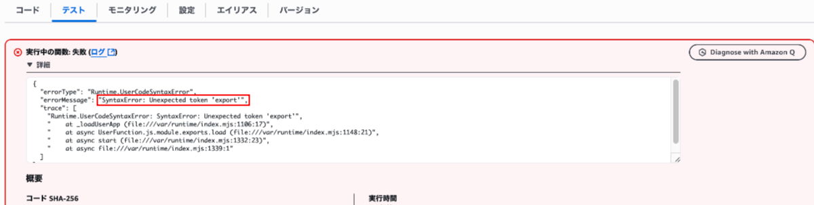

### 事象

- CDK で Lambda 関数を作成~デプロイした

- マネージメントコンソールからテストを実行したところ、以下のエラーが発生した

    - "export" のシンタックスエラー

        

---

### 原因

- Lambda 関数のハンドラーとなる JS ファイルの拡張子が `.js` だった

    → Lambda は `.js` ファイルをデフォルトで CommonJS とみなす

- つまり、ESModule の文法で書いたハンドラーが CommonJS と見なされ実行されるので、「expor const ~ なんて書き方は CommonJS の記法じゃないよ」 と警告されていた

<br>
<br>

参考サイト

[exports is not defined in ES module scopeエラーの解決方法](https://blog.serverworks.co.jp/lambda-node-module-error)

---

### 解決策

以下の２つのうちから選ぶ

1. ファイル拡張子を `.mjs` に変更する

    - コードの変更はしなくて良い

<br>

2. ファイル拡張子を `.js` のままにする場合

    - ハンドラーとなる JS ファイルを CommonJS の書き方に修正する (modle.exports や exports で書く)

        ```JavaScript
        exports.handler = async(args) => {
            //処理内容を記述
        }
        ```

