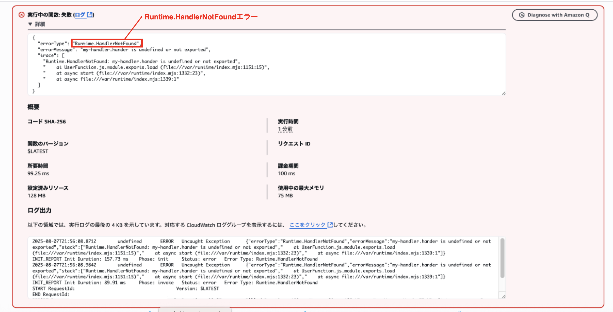

### 事象

- CDK で Lambda 関数を作成~デプロイした

- マネージメントコンソールからテストを実行したところ、以下のエラーが発生した

    - Runtime.HandlerNotFound

        

---

### 原因

- Lambda 関数コンストラクト (L2) で指定したハンドラ関数の名前が間違っていた

    

---

### 解決策

- Lambda 関数コンストラクトのハンドラー関数を指定している箇所を以下のように修正

    - × hander
    - ○ handler

        