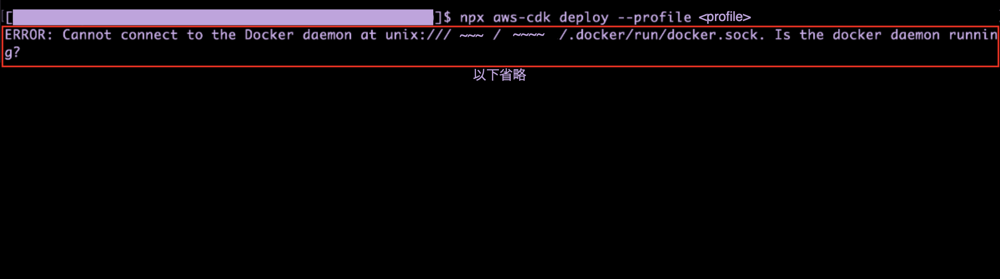

### 事象

- aws_lambda_nodejs を利用してLambda 関数を作成しようとしたところ、以下のエラーが発生し、リソースのデプロイができない

    - `Cannot connect to the Docker daemon` エラー (deploy 時に Docker demon が必要?)

        

---

### 原因

- ★Docker Engine を実行していなかった

<br>

#### なぜ Docker Engine を実行する必要があるのか

- aws_lambda_nodejs を使って Lambda 関数を作成する場合、**esbuild という仕組みを利用して Lambda 関数が作成される**

    

<br>

- esbuild とは

    - フロントエンドのコード変換+バンドルツール らしい

<br>

- ★aws_lambda_nodejs は cdk synth プロセス時に、**esbuild をインストールしたコンテナを実行し、トランスパイル&Lambda関数のビルドを行う**

    - よって、aws_lambda_nodejs で作成したリソースのデプロイ時に [Docker Engine が動いてないというエラーが発生した](#事象)

<br>
<br>

参考サイト

[AWS CDKでDocker Desktopを使わずにLambda関数（aws_lambda_nodejs）をローカルビルドする](https://dev.classmethod.jp/articles/local-build-a-lambda-function-nodejs-without-docker-desktop-with-aws-cdk/)

[話題のesbuildをさっくりと調査してみた](https://qiita.com/hedrall/items/2548718cfdf7bef3efc0#esbuildとは)

---

### 解決策

- 以下の２つの解決方法がある

    - Docker Engine を起動し、 デプロイし直す

        - ★この方法で CDK アプリをデプロイすると、、、

            - デプロイするために、esbuild コンテナイメージのダウンロード&起動に時間がかかる

            - デプロイ後に esbuild コンテナイメージが残る

    <br>

    - esbuild というモジュールをインストールする

        - この方法だと Docker Engine を起動する必要がなくなる

        1. esbuild モジュールを CDK プロジェクトにローカルインストール (devDependencies)

            ```bash
            npm install -D esbuild
            ```

            <br>

        2. cdk synth や cdk deploy コマンドが成功する

---

### おまけ

- aws_lambda_nodejs は Docker イメージから Lambda 関数を作成する機能は提供していない

    - 従って、Docker イメージから Lambda 関数を作成する場合は aws_lambda モジュールを利用する必要がある