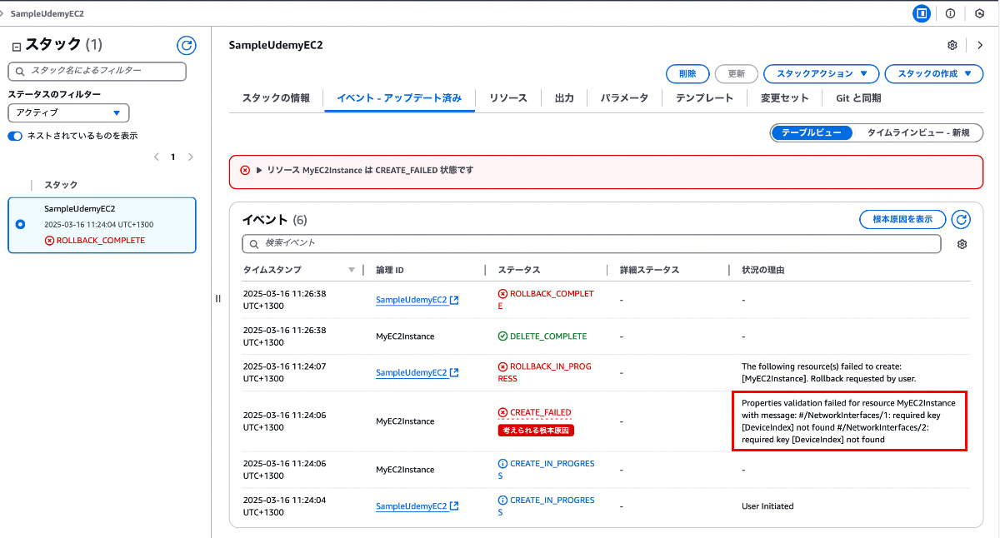
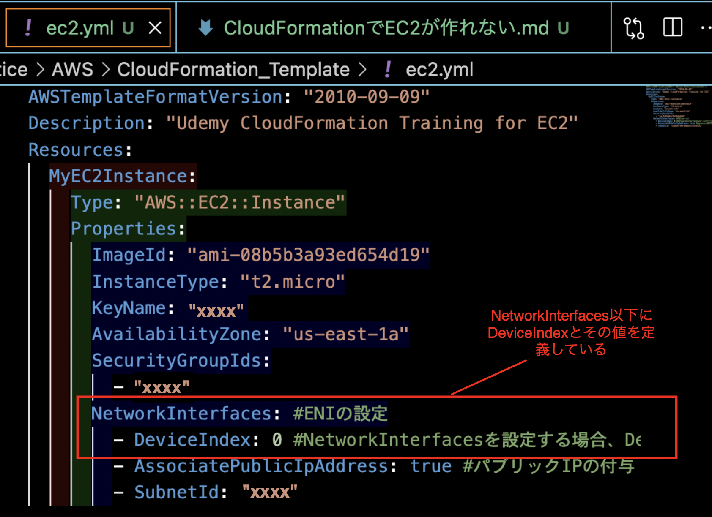
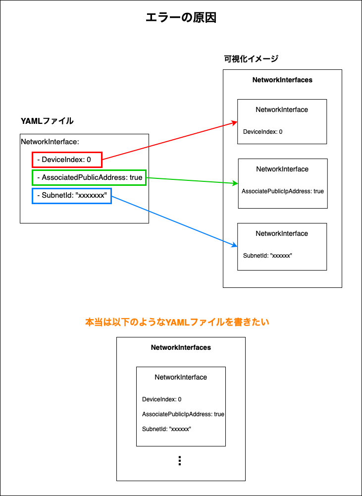
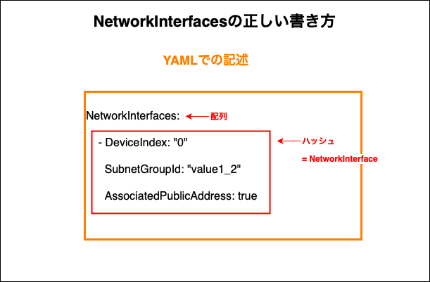
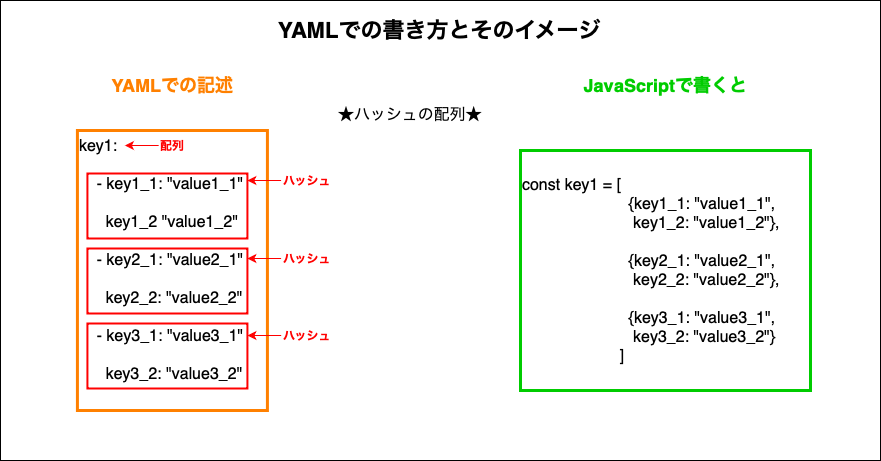
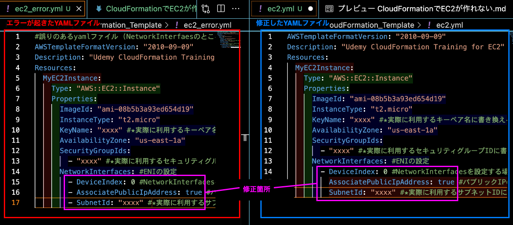

### 事象

- CloudFormation で EC2 インスタンスを作成しようとしたらエラーで作成できなかった

<br>

- エラー内容は `#/NetworkInterfaces/1: required key [DeviceIndex] not found #/NetworkInterfaces/2: required key [DeviceIndex] not found`

    - NetworkInterfaces に DeviceIndex  キーが存在しないからことが原因っぽい

    <br>

    

<br>

- テンプレートの YAML ファイルには NetworkInterfaces 以下に DeviceIndex キーを定義しているのだが...

    

---

### 原因

- NetworkInterfaces 要素の記述形式が間違っていた

    - = YAML の書き方の理解不足

<br>



---

### 解決策

- NetworkInterfaces の型は **NetworkInterface(ハッシュ) の配列**

    - NetworkInterface は子要素として DeviceIndex などのキーを持つハッシュを持つ

     

<br>

- ★★★ハッシュの配列の書き方がわからなかった = 以下の書き方が何を表しているかを理解できれば OK

    ```yaml
    key1:
        - key1_1: "value1_1"
          key1_2: "value1_2"
        - key2_1: "value2_1"
          key2_2: "value2_2"
        - key3_1: "value3_1"
          key3_2: "value3_2"
    ```

    

<br>

- 以下の画像が修正前と修正後の YAML ファイルの中身

    

<br>
<br>

参考サイト

[Kubernetesのyamlを書くときにハイフンの有無で悩む人へ](https://qiita.com/comcom97/items/64c2e29ec941f1c0450c)

[プログラミング初心者がアーキテクトっぽく語る](https://architecting.hateblo.jp/entry/2020/03/03/153755)
