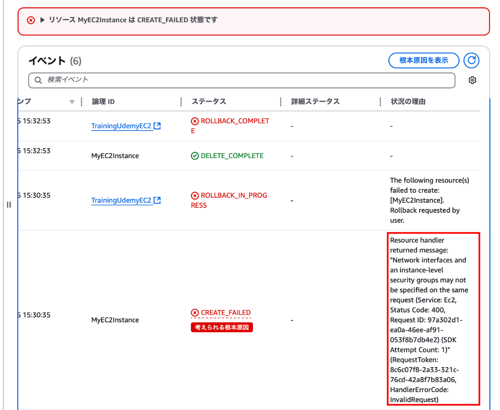
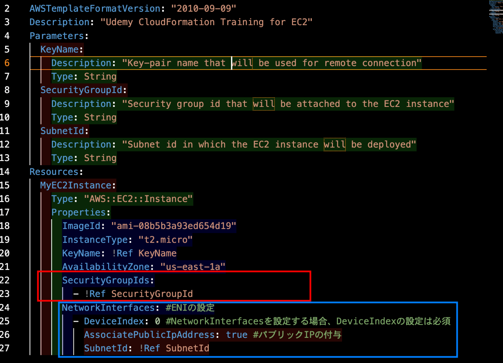
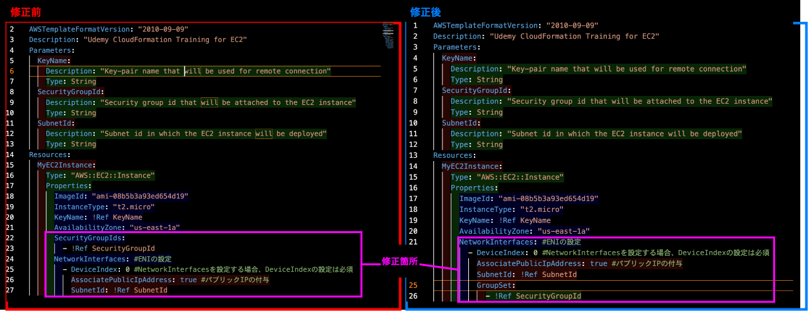

### 事象

- CloudFormation で EC2 インスタンスを作成しようとしたらエラーで作成できなかった

 

- エラー内容は `Network interfaces and an instance-level security groups may not be specified on the same request`

    - インスタンスレベルでのセキュリティグループの指定と NetworkInterfaces のレベルでのセキュリティグループの指定は一緒に指定してはいけないっぽい

     

    

---

### 原因

- NetworkInterfaces 要素が定義されている場合は、SecurityGroupIds ではなく NetworkInterfaces 要素の子要素である GroupSet にセキュリティグループ ID を設定する必要があったため

    - 1つの EC2 インスタンス定義に SecurityGroupIds と GroupSet を一緒に記述してはだめ

    

 
 

参考サイト

[[小ネタ]AWS CloudFormationのスタック作成時、ネットワークインターフェースでの指定のやり方でつまづいた話](https://dev.classmethod.jp/articles/aws-cloudformation-networkinterfaces-and-instance-level-error/)

---

### 解決策

- 今回の CloudFormation での EC2 インスタンスの作成では NetworkInterfaces 要素を定義してパブリック IP アドレスの付与が必要だったので、NetworkInterfaces 要素の GroupSet にセキュリティグループ ID を記述することになった

 
 

参考サイト

[[小ネタ]AWS CloudFormationのスタック作成時、ネットワークインターフェースでの指定のやり方でつまづいた話](https://dev.classmethod.jp/articles/aws-cloudformation-networkinterfaces-and-instance-level-error/)
