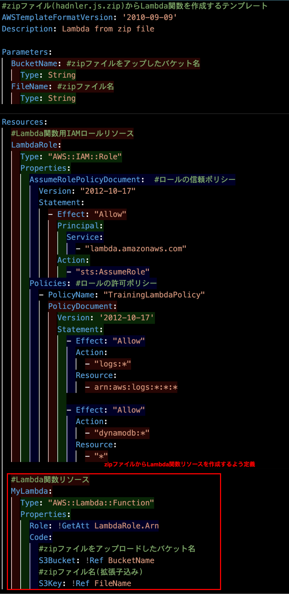
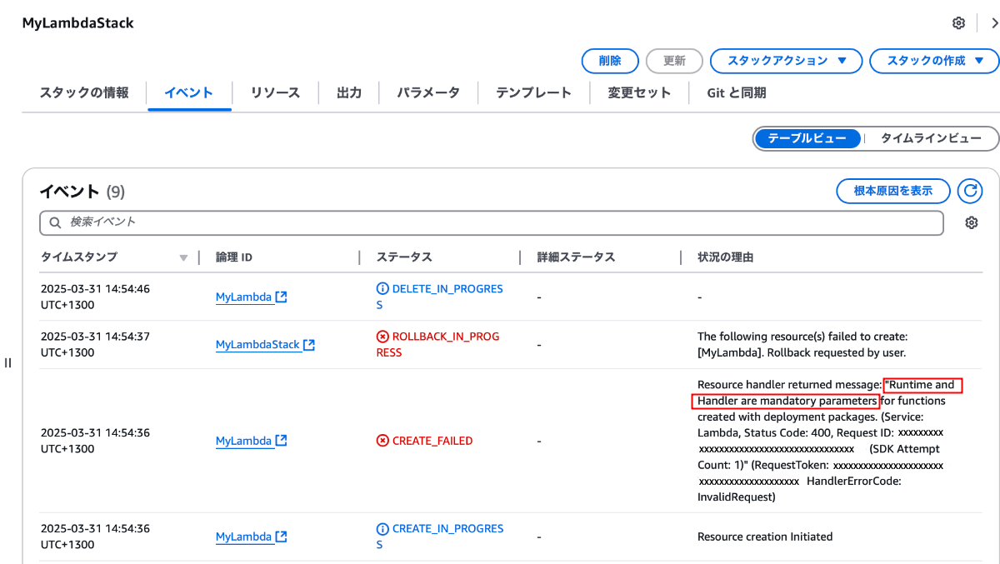
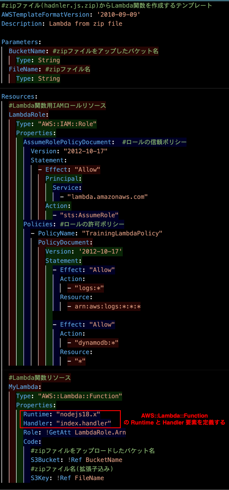

### 事象

- S3 にアップロードした zip ファイルを元に CloudFormation で Lambda 関数を作成したかったが、できなかった

- テンプレートファイルは以下の通り

    

---

### 原因

- スタックイベントえを見ると `Resource handler returned message: "Runtime and Handler are mandatory parameters for functions created with deployment packages.` というエラー原因であることがわかった

    

     

    → Lambda 関数リソースの定義に `Runtime` と `Handler` 要素を定義すればいいっぽい

 

- [公式 (AWS::Lambda:Function) のページ](https://docs.aws.amazon.com/ja_jp/AWSCloudFormation/latest/UserGuide/aws-resource-lambda-function.html)に、Lambda 関数を zip ファイルから作成する場合、**Runtime と Handler 要素は必須要素となる**と書いてあった

---

### 解決策

- Lambda 関数リソースの定義に `Runtime` と `Handler` 要素を定義する

    