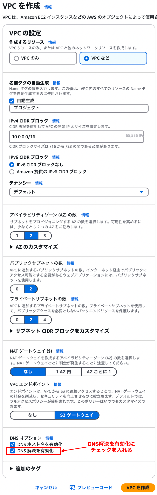

### 事象

- EC2 に Apach をインストールするために dnf コマンドを実行したが、タイムアウトで Apach のインストールできなかった

    - 何回か繰り返し dnf コマンドでインストールを試みたが、全て失敗

---

### 原因

 

- ★VPC の DNS 解決 (enableDnsSupport) を有効化していないかった

    - VPC の DNS 解決を有効にすると VPC にて AWS 提供の DNS サーバーを キャッシュ DNS サーバー (+フォーワーダー) 利用できるようになるイメージ

 
 

参考サイト

[EC2インスタンスからdnfが通らない時の解決方法](https://zenn.dev/yama_231010/articles/6fe673fba30776)

[yum installが上手く行かない時の対処法…](https://engineercollege.jp/blog/linux/45087857.html)

---

### 解決策

- VPC の DNS 解決を有効にする

    - **作成済みの VPC にて DNS 解決を有効にする場合**、VPCの設定編集画面にある `DNS 設定` の項目にある `DNS 解決を有効化` にチェックを入れる

        
    
     

    - **新規作成する VPC の場合**、 `DNS オプション` の項目にある `DNS 解決を有効化` にチェックを入れる

        

---

### dnf の仕組み (簡略バージョン)

 

1. `dnf install {パッケージ}` を実行すると、/etc/yum.repos.d/ 配下のリポジトリ情報を参照し、パッケージの取得先リポジトリ (サーバー) を決める

2. 取得先リポジトリに対象パッケージをダウンロードしに行く

3. 取得したパッケージを /var/lib/rpm 配下に保存する

 

★キャッシュ DNS サーバーに問題があると 取得先リポジトリ のドメイン名の解決ができないので、`2. 取得先リポジトリに対象パッケージをダウンロードしに行く`で失敗する

 
 

参考サイト

[yum実行時にエラーがでる原因、そもそもyumとはどう動いているか](https://www.ktsample.com/engineer/doc/ja/information/linux/article_linux_p1-1.html)

[yum、rpm 何が違う。。？](https://qiita.com/hoyat4967/items/9f698541a50a78ae5cfd)

[Linuxのパッケージ管理とアップデートに関する基礎知識](https://qiita.com/go1101/items/0508876affc4b3975a5d)

[Linux dnf/yum パッケージマネージャー/パッケージ管理システム](https://hogetech.info/linux/system/yum)

[【RHEL8】dnfコマンドについて](https://www.guri2o1667.work/entry/2020/10/10/【RHEL8】dnfコマンドについて)

[dnfコマンドの使い方](https://hana-shin.hatenablog.com/entry/2022/03/14/160312#3-DNFに関連するファイル)