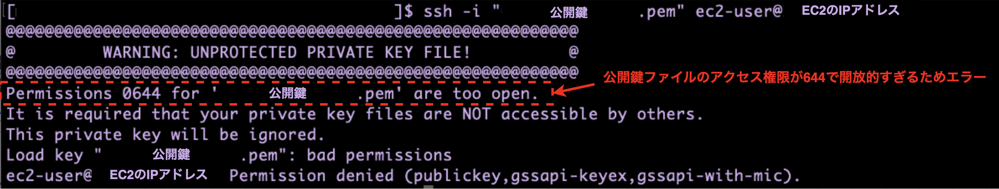

### 事象

- ssh コマンドで EC2 インスタンスに接続しようとしても `Permission denied` で接続が拒否される

<br>



---

### 原因

- 公開鍵のファイルのパーミッションが開放的すぎる

    - 644 = 所有者以外の所属グループやその他のユーザーからも読み取りが可能になっている

        - 他のユーザーから読み取りできる鍵ファイルを信用しないのが **EC2 の接続時だけではなく** SSH の基本思想らしい

<br>
<br>

参考サイト

[ec2の鍵の権限はなぜ400](https://teratail.com/questions/105151)

---

### 解決方法

- 鍵ファイルの権限を 400 (600) に変更する

    - 他のユーザーからアクセスできない = 0 を設定するのが基本

    - また、自分が誤って書き換えないように読み取りのみ = 4 を設定するのも基本

```bash
chmod 400 {キーファイル}
```

<br>
<br>

参考サイト

[EC2インスタンスにSSH接続する](https://zenn.dev/shimouta/articles/980fb72661da9e)


[個人的備忘録：EC2秘密鍵の正しいパーミッション設定と管理方法を理解し、「Permission denied」を防いでみた](https://qiita.com/free-honda/items/dfa6a4376b155f5c5162)

[ec2の鍵の権限はなぜ400](https://teratail.com/questions/105151)

[【AWS EC2】SSH接続が出来ないときに疑うこと](https://note.com/taro1212/n/n6c4d25c37178)