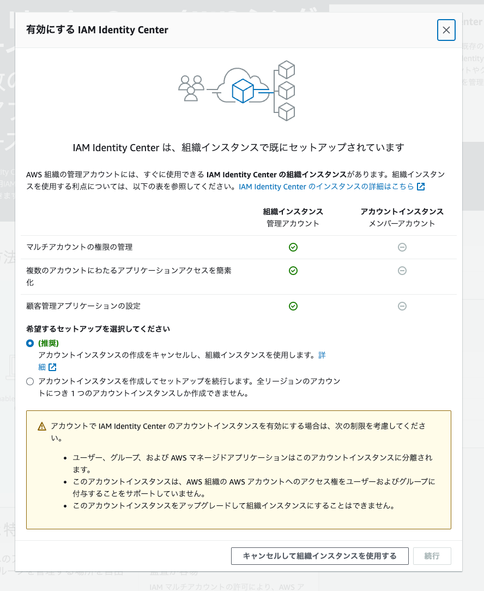
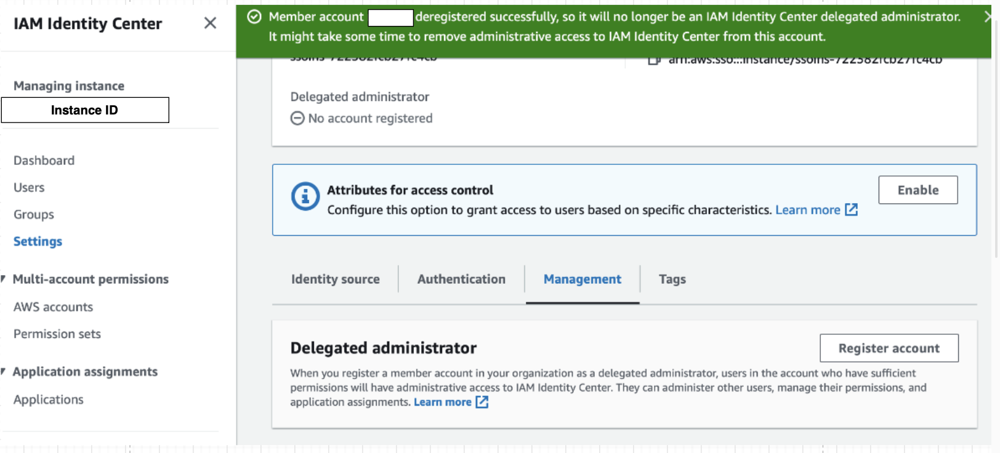
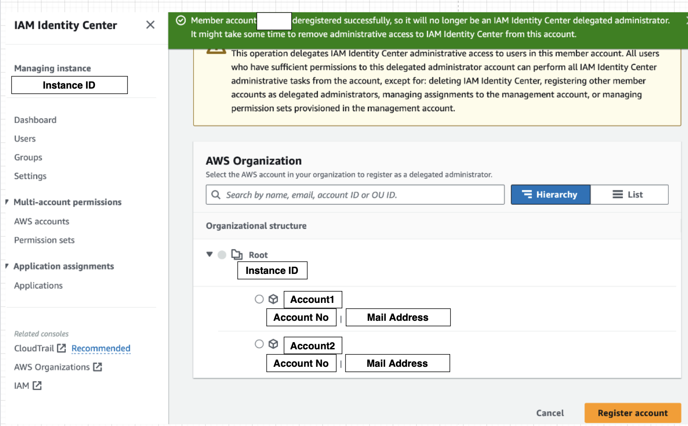

### 事象

- Administrator　許可セットを与えられたユーザーで IAM Identity Center のダッシュボードページにアクセスできない

- IAM Identity Center にアクセスし enable しようとすると、以下のページが表示される
    - 所属組織の IAM Identity Center ダッシュボードページにアクセスしたくても "続行ボタン" がグレーアウトされていて押せない

---

### 原因
以下の条件を満たさないと IAM Identity Center にアクセスできないことがわかった

1. その組織の管理者アカウントのユーザーであること

2. 管理者として権限を委譲されたアカウントのユーザーであること

---

### 解決方法

今回は選択したアカウントが管理者アカウントではなかったために起こった問題のため、管理者権限を委譲する方法で解決する

1\. 管理者アカウントで AWS マネージドコンソールにログインし、 IAM Identity Center にアクセス

 

2\. IAM Identity Center の "Settings" にて、権限を委譲するアカウントを選択する

- Management タブの Delegated administrator にて Register account をクリック

 

- 権限を委譲するアカウントを選択し、 Register account をクリック

 

- 権限が委譲されたか確認

 

3\. アクセスポータルから任意のユーザーでログインし、 IAM Identity Center にアクセスできなかったアカウントを選択し、 IAM Identity Center にアクセスできるか確認
