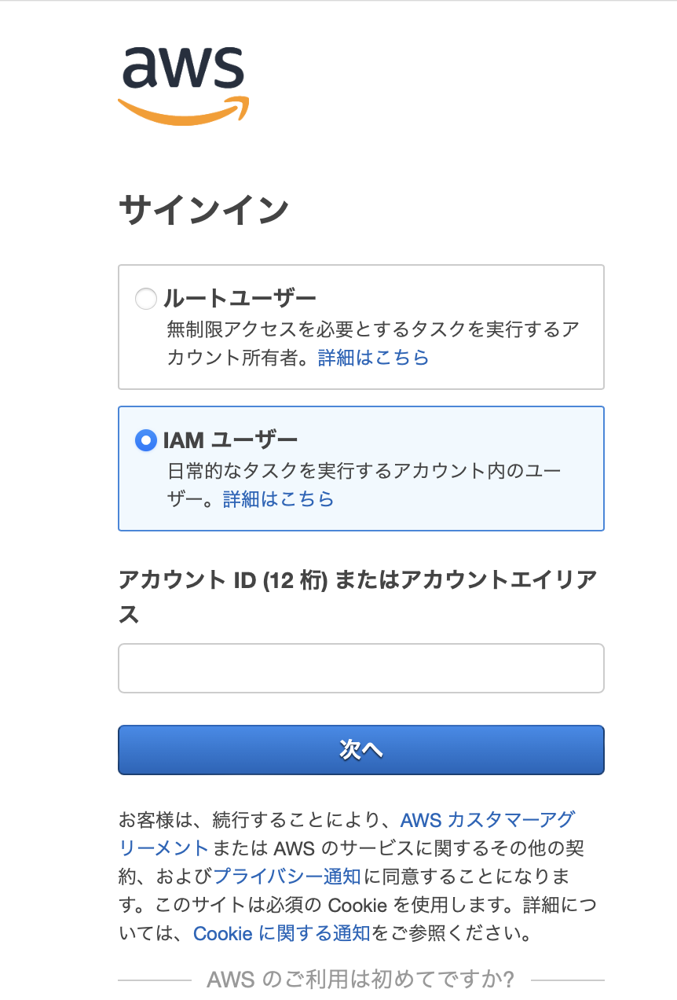

### 事象

- IAM Identy Center にて作成したユーザーで、AWS のマネージドコンソールにログインできない

### 原因

- IAM と IAM Identity Center は異なるサービスであり、IAM Identity Center で作成したユーザーは IAM ユーザーではない

### 解決方法

- IAM Identity Center で作ったユーザーはアクセスポータル経由でしかログインできない。よって、直接 AWS マネージドコンソールにログインするのではなくアクセスポータルからログインする