### 事象

- Route53 にて以下のような IP ベースルーティングの A レコードを追加した

    - 自分のグローバル IP アドレスが属するネットワークアドレスを CIDR 表記で CIDR ブロックに登録

    - 上記の CIDR ブロックに該当する IP アドレスのアクセスはバージニア北部の EC2 インスタンスにルーティングする

<br>

#### 想定した動き

- dig コマンドなどでドメインの名前解決の問い合わせをした結果、 バージニア北部の EC2 インスタンスの IP アドレスが返却される

    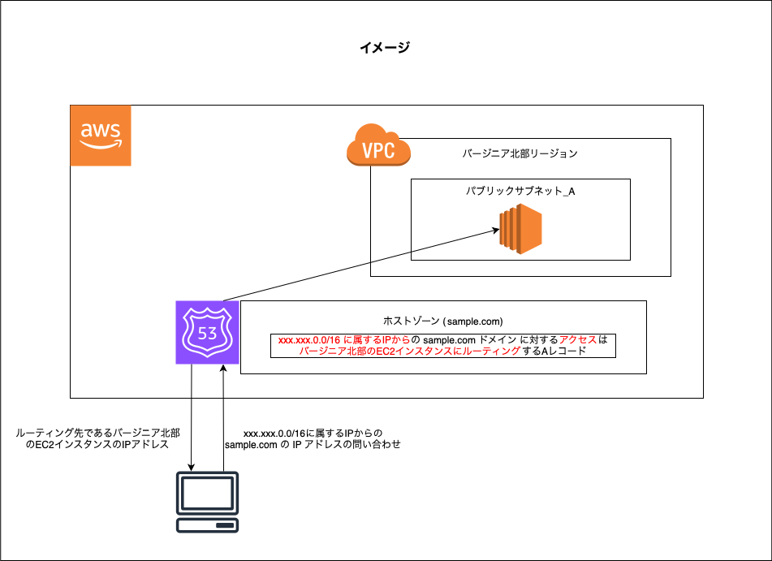

<br>

#### 実際の動き

- ドメイン名の解決ができない

    - dig コマンドでのドメインの問い合わせ

        - SOA レコードが返ってくる = ドメイン名の解決ができてない

    - ブラウザでアクセス

        - サーバーが見つからないと表示される = ドメイン名の解決ができてない

    <br>    

    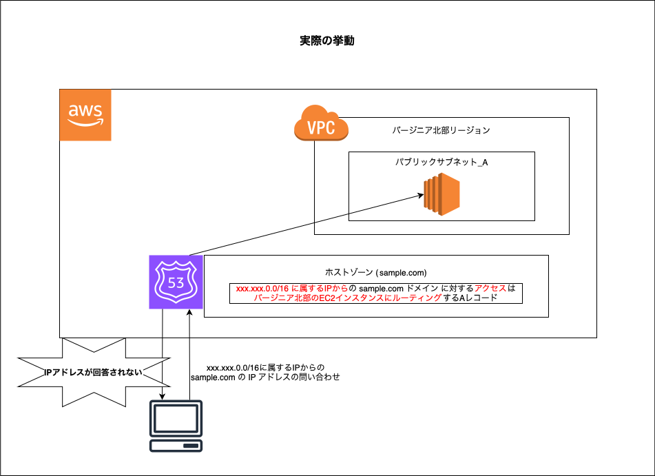

<br>

- しかし、+trace を付けた dig コマンドでのみドメイン名の解決ができた

---

### 原因

#### dig コマンドやブラウザからのアクセスでドメイン名の解決ができなかった理由

- キャッシュ DNS サーバーは 複数のサーバーから構成されており、 [anycast](#ip-anycast-とは) を利用していた

    - 複数のキャッシュ DNS サーバーのうち、どれか1つが DNS 権威サーバーに問い合わせを行っていた

<br>

- 自分の使っているルーターのキャッシュ DNS サーバーが [ECS (EDNS-Client-Subnet)](https://github.com/MasaGt/CS/blob/473b0831f2d92552cef369dfafd14b0f93076e20/EDNS.md) をサポートしていなかった

    - ★★★ 自身のグローバル IP アドレスではなく、キャッシュ DNS サーバーの IP アドレスでネームサーバーに問い合わせを行っていた ★★★

<br>

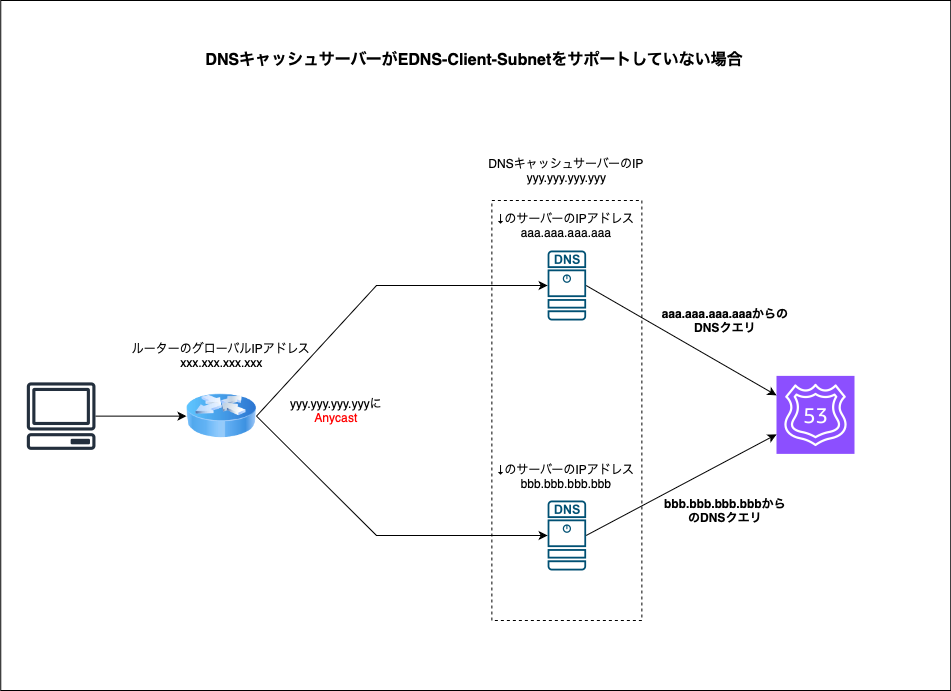

<br>

#### trace を付けた dig コマンドでのみドメイン名の解決ができた理由

- +trace オプションは実行したマシンが DNS 権威サーバーに反復問い合わせを行うというもの

    - 従って、自身のグローバル IP アドレス (=使っているルータのグローバル IP アドレス) で DNS 権威サーバーにアクセスしたので、ドメイン名の解決ができた

- 詳しくは[こちら](https://github.com/MasaGt/CS/blob/473b0831f2d92552cef369dfafd14b0f93076e20/dig%E3%82%B3%E3%83%9E%E3%83%B3%E3%83%89.md)を参照

---

### 解決策

以下の解決方法がある

1. キャッシュ DNS サーバーの IP アドレスを Route53 の CIDR ブロックに追加する

    - クライアントのグローバル IP のネットワークアドレスは CIDR ブロックから削除しても良い

<br>

2. キャッシュ DNS サーバーに ECS (EDNS-Client-Subnet) をサポートするものを指定する

    - Google の公開キャッシュ DNS サーバー (8.8.8.8) 
    は EDNS および ECS をサポートしている

        - dig コマンドでドメイン名の問い合わせを行う際に Google の公開キャッシュ DNS サーバーを再帰問い合わせ先に指定する

            ```bash
            dig ドメイン名 @8.8.8.8
            ```

    <br>

    - もしくは、使用している PC に設定されているキャッシュ DNS サーバーの IP アドレスを ECS がサポートされているサーバーの IP に変更する (8.8.8.8など)

---

### 実際に行った解決方法

- キャッシュ DNS サーバーの IP アドレスを Route53 の CIDR ブロックに追加する

#### 手順

1. 再帰問い合わせ際のキャッシュ DNS サーバーが ECS をサポートしているか調べる

    - 以下の dig コマンドはキャッシュ DNS サーバーのIPアドレスを出力する

        ```bash
        dig TXT o-o.myaddr.l.google.com +short
        ```

        - もし、返ってきた内容の中に `edns0-client-subnet ~~` が含まれていれば、dig コマンドでの問い合わせ先のキャッシュ DNS サーバーは ECS をサポートしている

        <br>

        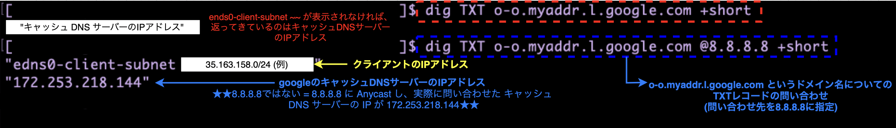

<br>

2. 再帰問い合わせ先のキャッシュ DNS サーバーが IP Anycast で通信しているかを調べる

    - `dig TXT o-o.myaddr.l.google.com +short` を繰り返し実行し、異なる IP アドレスが返却されれば現在使用しているキャッシュ DNS サーバーは IP Anycast で提供されている

    - 以下の画像は `dig TXT o-o.myaddr.l.google.com +short` の問い合わせ先に google の公開キャッシュ DNS サーバーを指定している様子。返ってくるキャッシュ DNS サーバーの IP アドレスが異なる = google の公開キャッシュ DNS サーバーの 8.8.8.8 は anycast address であることがわかる

        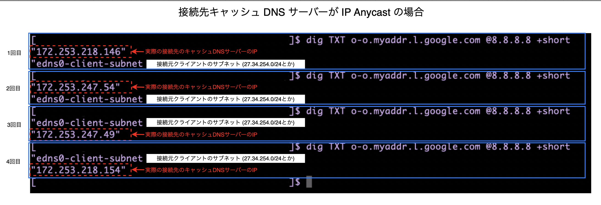

<br>

3. Route53 の CIDR ブロックにキャッシュ DNS サーバーの IP アドレスが属するサブネットを登録する

    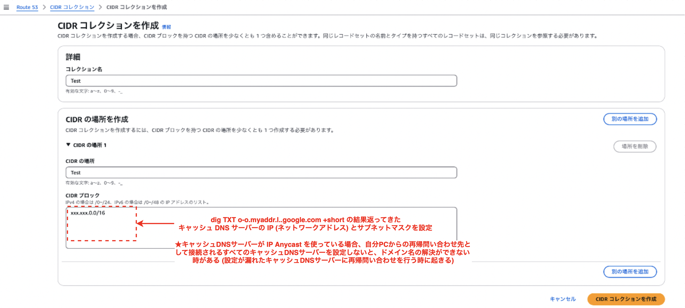

    <br>

    - ★自分の PC の再帰問い合わせ先のキャッシュ DNS サーバー IP アドレスが Anycast アドレス の場合は、実際に接続されるキャッシュ DNS サーバーの IP アドレスの設定もれに注意

        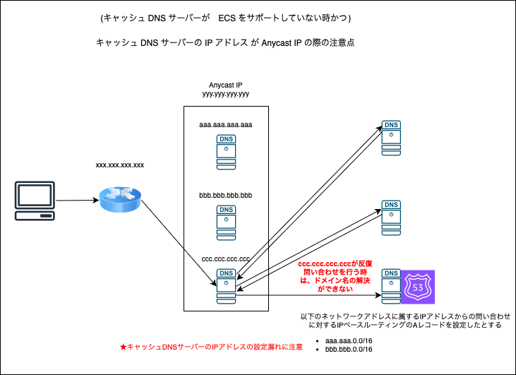

<br>

4. ↑で設定した CIDR ブロックを IP ベースルーティングの A レコードの CIDR ブロックに指定

    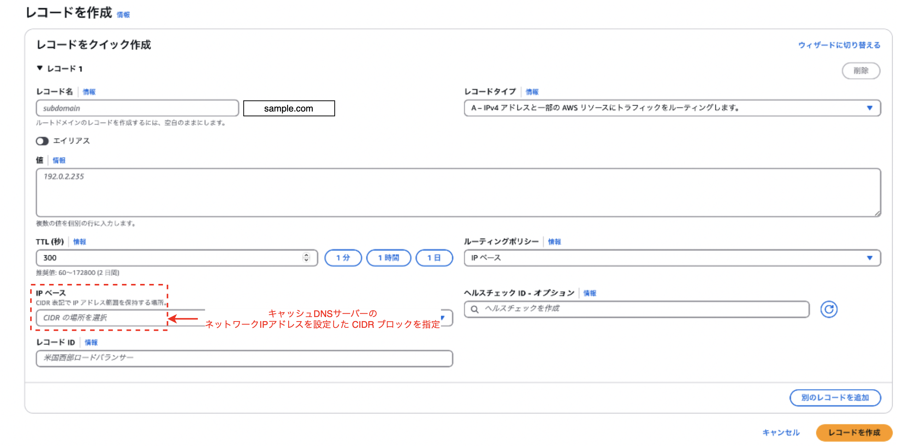

<br>

5. 少し待った後、 dig コマンドでドメイン名の解決ができるかどうか試す

    - ドメイン名が解決できていればひとまず OK

    - 解決できない場合、キャッシュ DNS サーバーの IP アドレスの設定漏れがないか再度確認

        - Route53 のログを確認してみるのもいい

<br>
<br>

参考サイト

[パブリック DNS リゾルバーが EDNS Client Subnet (ECS) 拡張機能をサポートしているかどうかを確認するには、どうすればよいですか?](https://repost.aws/ja/knowledge-center/route-53-find-ecs-support-dns-resolver)

[【新機能】Amazon Route 53 でアクセス元 IP をベースとしたルーティングがサポートされました](https://dev.classmethod.jp/articles/amazon-route-53-now-supports-routing-based-on-source-ip/)

---

### ECS をサポートしているキャッシュ DNS サーバーにドメイン名の問い合わせを行う場合

1. Route53 の CIDR ブロックに自分のマシンのグローバル IP アドレス (ネットワークアドレス/サブネットマスク) を設定する

<br>

2. dig コマンドでドメイン名の問い合わせを行う


    - 問い合わせ先のキャッシュ DNS サーバーは @8.8.8.8 (Google の公開キャッシュ DNS サーバーは ECS をサポートしているから)

        ```bash
        dig ドメイン名 @8.8.8.8
        ```

        <br>

    - キャッシュサーバーが ECS をサポートしている場合、自分のグローバル IP アドレスを反復問い合わせに含めるのでドメイン名の解決ができるはず

        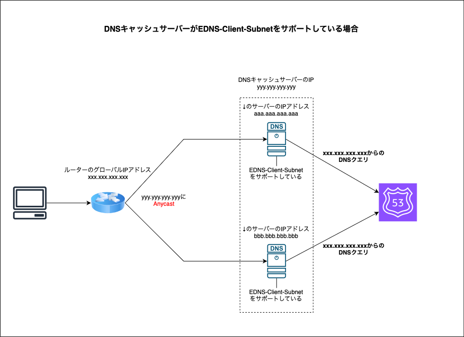


<br>

#### +subnetオプション

- dig コマンドの +subnet オプションを利用することで、問い合わせの発信元を設定できる

    ```bash
    dig ドメイン名 +subnet=IPアドレス/サブネットマスク
    ```

    <br>

    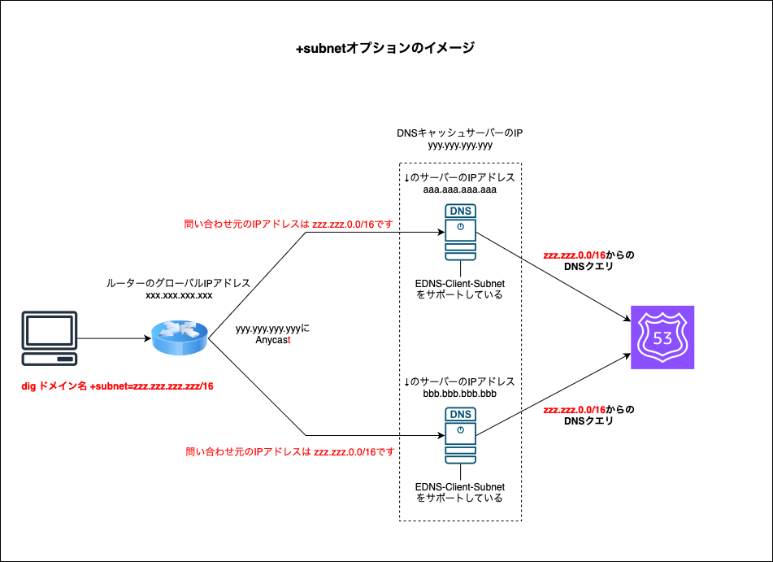

<br>

- 例: 問い合わせの発信元が 203.201.0.0/16 として dig コマンドを実行する

    ```bash
    #google のキャッシュ DNS サーバーを指定しているのは、google のキャッシュ DNS サーバーが が ECS をサポートしているから

    dig sample.com +subnet=203.201.0.0/16 @8.8.8.8
    ```

    <br>

    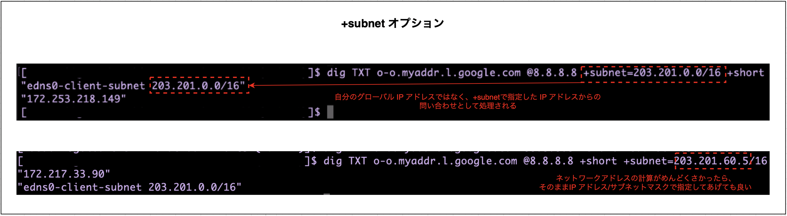

<br>

- +subnet オプションの何が嬉しいのか?

    - 他の IP アドレスからのドメイン名の問い合わせのケースをテストできる

    - もし、yyy.yyy.yyy.0/24 に属する IP アドレスからのアクセスを他のエンドポイントにルーティングするような A レコードを設定し、そのテストを行いたい場合は以下のコマンドで検証可能

        - ★キャッシュ DNS サーバーが ECS をサポートしている必要があることに注意

        ```bash
        dig ドメイン名 +subnet=yyy.yyy.yyy.0/24
        ```

<br>
<br>

参考サイト

[【新機能】Amazon Route 53 でアクセス元 IP をベースとしたルーティングがサポートされました](https://dev.classmethod.jp/articles/amazon-route-53-now-supports-routing-based-on-source-ip/)

---

### IP Anycast とは

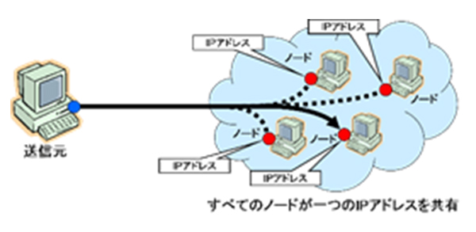

[DNSのさらなる信頼性向上のために～IP Anycast技術とDNS～](https://jprs.jp/related-info/guide/topics-column/no5.html)

<br>

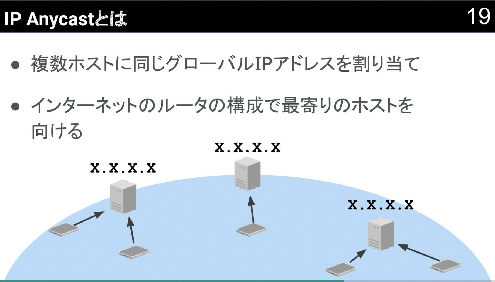

[DNSにちょっとだけ詳しくなりたい人に贈る少し突っ込んだDNSの話 / devioday1_dns](https://speakerdeck.com/takipone/devioday1-dns?slide=19)

<br>

- 1つの IP アドレスを複数の機器に割り当て、その IP アドレスヘのアクセス元に対して接続条件を満たした機器に接続する通信方式

    - 接続条件の例: アクセス元により近い機器に接続する

<br>

- 今回の事象で明らかになったこととして、自分が使っているルーターに設定されているデフォルのキャッシュ DNS サーバーは複数のサーバーから構成されており、 IP Anycast で通信していた

    - こちらからは1つのキャッシュ DNS の IP アドレスが設定されているが、裏では複数のキャッシュ DNS サーバーのうち1つと通信していた

<br>
<br>

参考サイト

[DNSのさらなる信頼性向上のために～IP Anycast技術とDNS～](https://jprs.jp/related-info/guide/topics-column/no5.html)

[What is Anycast DNS and how does it work?](https://www.cloudns.net/blog/what-is-anycast/)

[DNSにちょっとだけ詳しくなりたい人に贈る少し突っ込んだDNSの話 / devioday1_dns](https://speakerdeck.com/takipone/devioday1-dns?slide=19)

[エニーキャストDNSとは？ | エニーキャストDNSの仕組み](https://www.cloudflare.com/ja-jp/learning/dns/what-is-anycast-dns/)