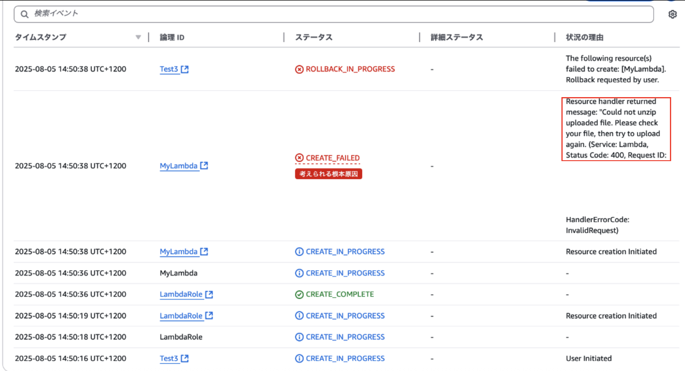

### 事象

- CloudFormation にて Zip ファイルから Lambda 関数を作成しようとしたところ、以下のエラーが発生した

    - Cloud not unzip uploaded file

        

---

### 原因

- アップロードしたファイルが gzip で圧縮されていた

    ```bash
    #以下のコマンドで圧縮していた
    tar cvfz inedx.js.tar index.js
    ```

<br>

- Zip ファイルから Lambda 関数を作成する場合、その名の通り zip 形式で圧縮されたファイルのみサポートされている

---

### 解決策

- zip で圧縮してアップロードし直す

    ```bash
    zip index.js.zip index.js
    ```

    - zip コマンドで圧縮しても、7zip や Mac のデフォルト圧縮ツールでも zip 形式で圧縮されていれば大丈夫