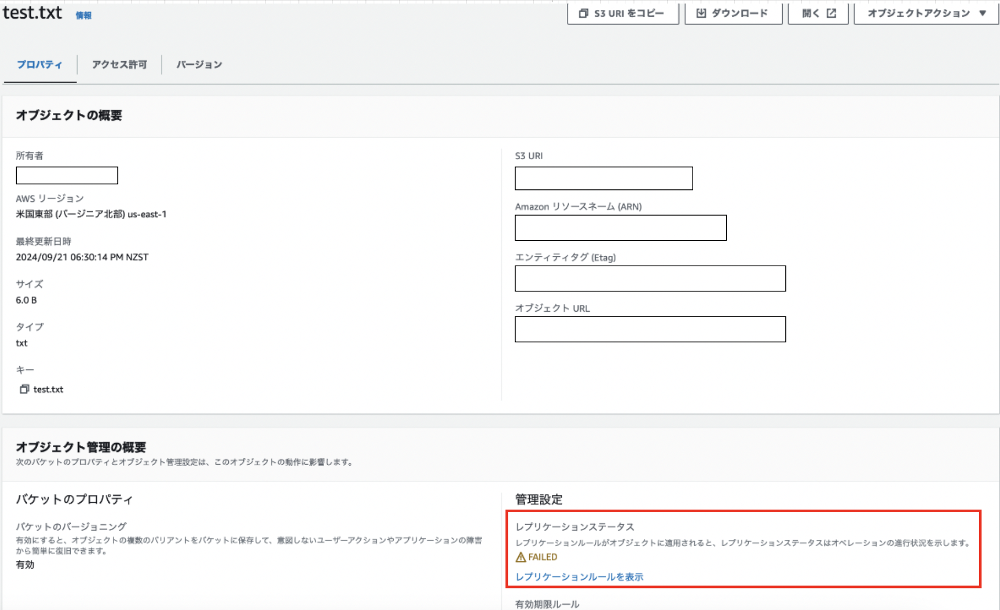
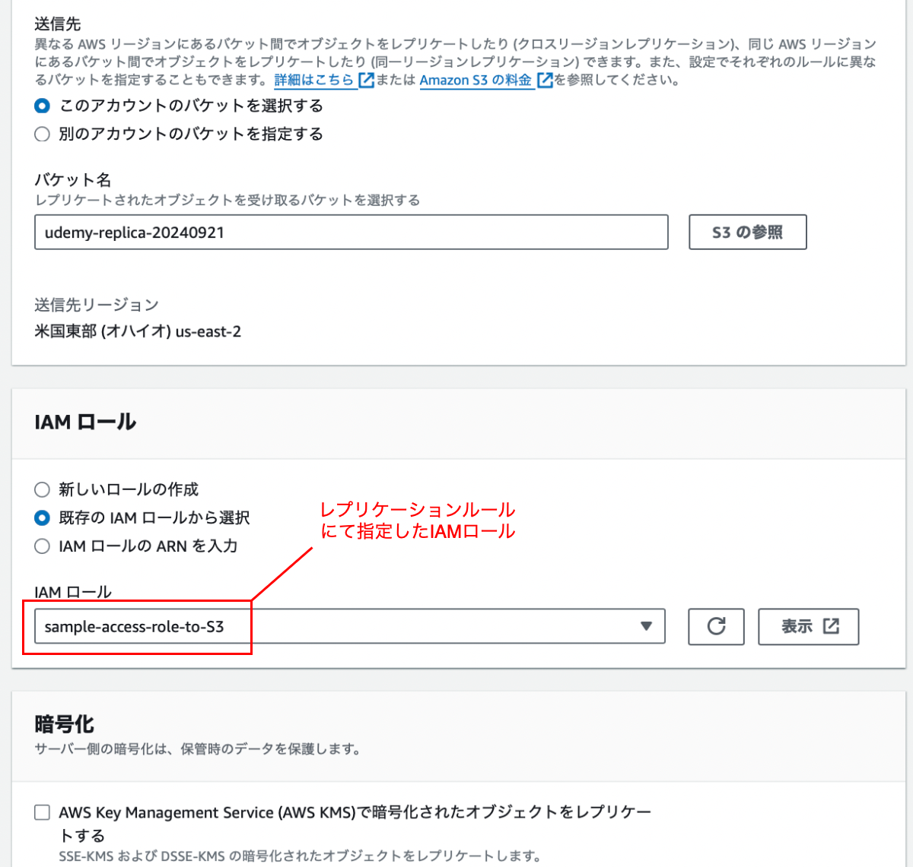
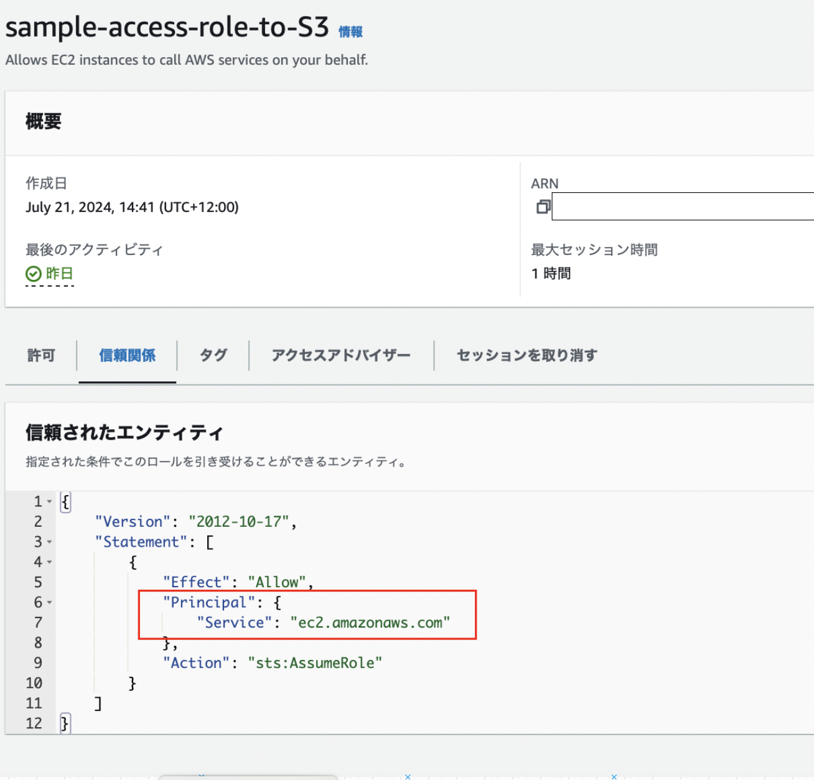
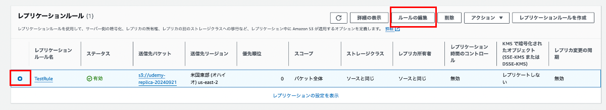
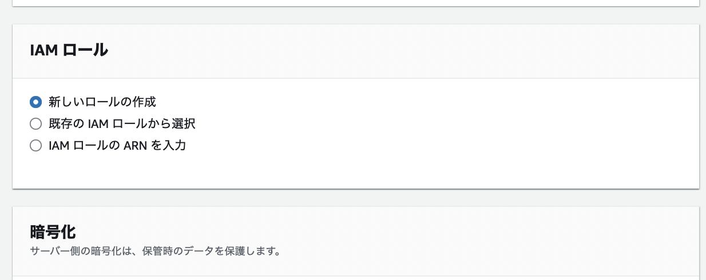
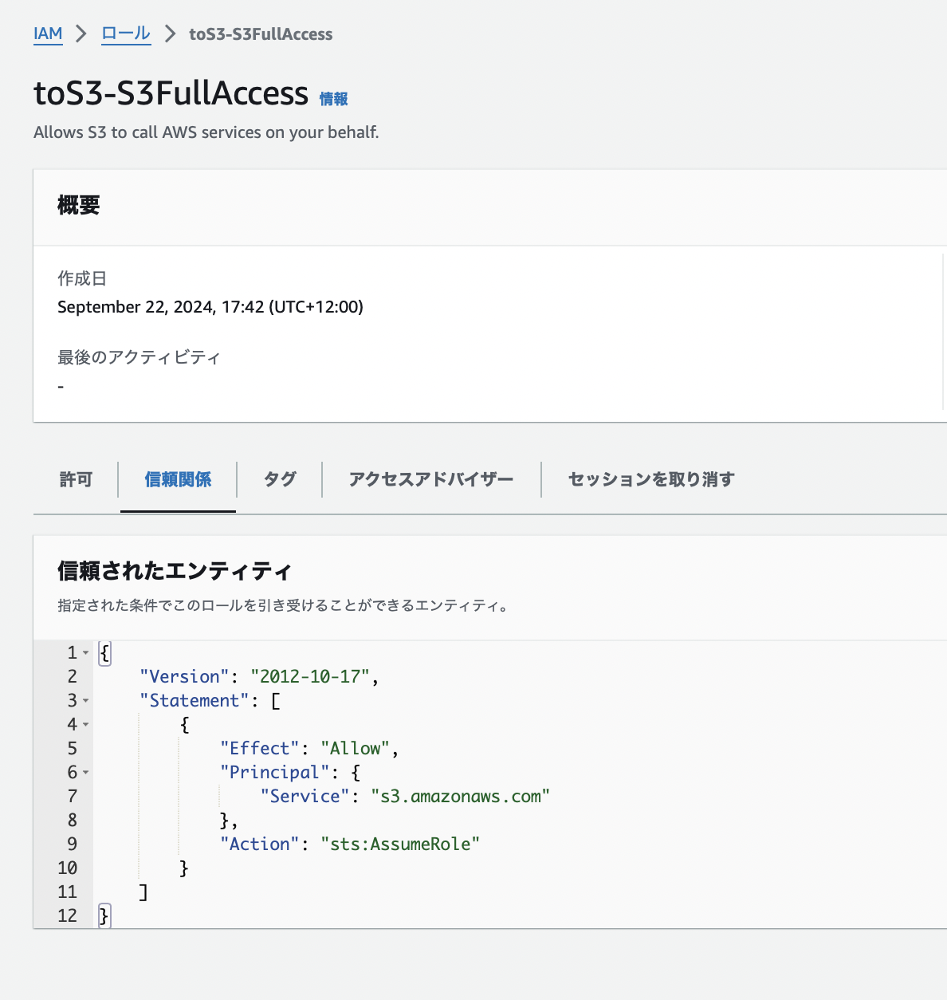

### レプリケーションルールを作成しても、ファイルのレプリケーションが FAILED になる

#### 事象

- レプリケーションをルールを作成後、マスタバケットにファイルをアップロードしてもレプリケーションされない

---

#### 原因

- アタッチした IAM ロールが不適切なものだった

- S3へのアクセスを許可するロールだったが、Principal が EC2 だった

---

#### 解決策

- レプリケーションルールを編集し、 IAMロールを新しく作成した

    1. 間違っていたレプリケーションルールを選択し、 `ルールの編集` をクリック

    

     

    2. IAM ロールの項目にて `新しいロールの作成` を選択し、保存する

    

---

#### ちなみに

- Principal が S3 で S3FullAccess を持つロールを選択してもレプリケーションできた

    

    - しかしセキュリティ上、最低限のパーミッションに限定した方がいい

        → IAM ロールを新しく作成した方がいい