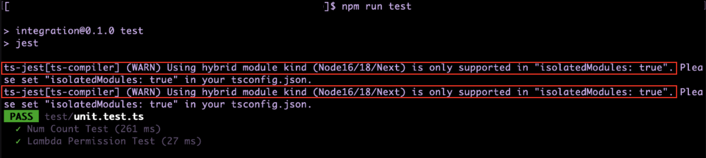
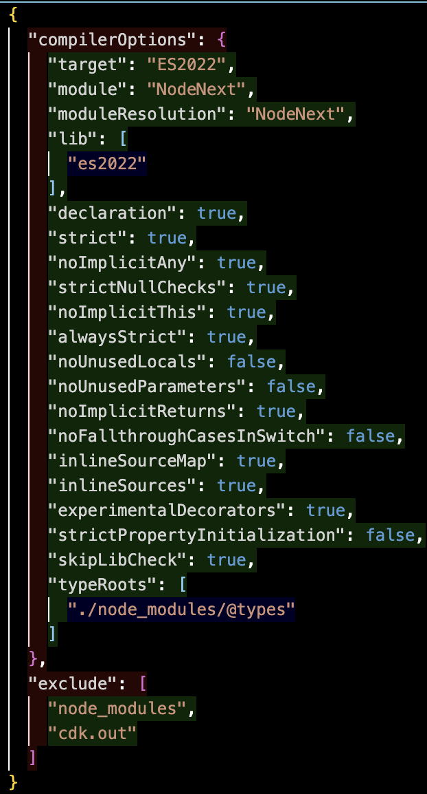
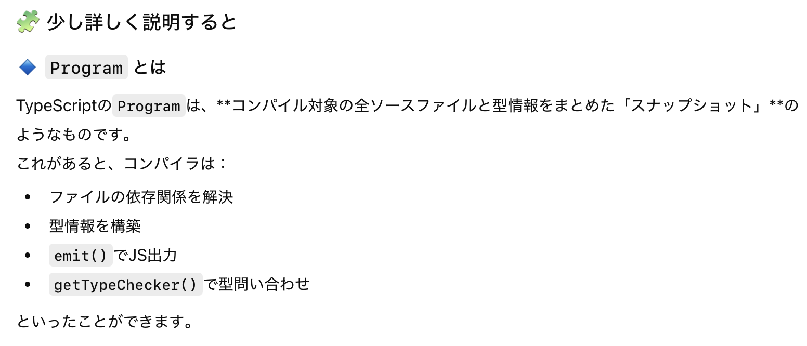
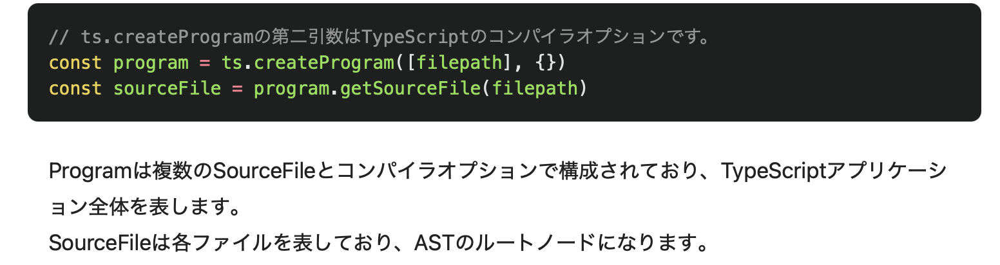
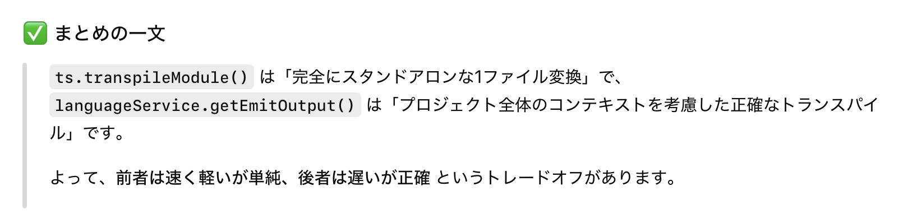

### 事象

- CDK アプリに対して、スナップショットテストやアサーションテストを実行する際に以下の警告が表示される (テスト自体は実行される)

    `ts-jest[ts-compiler] (WARN) Using hybrid module kind (Node16/18/Next) is only supported in "isolatedModules: true". Please set "isolatedModules: true" in your tsconfig.json.`

    

---

### 原因

- 超ざっくり説明すると、tsconfig.json の設定が原因で警告が出てる

    - ts-jest を利用する上で、tsconfig の`module` に node16, node18, node20, nodenext などの ESM と CJS の両方をサポートする値を設定した場合、tsconfig の `isolatedModules` を true にする必要があるとのとこ

        

     

    - 確かに自分の tsconfig.json を確認してみると `isolatedModules` が有効 (true) になっていなかった

        

 

- でもなぜ???

    → 次のセクションに続く

 
 

参考サイト

[ESM Support](https://kulshekhar.github.io/ts-jest/docs/guides/esm-support)

---

### もう少し詳しい原因解析

#### 仮説

- tsconfig の module の設定値によって、ts-jest のコンパイラが単独ファイルごとのコンパイルに挙動が変わるのかも? その挙動に IDE での静的型チェック合わせるために isolatedModules を true にするのかもしれない。。。

 
 

#### エラーの切り分け

- エラーログから判断するに、ts-jest ではなく typescript コンパイラ (ts-compiler) 側のエラーでは?

    - typescript のみをインストールし、module: NodeNext + moduleResolution: false を設定し、ts ファイルを実行してみる

        →結果: エラーは表示されなかった

        - 当たり前。なぜなら typescript パッケージに ts-compiler というモジュールは存在しない

            
        
         

        - ts-jest パッケージに ts-compiler.ts というモジュールが含まれていた

            

 
 

#### ts-jest の ts-compiler.ts を追跡

1. `Using hybrid module kind ~~` というエラーを投げているのはts-compiler.ts

    

 

2. ts-compiler.ts の getCompiledOutput 関数は何をしているのか?

    - tsconfig の isolatedMoudles の値によって ts ファイルの**コンパイル方法を変えているっぽい**

        

 

3. ts-compiler.ts の _transpileOutput も見てみる (isolatedModule が true の時に実行される ts ファイルのコンパイル処理)

    

 
 

#### わかったこと

- module が hybrid module (Node16, Node18, NodeNext) の場合かつ isolatedModule が false の場合 **language service を使ってコンパイル**

 

- module が hybrid module (Node16, Node18, NodeNext) の場合かつ isolatedModule が true の場合 **ts.createProgram() を使ってコンパイル**

 

- module が hybrid module (Node16, Node18, NodeNext) 以外の場合かつ isolatedModule が true の場合 **ts.transpileModules() を使ってコンパイル**

 

- module が hybrid module (Node16, Node18, NodeNext) 以外の場合かつ isolatedModule が false の場合 **language service を使ってコンパイル**

 
 

#### それぞれのコンパイル方法について

- ts.createProgram

    - プロジェクト全体を元に Program を作成しコンパイルする方法 (tsc のデフォルトのコンパイルと同じ方法)

        

         

        - ★ Program とは: コンパイル対象の ts ファイルやコンパイラオプションなどの情報をまとめたオブジェクト

            

             

            

 

- Language Service

    - ★ Language Service とは: TypeScript の機能の1つ
        
        - リアルタイムでコード解析、型チェック、コンパイル(トランスパイル) などを実行することができる

        

     

    - LanguageServiceHost という Program に似たオブジェクトを内部に持つオブジェクトを元にコンパイルをする方法

        

         

        - getEmitOutput() で単独ファイルでのコンパイルを実行する

            

            

 

- ts.compileModule

    - Program や LanguageService を一切使わず、1ファイルだけをパースして即 コンパイル (トランスパイル) する軽量関数

        

 

- 上の3つのコンパイル方法の特徴を比較すると、

    

 
 

参考サイト

[ts-jest](https://github.com/kulshekhar/ts-jest)

[TypeScriptコンパイラの内側](https://typescript-jp.gitbook.io/deep-dive/overview)

[第8章　ツールとしてのTypeScript](http://typescript.ninja/typescript-in-definitelyland/typescript-as-a-tool.html)

[Isolated Modules option](https://kulshekhar.github.io/ts-jest/docs/28.0/getting-started/options/isolatedModules?utm_source=chatgpt.com)

[Using the Language Service API](https://github.com/microsoft/typescript/wiki/using-the-language-service-api)

[TypeScriptにpluginがやってくる 使ってみよう編](https://qiita.com/Quramy/items/1fc9aee235b79236775c)

[TypeScript再入門 ― 「がんばらないTypeScript」で、JavaScriptを“柔らかい”静的型付き言語に](https://en-ambi.com/itcontents/entry/2019/04/16/103000)

[私がTypeScriptについて勘違いしていたこと、そしてその理由](https://postd.cc/i-was-wrong-about-typescript-here-is-why/)

[TypeScriptの仕組みを整理してみた](https://qiita.com/hisashi_matsui/items/9e446ae9c5d6a876902d)

[TypeScript Compiler APIに入門する](https://qiita.com/suke083/items/878e9d275305ae18c30b)

---

### 解決策

- エラーメッセージの通り tsconfig.json にて isolatedModules を true にする

または、

- tsconfig.json の module を Node16, Node18, NodeNext 以外にする

もしくは、

- module が Node16 (Node18, NodeNext) で isolatedModules が false でも Language Server でコンパイルはされるので **Using hybrid module kind ~~ という警告を無視する**