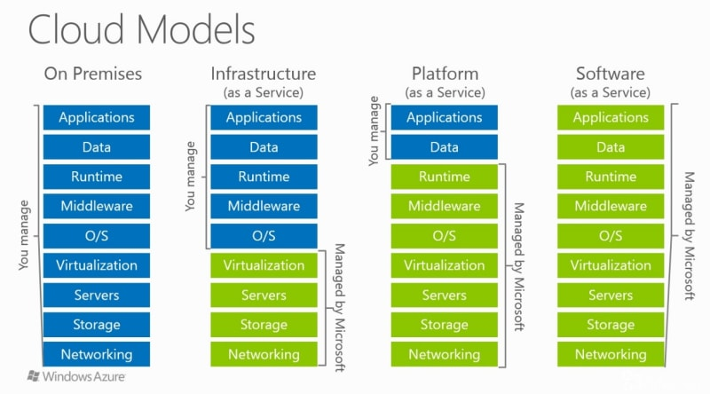

### IaaS / PaaS / SaaS

クラウドによって提供されるサービスの主要なモデル

[IaaS vs. PaaS vs. SaaS](https://dev.to/cloudtech/iaas-vs-paas-vs-saas-41d2)

---

### IaaS

Infrastructure as a Service

インフラストラクチャを仮想化してクラウド上で提供するサービス

=> ネットワーク、サーバー、ストレージなどのインフラ部分をクラウドで(インターネットを通して)提供する

**OSはプロバイダーから提供されている場合もあれば、自身でインストールする必要がある場合もある**

---

### PaaS

Platform as a Service

webサーバーやDBサーバーなどまでをクラウドで提供するサービス

---

### SaaS

Service as a Service

サービス(アプリ)までの全ての領域をインターネットを通して提供するサービス

ユーザーからすると、アプリ部分だけを利用しているように感じる

---

### IaaS と PaaS の違い

提供されるサービス(領域)が違う
- IaaS: OSやミドルウェアは自分で調達/構築する必要があるため、その知識を持った人が必要だが、カスタマイズ性は PaaS よりも高い

(クラウドサービスプロバイダーによっては、IaaS で OS も提供される)

- PaaS: OSやミドルウェアも提供されるので、自身はその上で動くアプリの開発に集中できる　