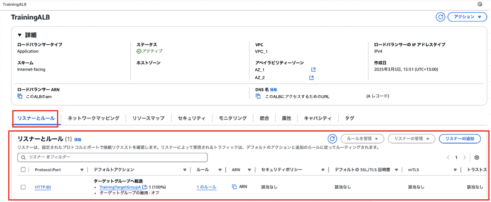
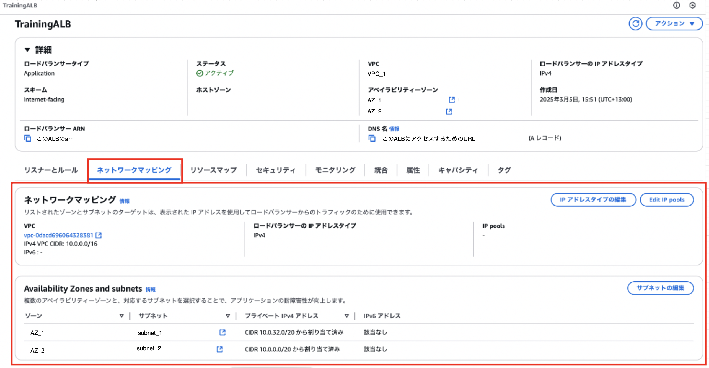
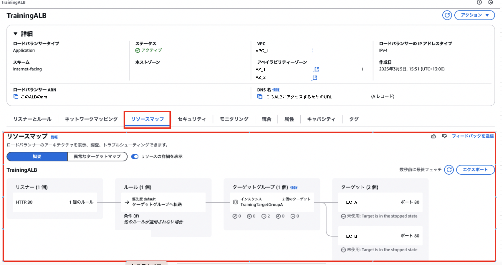
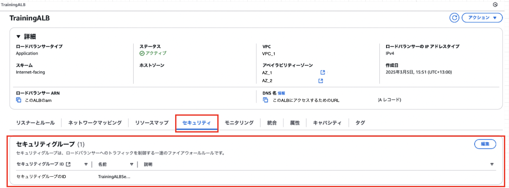
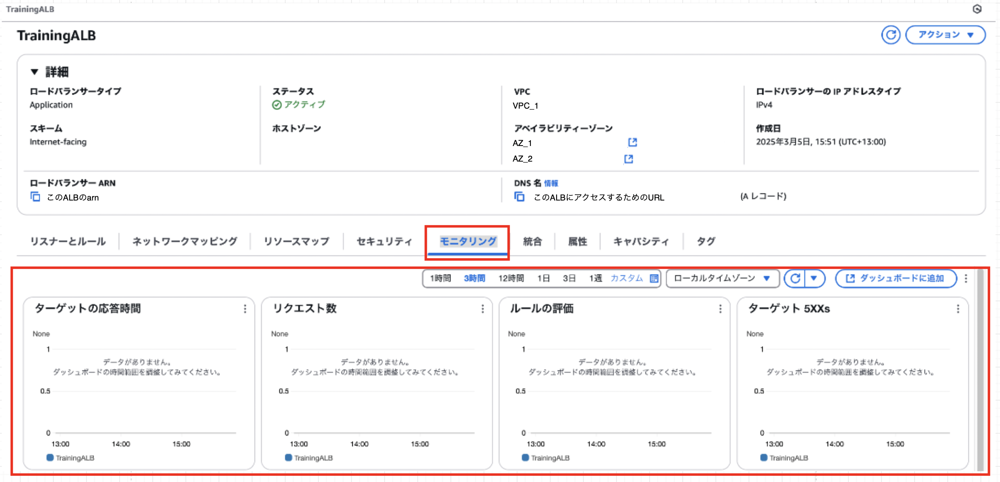
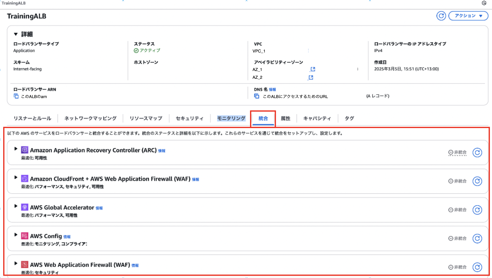
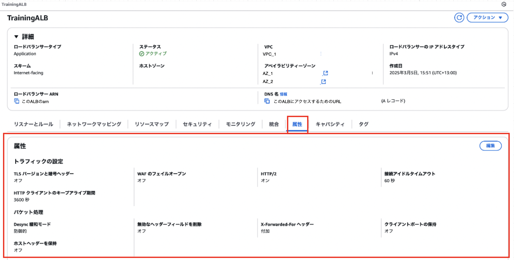
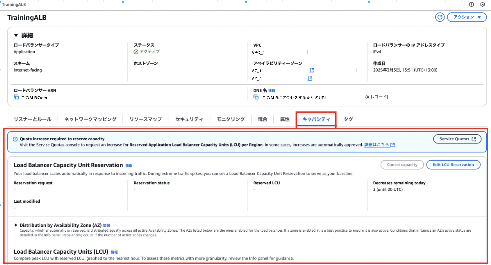
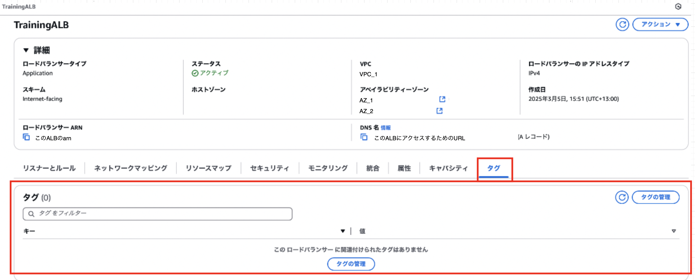

### リスナーとルール

- ALB に設定されている[リスナー、リスナールール](./AWS_ELB.md#リスナーリスナールールアクション)などを確認することがきる

---

### ネットワークマッピング

- ALB が配置されている VPC、AZ、サブネットを確認することがきる

---

### リソースマップ

- ALB → ターゲット までの紐付けを視覚的に確認することができる

---

### セキュリティ

- ALB に設定されたセキュリティグループを確認することができる

---

### モニタリング

- ALB のメトリクスを視覚的に確認することができる

---

### 統合

- ALB を他の AWS サービスと連携させることができる

---

### 属性

- [ALB 関連の設定](./ALB_Attributes.md)を確認することができる

---

### キャパシティ

- ALB の [Load Balancer Capacity Unit](./AWS_ELB.md#基本的なコスト) などを確認することができる

---

### タグ

- ALB に付与されたタグを確認することができる

