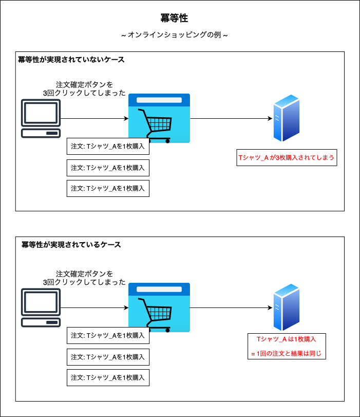

### 冪等性とは (idempotency, idempotence)

- 冪等性 (べきとうせい) とは

    - **ある操作を 1 回行っても複数回行っても結果が同じである** という概念

        ```
        例: オンラインショッピング

        ユーザーがとある商品の購入を決めユーザー情報や支払い方法などを記入し、注文確定ボタンを押す際に複数回クリックをしてしまった

        冪等性のあるシステムでは、複数回の同じ注文受けても、★★1回の注文として処理する★★

        冪等性のないシステムでは、同じ内容の注文がクリックされた回数分処理されてしまう = 重複注文になってしまう
        ```

        <br>

        

        <br>

        → 冪等性を実現するために、通常は `① クライアントサイドで連続クリックを制御` + `② サーバーサイドで重複注文の判断とその処理` を実装する必要がある

        

        引用: [サーバーレスが気になる開発者に捧ぐ「べき等性」ことはじめ](https://aws.amazon.com/jp/builders-flash/202104/serverless-idempotency/)

<br>
<br>

参考サイト

[サーバーレスが気になる開発者に捧ぐ「べき等性」ことはじめ](https://aws.amazon.com/jp/builders-flash/202104/serverless-idempotency/)
