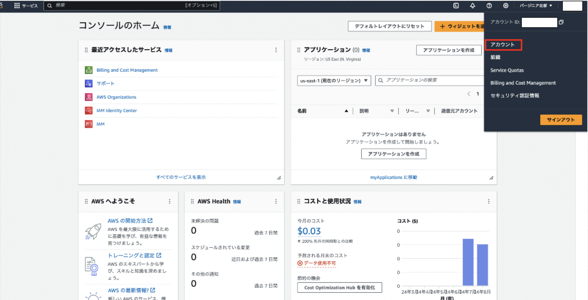
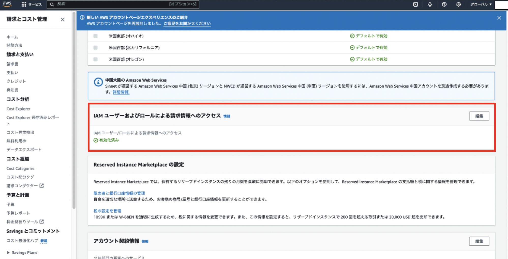
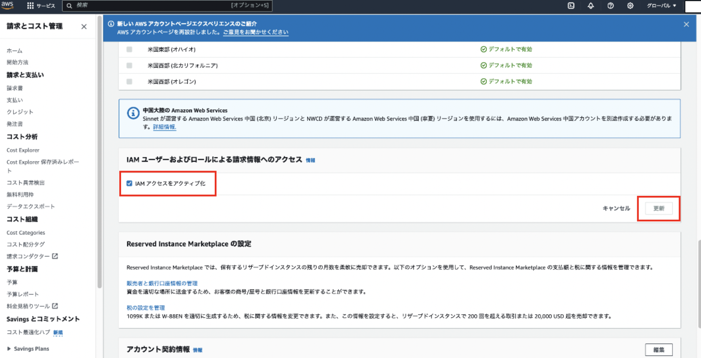
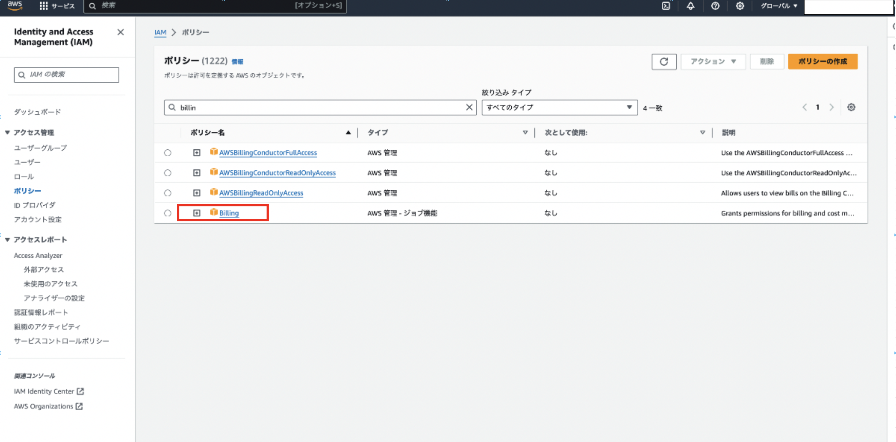
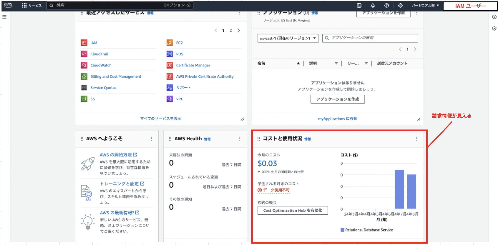
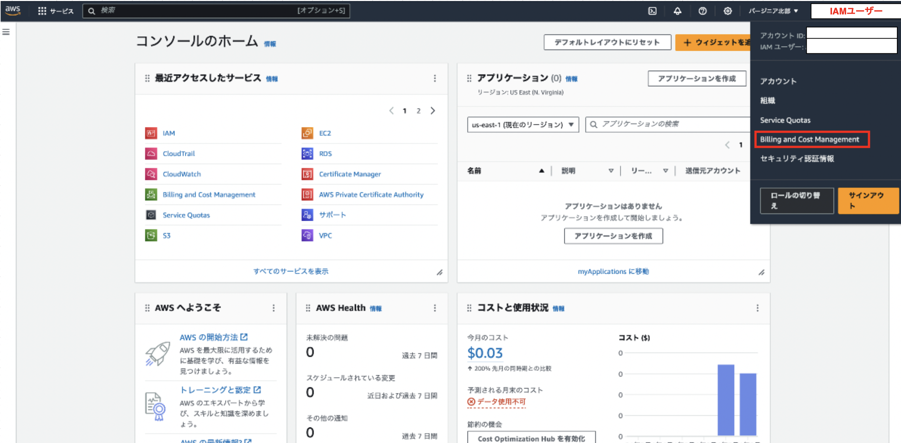
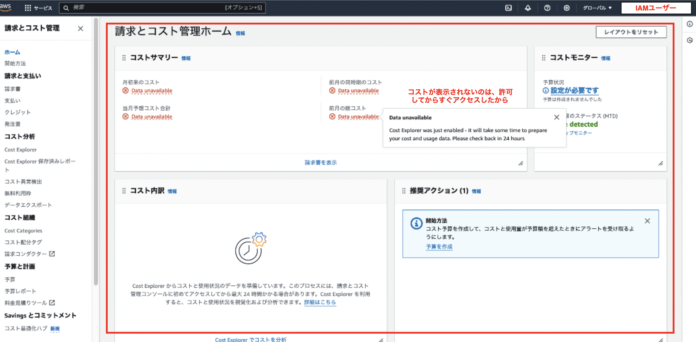
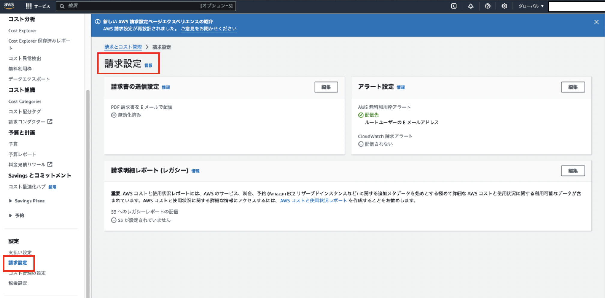
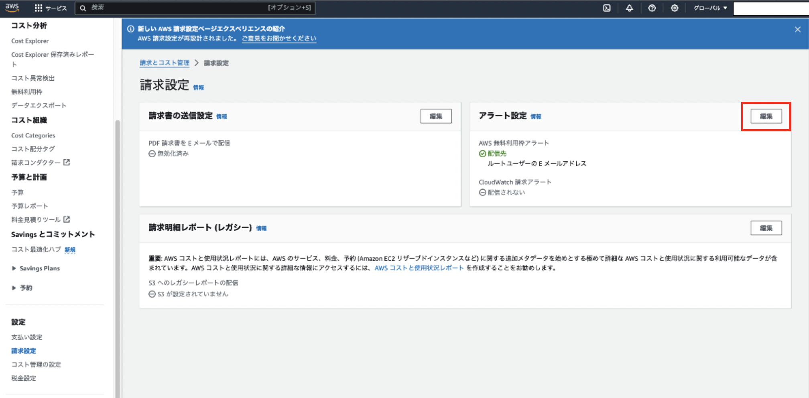
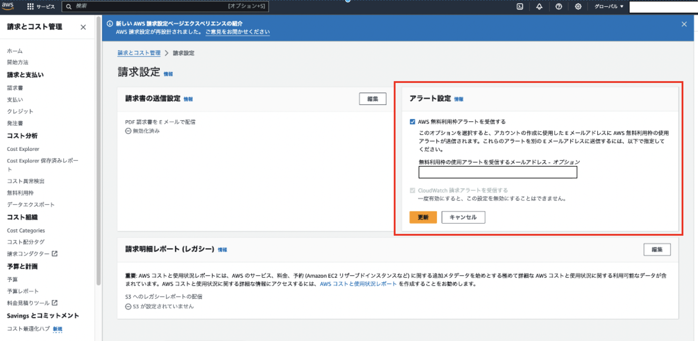

### IAM ユーザーでも請求情報が見れるように設定

通常、請求情報(今月どのくらいの金額がかかっているのか)を確認するには root ユーザーでログインしなければ見ることができない

→ IAM ユーザーでも請求情報を見れるようにしたい

 

\[手順\]

1. root ユーザーでログインし、アカウトメニューの`アカウント`をクリック

    

 

2. アカウント画面にて (下へスクロースし)

- `IAMユーザーおよびロールによる請求情報へのアクセス`の編集をクリック

    

- `IAMアクセスをアクティブ化`にチェックし、更新をクリック
    

 

3. IAM にて IAM ユーザーか、そのユーザーが属するグループに`Billing`ポリシーをアタッチする
    
    *PowerUserAccess や AdministratorAccess にも含まれている

    

 

4. IAM ユーザーでログインし、請求情報にアクセスできるか確認する

    - ホームの`コストと使用状況`に内容が表示される

    

     

    - アカウントメニューの`Billing and Cost Management`をクリックすると請求情報にアクセスできる

    
    

 
 

参考サイト

[AWSの請求情報をIAMユーザーでも見れるようにしよう](https://zenn.dev/k_tamu/articles/59ae03a2752522)

[[小ネタ]AWSアカウントの請求情報をIAMユーザに見せる方法](https://dev.classmethod.jp/articles/show-your-aws-billing-info-to-iam-users/)

[[AWS] IAMユーザで請求情報を確認す](https://atarisoft.blog/check-billing-information-as-an-iam-user-on-aws-management-console/)

---

### 請求アラートを設定する

- AWS 無料利用枠アラート
    - 無料利用枠を超えそう&超えた場合に、メールでアラートを受け取ることができる

- [CloudWatch](./CloudWatch.md) アラート
    - 無料枠ではなく、通常利用において AWS サービスの利用料金などの条件をつけてアラートを受け取ることができる

 

\[手順\]

1. アカウントメニューから`Billing and Cost Management`をクリックする

    

 

2. サイドメニューから`請求情報`をクリック

    

 

3. アラート設定の`編集`をクリックし、受け取りたいアラートにチェックし、`更新`をクリックする

    
    

 

$\color{red}CloudWatchアラートにチェックを入れただけではアラートは飛ばない$

→ CloudWatch にて対象と条件を設定して初めてアラートが飛ぶ