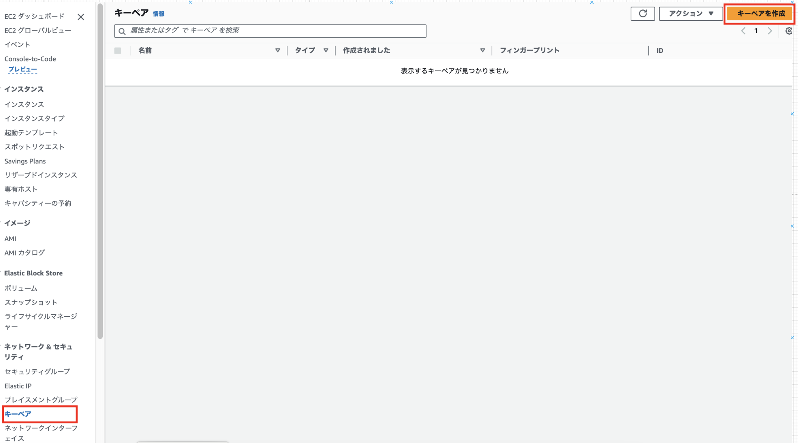
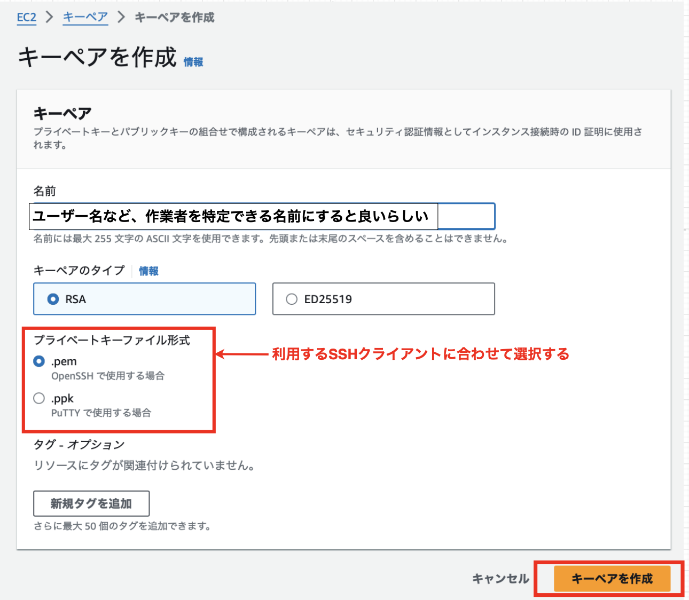
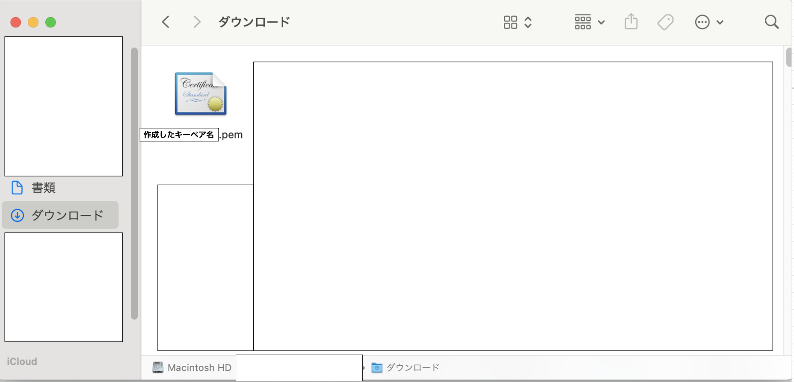
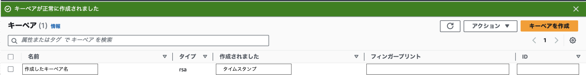
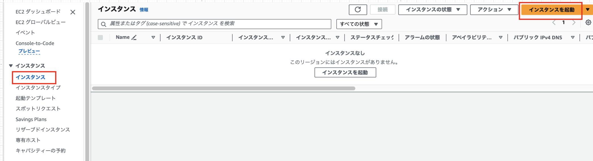
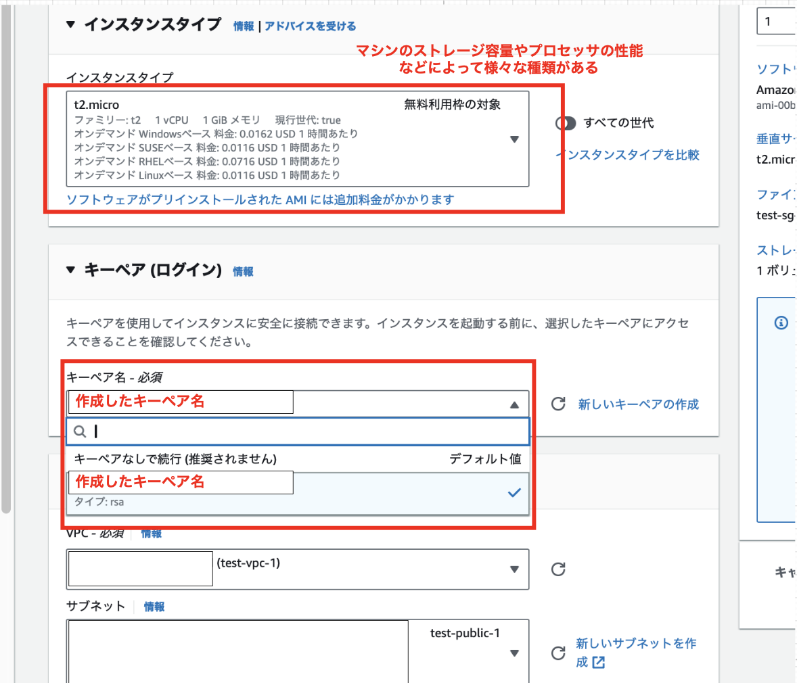
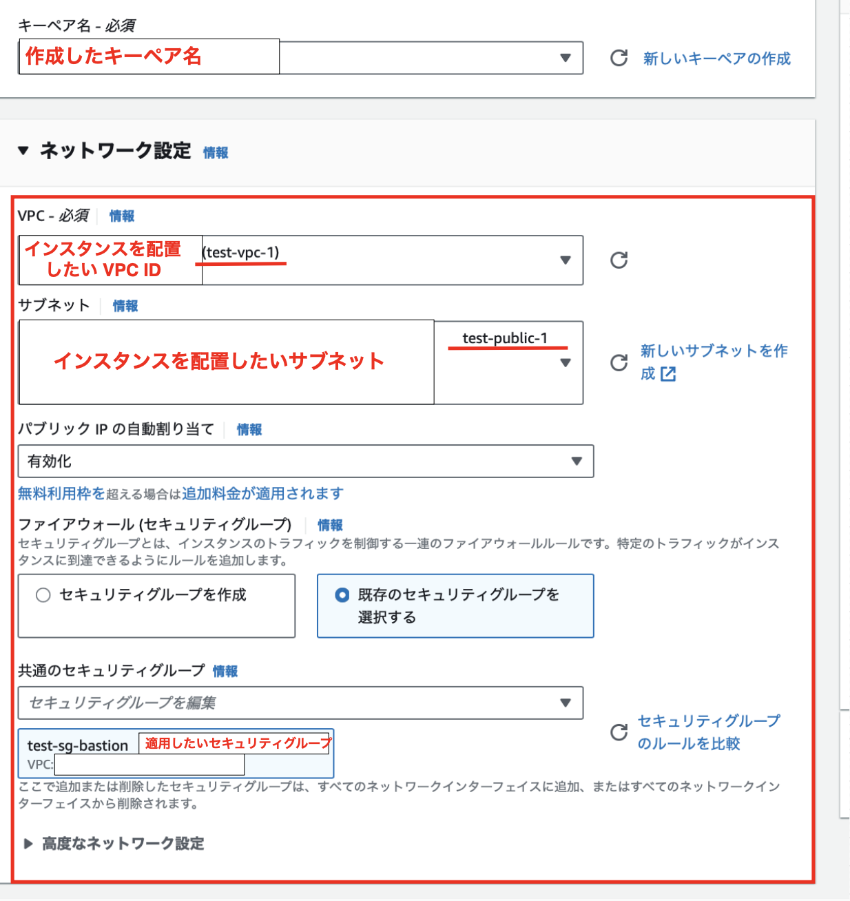
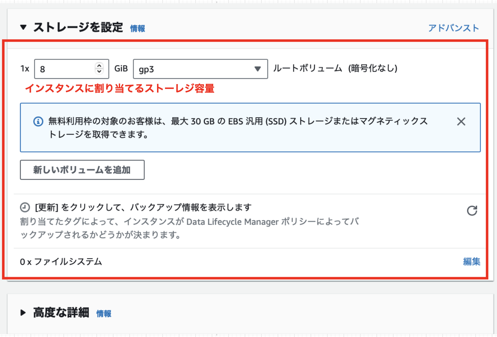
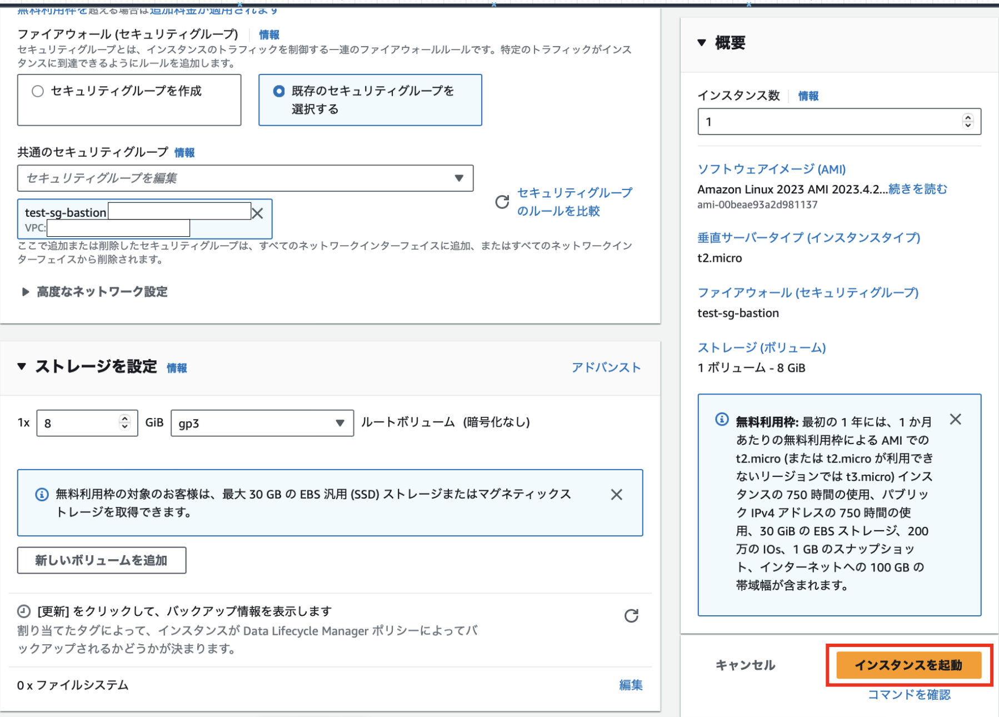

### 踏み台サーバー (Bastion Server) とは

パブリックサブネットに配置された、プライベートサブネットに配置されたリソースにアクセスするための中継サーバー

下記画像でいう Public Subnet の Web Server が踏み台サーバーにあたる

引用: [踏み台サーバーを経由してプライベートサブネットにある EC2 に SSH で接続する](https://www.aws-room.com/entry/ec2-bastion)

 

なぜ踏み台サーバーは必要なのか?

- プライベートサブネットに配置されたインスタンスへのアクセス元を1箇所に限定することで、外部からの侵入リスクを軽減する

- また、踏み台サーバーへアクセスできるIPを限定することでさらにリスクを軽減できる

 

踏み台サーバーは EC2 を利用して作成されることが多い

---

### 事前準備

踏み台サーバーには SSH で接続するため、自身が持つ密鍵とサーバーに配置する公開鍵が必要

1\. EC2 ダッシュボードより、「キーペア」を選択し「キーペアを作成」をクリック

 

2\. キーペアの作成に必要な項目を設定したら、「キーペアを作成」をクリックする

 

3\. 「キーペアを作成」クリック後に秘密鍵がダウンロードされる。また、キーペア画面にて作成されていることも確認する。

 
 

*作成後の秘密鍵のダウンロードに失敗した場合

-> 以降にダウンロードできる機会は無いため、作成したキーペアを削除し作り直す必要がある

---

### 踏み台サーバーの作成

1\. EC2ダッシュボードの「インスタンス」より、「インスタンスの起動」をクリック

 

2\. EC2 の設定を行う

- EC2 インスタンス名と OS の設定を行う

 

- インスタンスタイプ(マシンの性能)とサーバーにおく公開鍵を選択する

 

- 配置する VPC とそのサブネット、適用するセキュリティグループを設定する

    - *パブリックIPの自動割り当てについて
        - 今回のインスタンスはパブリックサブネットに配置し、外部からアクセスされるのでパブリックIPアドレスが必要

        - プライベートサブネットに配置されるインスタンスにはパブリックIPは必要ない **(たぶん)**

 

- インスタンスに割り当てるストレージ容量を設定する

 

- 各項目の設定が完了したら、「インスタンスを起動」をクリックする

